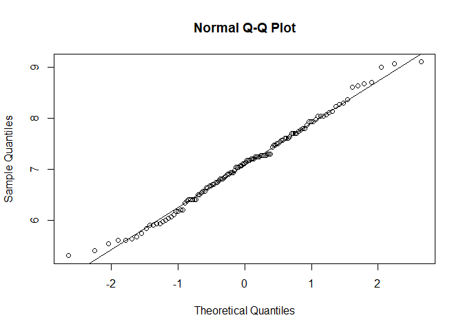
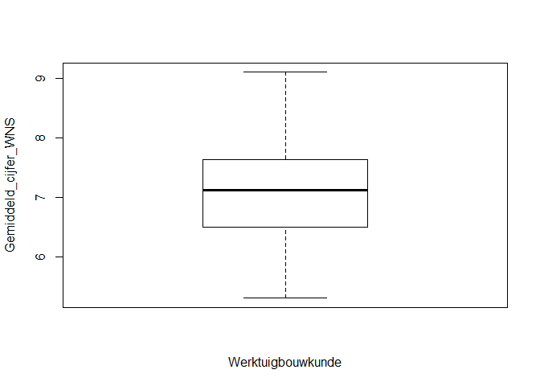

---
output:
  html_document:
    theme: lumen
    toc: yes
    toc_float: 
      collapsed: FALSE 
    number_sections: true
    keep_md: true
  keywords: [statistisch handboek, studiedata]
  
---

---
title: One sample t-toets
date: "versie 0.5.2, 23-10-2019"
number-sections: yes
---
<style>
<!--html_preserve-->/* Stylesheet Statistisch Handboek */

/* Title */
h1.title {
    opacity: 1;
    text-align: left;
    color: #158CBA;
}

/* Casus */
#casus {
    display: block;
    padding: 9.5px;
    margin: 0 0 10px;
    font-size: 14px;
    line-height: 2;
    color: #000000;
    background-color: #f5f5f5;
    border: 1px solid #158CBA;
    border-radius: 4px;
}

/* Empty data */
.empty{
    display: block;
    color: #FF0000;
}

/* Klippy */
.btn-klippy .octicon {
    display: inline-block;
    margin: 2px;
    padding: 2px;
    width: 15px !important;
}

/* Main container */
.main-container {
    margin-top: 50px;
}

/* Toetsmatrix */
table.toetsmatrix {
    text-align: center;
    margin: 5px;
    padding: 5px;
}


td.header1 {
    font-weight: bold;
    color: #FFFFFF;
    background-color: #158CBA;
    text-align: center;
}

td.header2 {
    font-weight: bold;
    color: #FFFFFF;
    background-color: #A6A6A6;
    text-align: center;
}

td.header3 {
    font-weight: bold;
    background-color: #D9D9D9;
    text-align: center;
}

table.toetsmatrix td {
    border-color: #000000 !important;
    padding: 10px;
}

td.innercell{
    border: 1px solid #000000;
}

td.innercell a {
    text-decoration: none;
}

td.innercell a:hover {
    text-decoration: underline;
}

td.published {
    color: #158cba;
}

td.unpublished, td.unpublished a {
    color: #A6A6A6;
}

td.unpublished a:hover {
    color: #A6A6A6;
    text-decoration: none;
}

/* Footer */
#footer {
 color: #808080
 background-image: url('images/VPO_logo_studiedata.png');;
 background-repeat: no-repeat;
 background-position: right;
 background-size: 230px auto;
 padding-right: 242px;
}

</style>

<div class="navbar navbar-default  navbar-fixed-top" role="navigation">
  <div class="container">
    <div class="navbar-header">
      <button type="button" class="navbar-toggle collapsed" data-toggle="collapse" data-target="#navbar">
        <span class="icon-bar"></span>
        <span class="icon-bar"></span>
        <span class="icon-bar"></span>
      </button>
      <a class="navbar-brand" href="/Users/theo/Dropbox/Bitbucket/sho_skeleton/_site/index.html">Statistisch Handboek Hoger Onderwijs</a>
    </div>
    <div id="navbar" class="navbar-collapse collapse">
      <ul class="nav navbar-nav">
        <li>
  <a href="/Users/theo/Dropbox/Bitbucket/sho_skeleton/_site/Toetsmatrix.html">Toetsmatrix</a>
</li>
<li>
  <a href="/Users/theo/Dropbox/Bitbucket/sho_skeleton/_site/Over.html">Over</a>
</li>
<li>
  <a href="/Users/theo/Dropbox/Bitbucket/sho_skeleton/_site/Licentie.html">Licentie</a>
</li>
      </ul>
      <ul class="nav navbar-nav navbar-right">

      </ul>
    </div><!--/.nav-collapse -->
  </div><!--/.container -->
</div><!--/html_preserve-->

<style>
  .col2 {
    columns: 2 200px;
    -webkit-columns: 2 200px;
    -moz-columns: 2 200px;
  }
</style>


<!-- ## BLOK: Data-aanmaken.R -->

<!-- ## /BLOK: Data-aanmaken.R -->

# Toepassing
Gebruik de *t-toets* om te toetsen of de gemiddeldes van twee groepen aan elkaar gelijk zijn. Gebruik de *one sample t-toets* om aan de hand van één steekproef het gemiddelde van de totale populatie te vergelijken met een vooraf bekende waarde.[^1] 

# Onderwijscasus
De opleidingsdirecteur van de opleiding Werktuigbouwkunde wil weten of het gemiddelde eindexamencijfer voor de exacte vakken (Wiskunde, Natuurkunde en Scheikunde; WNS) van vwo studenten hoger is dan het landelijk gemiddelde (6,8).[^2] Zo kan zij bepalen of het curriculum van de inleidende vakken genoeg aansluit bij eerstejaars studenten met een vwo vooropleiding.[^3]

H~0~: Het gemiddelde eindexamencijfer voor de exacte vakken van vwo studenten die beginnen aan de Bachelor Werktuigbouwkunde is gelijk aan het landelijk gemiddelde: µ = 6,8. 

H~A~: Het gemiddelde eindexamencijfer voor de exacte vakken van vwo studenten die beginnen aan de Bachelor Werktuigbouwkunde is anders dan het landelijk gemiddelde: µ ≠ 6,8. 

# Assumpties
Voor een betrouwbaar resultaat moet de data aan een aantal voorwaarden voldoen voordat de toets uitgevoerd kan worden.

## Normaliteit 
De t-toets gaat ervan uit dat de data normaal verdeeld is. Controleer deze assumptie met de volgende stappen:  
1. Controleer de data visueel met een histogram, een boxplot of een Q-Q plot.   
2. Toets of de data normaal verdeeld is met de *Kolmogorov-Smirnov test* of bij een kleinere steekproef (n < 50[^3]) met de *Shapiro-Wilk test*.[^4]  
3. Als blijkt dat de data niet normaal verdeeld is, transformeer de data eventueel en bepaal daarna of deze wel normaal verdeeld is.

Als er geen sprake is van normaliteit, gebruik de *Wilcoxon Signed Rank Test*.[^5]

# Uitvoering in R
Er zijn twee datasets `Gemiddeld_cijfer_WNS` en `Gemiddeld_cijfer_WNS_n30` ingeladen met de gemiddelde eindexamencijfers van WNS van eerstejaars Werktuigbouwkunde. Het eerste bestand bevat 122 middelbare scholierenstudenten en het tweede bevat 30 studenten.

## Gemiddelde en standaarddeviatie
Inspecteer de data met `length()`, `mean()` en `sd()` om meer inzicht te krijgen in de data.

<!-- ## BLOK: Data-bekijken.R -->

```r
## Gemiddelde en standaarddeviatie
mean(Gemiddeld_cijfer_WNS)
## [1] 7.084426
sd(Gemiddeld_cijfer_WNS)
## [1] 0.8356957
```
<!-- ## /BLOK: Data-bekijken.R -->

## Visuele inspectie van normaliteit

Geef normaliteit visueel weer met een histogram, boxplot of Q-Q plot. 

### Histogram

<!-- ## BLOK: Histogram.R -->

```r
## Histogram met ggplot2 en plotly
library(ggplot2)
library(plotly)
h <- ggplot(data.frame(Gemiddeld_cijfer_WNS), aes(x = Gemiddeld_cijfer_WNS)) +
  geom_histogram(aes(y = ..density..),
                 binwidth = 0.5, color = "white", fill = "#158CBA", ) +
  geom_density(alpha = .2, adjust = 1) +
  ylab("Frequentiedichtheid") +
  xlab("Gemiddeld_cijfer_WNS") +
  scale_x_continuous(labels = as.character(seq(5.5, 9, 0.5)), breaks = seq(5.5, 9, 0.5)) +
  labs(title = "Eindcijfers Wiskunde, Natuurkunde en Scheikunde", subtitle = "Eerstejaarsstudenten Werktuigbouwkunde")
ggplotly(h) %>% config(displayModeBar = F)
```

<!--html_preserve--><div id="htmlwidget-22709e3322c6a2483043" style="width:672px;height:480px;" class="plotly html-widget"></div>
<script type="application/json" data-for="htmlwidget-22709e3322c6a2483043">{"x":{"data":[{"orientation":"v","width":[0.5,0.5,0.5,0.5,0.5,0.5,0.5,0.5],"base":[0,0,0,0,0,0,0,0],"x":[5.5,6,6.5,7,7.5,8,8.5,9],"y":[0.131147540983607,0.229508196721311,0.327868852459016,0.491803278688525,0.409836065573771,0.245901639344262,0.114754098360656,0.0491803278688525],"text":["density: 0.13114754<br />count: 0.13114754<br />Gemiddeld_cijfer_WNS: 5.5","density: 0.22950820<br />count: 0.22950820<br />Gemiddeld_cijfer_WNS: 6.0","density: 0.32786885<br />count: 0.32786885<br />Gemiddeld_cijfer_WNS: 6.5","density: 0.49180328<br />count: 0.49180328<br />Gemiddeld_cijfer_WNS: 7.0","density: 0.40983607<br />count: 0.40983607<br />Gemiddeld_cijfer_WNS: 7.5","density: 0.24590164<br />count: 0.24590164<br />Gemiddeld_cijfer_WNS: 8.0","density: 0.11475410<br />count: 0.11475410<br />Gemiddeld_cijfer_WNS: 8.5","density: 0.04918033<br />count: 0.04918033<br />Gemiddeld_cijfer_WNS: 9.0"],"type":"bar","marker":{"autocolorscale":false,"color":"rgba(21,140,186,1)","line":{"width":1.88976377952756,"color":"rgba(255,255,255,1)"}},"showlegend":false,"xaxis":"x","yaxis":"y","hoverinfo":"text","frame":null},{"x":[5.3,5.30743639921722,5.31487279843444,5.32230919765166,5.32974559686888,5.33718199608611,5.34461839530333,5.35205479452055,5.35949119373777,5.36692759295499,5.37436399217221,5.38180039138943,5.38923679060665,5.39667318982387,5.4041095890411,5.41154598825832,5.41898238747554,5.42641878669276,5.43385518590998,5.4412915851272,5.44872798434442,5.45616438356164,5.46360078277886,5.47103718199609,5.47847358121331,5.48590998043053,5.49334637964775,5.50078277886497,5.50821917808219,5.51565557729941,5.52309197651663,5.53052837573386,5.53796477495108,5.5454011741683,5.55283757338552,5.56027397260274,5.56771037181996,5.57514677103718,5.5825831702544,5.59001956947162,5.59745596868884,5.60489236790607,5.61232876712329,5.61976516634051,5.62720156555773,5.63463796477495,5.64207436399217,5.64951076320939,5.65694716242661,5.66438356164384,5.67181996086106,5.67925636007828,5.6866927592955,5.69412915851272,5.70156555772994,5.70900195694716,5.71643835616438,5.7238747553816,5.73131115459883,5.73874755381605,5.74618395303327,5.75362035225049,5.76105675146771,5.76849315068493,5.77592954990215,5.78336594911937,5.79080234833659,5.79823874755382,5.80567514677104,5.81311154598826,5.82054794520548,5.8279843444227,5.83542074363992,5.84285714285714,5.85029354207436,5.85772994129159,5.86516634050881,5.87260273972603,5.88003913894325,5.88747553816047,5.89491193737769,5.90234833659491,5.90978473581213,5.91722113502935,5.92465753424657,5.9320939334638,5.93953033268102,5.94696673189824,5.95440313111546,5.96183953033268,5.9692759295499,5.97671232876712,5.98414872798434,5.99158512720157,5.99902152641879,6.00645792563601,6.01389432485323,6.02133072407045,6.02876712328767,6.03620352250489,6.04363992172211,6.05107632093933,6.05851272015656,6.06594911937378,6.073385518591,6.08082191780822,6.08825831702544,6.09569471624266,6.10313111545988,6.1105675146771,6.11800391389432,6.12544031311155,6.13287671232877,6.14031311154599,6.14774951076321,6.15518590998043,6.16262230919765,6.17005870841487,6.17749510763209,6.18493150684932,6.19236790606654,6.19980430528376,6.20724070450098,6.2146771037182,6.22211350293542,6.22954990215264,6.23698630136986,6.24442270058708,6.2518590998043,6.25929549902153,6.26673189823875,6.27416829745597,6.28160469667319,6.28904109589041,6.29647749510763,6.30391389432485,6.31135029354207,6.3187866927593,6.32622309197652,6.33365949119374,6.34109589041096,6.34853228962818,6.3559686888454,6.36340508806262,6.37084148727984,6.37827788649706,6.38571428571429,6.39315068493151,6.40058708414873,6.40802348336595,6.41545988258317,6.42289628180039,6.43033268101761,6.43776908023483,6.44520547945205,6.45264187866928,6.4600782778865,6.46751467710372,6.47495107632094,6.48238747553816,6.48982387475538,6.4972602739726,6.50469667318982,6.51213307240704,6.51956947162427,6.52700587084149,6.53444227005871,6.54187866927593,6.54931506849315,6.55675146771037,6.56418786692759,6.57162426614481,6.57906066536203,6.58649706457926,6.59393346379648,6.6013698630137,6.60880626223092,6.61624266144814,6.62367906066536,6.63111545988258,6.6385518590998,6.64598825831703,6.65342465753425,6.66086105675147,6.66829745596869,6.67573385518591,6.68317025440313,6.69060665362035,6.69804305283757,6.70547945205479,6.71291585127202,6.72035225048924,6.72778864970646,6.73522504892368,6.7426614481409,6.75009784735812,6.75753424657534,6.76497064579256,6.77240704500978,6.77984344422701,6.78727984344423,6.79471624266145,6.80215264187867,6.80958904109589,6.81702544031311,6.82446183953033,6.83189823874755,6.83933463796478,6.846771037182,6.85420743639922,6.86164383561644,6.86908023483366,6.87651663405088,6.8839530332681,6.89138943248532,6.89882583170254,6.90626223091976,6.91369863013699,6.92113502935421,6.92857142857143,6.93600782778865,6.94344422700587,6.95088062622309,6.95831702544031,6.96575342465753,6.97318982387475,6.98062622309198,6.9880626223092,6.99549902152642,7.00293542074364,7.01037181996086,7.01780821917808,7.0252446183953,7.03268101761252,7.04011741682975,7.04755381604697,7.05499021526419,7.06242661448141,7.06986301369863,7.07729941291585,7.08473581213307,7.09217221135029,7.09960861056751,7.10704500978474,7.11448140900196,7.12191780821918,7.1293542074364,7.13679060665362,7.14422700587084,7.15166340508806,7.15909980430528,7.1665362035225,7.17397260273973,7.18140900195695,7.18884540117417,7.19628180039139,7.20371819960861,7.21115459882583,7.21859099804305,7.22602739726027,7.2334637964775,7.24090019569472,7.24833659491194,7.25577299412916,7.26320939334638,7.2706457925636,7.27808219178082,7.28551859099804,7.29295499021526,7.30039138943249,7.30782778864971,7.31526418786693,7.32270058708415,7.33013698630137,7.33757338551859,7.34500978473581,7.35244618395303,7.35988258317025,7.36731898238748,7.3747553816047,7.38219178082192,7.38962818003914,7.39706457925636,7.40450097847358,7.4119373776908,7.41937377690802,7.42681017612524,7.43424657534247,7.44168297455969,7.44911937377691,7.45655577299413,7.46399217221135,7.47142857142857,7.47886497064579,7.48630136986301,7.49373776908023,7.50117416829746,7.50861056751468,7.5160469667319,7.52348336594912,7.53091976516634,7.53835616438356,7.54579256360078,7.553228962818,7.56066536203523,7.56810176125245,7.57553816046967,7.58297455968689,7.59041095890411,7.59784735812133,7.60528375733855,7.61272015655577,7.62015655577299,7.62759295499021,7.63502935420744,7.64246575342466,7.64990215264188,7.6573385518591,7.66477495107632,7.67221135029354,7.67964774951076,7.68708414872798,7.69452054794521,7.70195694716243,7.70939334637965,7.71682974559687,7.72426614481409,7.73170254403131,7.73913894324853,7.74657534246575,7.75401174168297,7.7614481409002,7.76888454011742,7.77632093933464,7.78375733855186,7.79119373776908,7.7986301369863,7.80606653620352,7.81350293542074,7.82093933463796,7.82837573385519,7.83581213307241,7.84324853228963,7.85068493150685,7.85812133072407,7.86555772994129,7.87299412915851,7.88043052837573,7.88786692759295,7.89530332681018,7.9027397260274,7.91017612524462,7.91761252446184,7.92504892367906,7.93248532289628,7.9399217221135,7.94735812133072,7.95479452054794,7.96223091976517,7.96966731898239,7.97710371819961,7.98454011741683,7.99197651663405,7.99941291585127,8.00684931506849,8.01428571428571,8.02172211350294,8.02915851272016,8.03659491193738,8.0440313111546,8.05146771037182,8.05890410958904,8.06634050880626,8.07377690802348,8.0812133072407,8.08864970645793,8.09608610567515,8.10352250489237,8.11095890410959,8.11839530332681,8.12583170254403,8.13326810176125,8.14070450097847,8.1481409001957,8.15557729941291,8.16301369863014,8.17045009784736,8.17788649706458,8.1853228962818,8.19275929549902,8.20019569471624,8.20763209393346,8.21506849315069,8.22250489236791,8.22994129158513,8.23737769080235,8.24481409001957,8.25225048923679,8.25968688845401,8.26712328767123,8.27455968688845,8.28199608610567,8.2894324853229,8.29686888454012,8.30430528375734,8.31174168297456,8.31917808219178,8.326614481409,8.33405088062622,8.34148727984344,8.34892367906066,8.35636007827789,8.36379647749511,8.37123287671233,8.37866927592955,8.38610567514677,8.39354207436399,8.40097847358121,8.40841487279843,8.41585127201565,8.42328767123288,8.4307240704501,8.43816046966732,8.44559686888454,8.45303326810176,8.46046966731898,8.4679060665362,8.47534246575342,8.48277886497065,8.49021526418787,8.49765166340509,8.50508806262231,8.51252446183953,8.51996086105675,8.52739726027397,8.53483365949119,8.54227005870841,8.54970645792564,8.55714285714286,8.56457925636008,8.5720156555773,8.57945205479452,8.58688845401174,8.59432485322896,8.60176125244618,8.6091976516634,8.61663405088063,8.62407045009785,8.63150684931507,8.63894324853229,8.64637964774951,8.65381604696673,8.66125244618395,8.66868884540117,8.6761252446184,8.68356164383562,8.69099804305284,8.69843444227006,8.70587084148728,8.7133072407045,8.72074363992172,8.72818003913894,8.73561643835616,8.74305283757339,8.75048923679061,8.75792563600783,8.76536203522505,8.77279843444227,8.78023483365949,8.78767123287671,8.79510763209393,8.80254403131115,8.80998043052838,8.8174168297456,8.82485322896282,8.83228962818004,8.83972602739726,8.84716242661448,8.8545988258317,8.86203522504892,8.86947162426614,8.87690802348337,8.88434442270059,8.89178082191781,8.89921722113503,8.90665362035225,8.91409001956947,8.92152641878669,8.92896281800391,8.93639921722114,8.94383561643836,8.95127201565558,8.9587084148728,8.96614481409002,8.97358121330724,8.98101761252446,8.98845401174168,8.9958904109589,9.00332681017612,9.01076320939335,9.01819960861057,9.02563600782779,9.03307240704501,9.04050880626223,9.04794520547945,9.05538160469667,9.06281800391389,9.07025440313112,9.07769080234834,9.08512720156556,9.09256360078278,9.1,9.1,9.1,9.09256360078278,9.08512720156556,9.07769080234834,9.07025440313112,9.06281800391389,9.05538160469667,9.04794520547945,9.04050880626223,9.03307240704501,9.02563600782779,9.01819960861057,9.01076320939335,9.00332681017612,8.9958904109589,8.98845401174168,8.98101761252446,8.97358121330724,8.96614481409002,8.9587084148728,8.95127201565558,8.94383561643836,8.93639921722114,8.92896281800391,8.92152641878669,8.91409001956947,8.90665362035225,8.89921722113503,8.89178082191781,8.88434442270059,8.87690802348337,8.86947162426614,8.86203522504892,8.8545988258317,8.84716242661448,8.83972602739726,8.83228962818004,8.82485322896282,8.8174168297456,8.80998043052838,8.80254403131115,8.79510763209393,8.78767123287671,8.78023483365949,8.77279843444227,8.76536203522505,8.75792563600783,8.75048923679061,8.74305283757339,8.73561643835616,8.72818003913894,8.72074363992172,8.7133072407045,8.70587084148728,8.69843444227006,8.69099804305284,8.68356164383562,8.6761252446184,8.66868884540117,8.66125244618395,8.65381604696673,8.64637964774951,8.63894324853229,8.63150684931507,8.62407045009785,8.61663405088063,8.6091976516634,8.60176125244618,8.59432485322896,8.58688845401174,8.57945205479452,8.5720156555773,8.56457925636008,8.55714285714286,8.54970645792564,8.54227005870841,8.53483365949119,8.52739726027397,8.51996086105675,8.51252446183953,8.50508806262231,8.49765166340509,8.49021526418787,8.48277886497065,8.47534246575342,8.4679060665362,8.46046966731898,8.45303326810176,8.44559686888454,8.43816046966732,8.4307240704501,8.42328767123288,8.41585127201565,8.40841487279843,8.40097847358121,8.39354207436399,8.38610567514677,8.37866927592955,8.37123287671233,8.36379647749511,8.35636007827789,8.34892367906066,8.34148727984344,8.33405088062622,8.326614481409,8.31917808219178,8.31174168297456,8.30430528375734,8.29686888454012,8.2894324853229,8.28199608610567,8.27455968688845,8.26712328767123,8.25968688845401,8.25225048923679,8.24481409001957,8.23737769080235,8.22994129158513,8.22250489236791,8.21506849315069,8.20763209393346,8.20019569471624,8.19275929549902,8.1853228962818,8.17788649706458,8.17045009784736,8.16301369863014,8.15557729941291,8.1481409001957,8.14070450097847,8.13326810176125,8.12583170254403,8.11839530332681,8.11095890410959,8.10352250489237,8.09608610567515,8.08864970645793,8.0812133072407,8.07377690802348,8.06634050880626,8.05890410958904,8.05146771037182,8.0440313111546,8.03659491193738,8.02915851272016,8.02172211350294,8.01428571428571,8.00684931506849,7.99941291585127,7.99197651663405,7.98454011741683,7.97710371819961,7.96966731898239,7.96223091976517,7.95479452054794,7.94735812133072,7.9399217221135,7.93248532289628,7.92504892367906,7.91761252446184,7.91017612524462,7.9027397260274,7.89530332681018,7.88786692759295,7.88043052837573,7.87299412915851,7.86555772994129,7.85812133072407,7.85068493150685,7.84324853228963,7.83581213307241,7.82837573385519,7.82093933463796,7.81350293542074,7.80606653620352,7.7986301369863,7.79119373776908,7.78375733855186,7.77632093933464,7.76888454011742,7.7614481409002,7.75401174168297,7.74657534246575,7.73913894324853,7.73170254403131,7.72426614481409,7.71682974559687,7.70939334637965,7.70195694716243,7.69452054794521,7.68708414872798,7.67964774951076,7.67221135029354,7.66477495107632,7.6573385518591,7.64990215264188,7.64246575342466,7.63502935420744,7.62759295499021,7.62015655577299,7.61272015655577,7.60528375733855,7.59784735812133,7.59041095890411,7.58297455968689,7.57553816046967,7.56810176125245,7.56066536203523,7.553228962818,7.54579256360078,7.53835616438356,7.53091976516634,7.52348336594912,7.5160469667319,7.50861056751468,7.50117416829746,7.49373776908023,7.48630136986301,7.47886497064579,7.47142857142857,7.46399217221135,7.45655577299413,7.44911937377691,7.44168297455969,7.43424657534247,7.42681017612524,7.41937377690802,7.4119373776908,7.40450097847358,7.39706457925636,7.38962818003914,7.38219178082192,7.3747553816047,7.36731898238748,7.35988258317025,7.35244618395303,7.34500978473581,7.33757338551859,7.33013698630137,7.32270058708415,7.31526418786693,7.30782778864971,7.30039138943249,7.29295499021526,7.28551859099804,7.27808219178082,7.2706457925636,7.26320939334638,7.25577299412916,7.24833659491194,7.24090019569472,7.2334637964775,7.22602739726027,7.21859099804305,7.21115459882583,7.20371819960861,7.19628180039139,7.18884540117417,7.18140900195695,7.17397260273973,7.1665362035225,7.15909980430528,7.15166340508806,7.14422700587084,7.13679060665362,7.1293542074364,7.12191780821918,7.11448140900196,7.10704500978474,7.09960861056751,7.09217221135029,7.08473581213307,7.07729941291585,7.06986301369863,7.06242661448141,7.05499021526419,7.04755381604697,7.04011741682975,7.03268101761252,7.0252446183953,7.01780821917808,7.01037181996086,7.00293542074364,6.99549902152642,6.9880626223092,6.98062622309198,6.97318982387475,6.96575342465753,6.95831702544031,6.95088062622309,6.94344422700587,6.93600782778865,6.92857142857143,6.92113502935421,6.91369863013699,6.90626223091976,6.89882583170254,6.89138943248532,6.8839530332681,6.87651663405088,6.86908023483366,6.86164383561644,6.85420743639922,6.846771037182,6.83933463796478,6.83189823874755,6.82446183953033,6.81702544031311,6.80958904109589,6.80215264187867,6.79471624266145,6.78727984344423,6.77984344422701,6.77240704500978,6.76497064579256,6.75753424657534,6.75009784735812,6.7426614481409,6.73522504892368,6.72778864970646,6.72035225048924,6.71291585127202,6.70547945205479,6.69804305283757,6.69060665362035,6.68317025440313,6.67573385518591,6.66829745596869,6.66086105675147,6.65342465753425,6.64598825831703,6.6385518590998,6.63111545988258,6.62367906066536,6.61624266144814,6.60880626223092,6.6013698630137,6.59393346379648,6.58649706457926,6.57906066536203,6.57162426614481,6.56418786692759,6.55675146771037,6.54931506849315,6.54187866927593,6.53444227005871,6.52700587084149,6.51956947162427,6.51213307240704,6.50469667318982,6.4972602739726,6.48982387475538,6.48238747553816,6.47495107632094,6.46751467710372,6.4600782778865,6.45264187866928,6.44520547945205,6.43776908023483,6.43033268101761,6.42289628180039,6.41545988258317,6.40802348336595,6.40058708414873,6.39315068493151,6.38571428571429,6.37827788649706,6.37084148727984,6.36340508806262,6.3559686888454,6.34853228962818,6.34109589041096,6.33365949119374,6.32622309197652,6.3187866927593,6.31135029354207,6.30391389432485,6.29647749510763,6.28904109589041,6.28160469667319,6.27416829745597,6.26673189823875,6.25929549902153,6.2518590998043,6.24442270058708,6.23698630136986,6.22954990215264,6.22211350293542,6.2146771037182,6.20724070450098,6.19980430528376,6.19236790606654,6.18493150684932,6.17749510763209,6.17005870841487,6.16262230919765,6.15518590998043,6.14774951076321,6.14031311154599,6.13287671232877,6.12544031311155,6.11800391389432,6.1105675146771,6.10313111545988,6.09569471624266,6.08825831702544,6.08082191780822,6.073385518591,6.06594911937378,6.05851272015656,6.05107632093933,6.04363992172211,6.03620352250489,6.02876712328767,6.02133072407045,6.01389432485323,6.00645792563601,5.99902152641879,5.99158512720157,5.98414872798434,5.97671232876712,5.9692759295499,5.96183953033268,5.95440313111546,5.94696673189824,5.93953033268102,5.9320939334638,5.92465753424657,5.91722113502935,5.90978473581213,5.90234833659491,5.89491193737769,5.88747553816047,5.88003913894325,5.87260273972603,5.86516634050881,5.85772994129159,5.85029354207436,5.84285714285714,5.83542074363992,5.8279843444227,5.82054794520548,5.81311154598826,5.80567514677104,5.79823874755382,5.79080234833659,5.78336594911937,5.77592954990215,5.76849315068493,5.76105675146771,5.75362035225049,5.74618395303327,5.73874755381605,5.73131115459883,5.7238747553816,5.71643835616438,5.70900195694716,5.70156555772994,5.69412915851272,5.6866927592955,5.67925636007828,5.67181996086106,5.66438356164384,5.65694716242661,5.64951076320939,5.64207436399217,5.63463796477495,5.62720156555773,5.61976516634051,5.61232876712329,5.60489236790607,5.59745596868884,5.59001956947162,5.5825831702544,5.57514677103718,5.56771037181996,5.56027397260274,5.55283757338552,5.5454011741683,5.53796477495108,5.53052837573386,5.52309197651663,5.51565557729941,5.50821917808219,5.50078277886497,5.49334637964775,5.48590998043053,5.47847358121331,5.47103718199609,5.46360078277886,5.45616438356164,5.44872798434442,5.4412915851272,5.43385518590998,5.42641878669276,5.41898238747554,5.41154598825832,5.4041095890411,5.39667318982387,5.38923679060665,5.38180039138943,5.37436399217221,5.36692759295499,5.35949119373777,5.35205479452055,5.34461839530333,5.33718199608611,5.32974559686888,5.32230919765166,5.31487279843444,5.30743639921722,5.3,5.3],"y":[0,0,0,0,0,0,0,0,0,0,0,0,0,0,0,0,0,0,0,0,0,0,0,0,0,0,0,0,0,0,0,0,0,0,0,0,0,0,0,0,0,0,0,0,0,0,0,0,0,0,0,0,0,0,0,0,0,0,0,0,0,0,0,0,0,0,0,0,0,0,0,0,0,0,0,0,0,0,0,0,0,0,0,0,0,0,0,0,0,0,0,0,0,0,0,0,0,0,0,0,0,0,0,0,0,0,0,0,0,0,0,0,0,0,0,0,0,0,0,0,0,0,0,0,0,0,0,0,0,0,0,0,0,0,0,0,0,0,0,0,0,0,0,0,0,0,0,0,0,0,0,0,0,0,0,0,0,0,0,0,0,0,0,0,0,0,0,0,0,0,0,0,0,0,0,0,0,0,0,0,0,0,0,0,0,0,0,0,0,0,0,0,0,0,0,0,0,0,0,0,0,0,0,0,0,0,0,0,0,0,0,0,0,0,0,0,0,0,0,0,0,0,0,0,0,0,0,0,0,0,0,0,0,0,0,0,0,0,0,0,0,0,0,0,0,0,0,0,0,0,0,0,0,0,0,0,0,0,0,0,0,0,0,0,0,0,0,0,0,0,0,0,0,0,0,0,0,0,0,0,0,0,0,0,0,0,0,0,0,0,0,0,0,0,0,0,0,0,0,0,0,0,0,0,0,0,0,0,0,0,0,0,0,0,0,0,0,0,0,0,0,0,0,0,0,0,0,0,0,0,0,0,0,0,0,0,0,0,0,0,0,0,0,0,0,0,0,0,0,0,0,0,0,0,0,0,0,0,0,0,0,0,0,0,0,0,0,0,0,0,0,0,0,0,0,0,0,0,0,0,0,0,0,0,0,0,0,0,0,0,0,0,0,0,0,0,0,0,0,0,0,0,0,0,0,0,0,0,0,0,0,0,0,0,0,0,0,0,0,0,0,0,0,0,0,0,0,0,0,0,0,0,0,0,0,0,0,0,0,0,0,0,0,0,0,0,0,0,0,0,0,0,0,0,0,0,0,0,0,0,0,0,0,0,0,0,0,0,0,0,0,0,0,0,0,0,0,0,0,0,0,0,0,0,0,0,0,0,0,0,0,0,0,0,0,0,0,0,0,0,0,0,0,0,0,0,0,0,0,0,0,0,0,0.0480608295890382,0.0488098097094761,0.0495542729613776,0.0502962948561488,0.0510328503866768,0.051765838394888,0.0524957725392056,0.053219371081959,0.0539402629350935,0.0546565709035106,0.0553679154552517,0.0560765677003836,0.0567793140687878,0.0574786675791517,0.0581748688208364,0.0588653293328286,0.0595534110549058,0.0602373999157859,0.0609174967042199,0.0615954618281063,0.06226892250589,0.0629401671622633,0.0636091777361912,0.064274777380013,0.0649390689725203,0.0656011473348041,0.0662616111775453,0.0669212099371256,0.0675794011517694,0.0682372803214904,0.0688948181239742,0.0695526014885434,0.0702107622792149,0.0708698501773601,0.0715304738428999,0.0721920781212932,0.072856871991634,0.0735237393100317,0.0741930687413741,0.0748672784594383,0.0755440597997376,0.0762260624332305,0.0769133720639537,0.0776039936588117,0.0783037752494572,0.079008323328133,0.0797190185812568,0.0804399714962299,0.0811661321990984,0.0819029112226193,0.0826492129682779,0.0834015829318736,0.0841703790642236,0.0849468033188609,0.0857339214635056,0.0865372081697818,0.0873487111655514,0.0881772511988732,0.0890197751453137,0.0898714640905727,0.0907479512460334,0.0916349145572009,0.0925378614666557,0.0934630800052186,0.09439974676154,0.0953606106064715,0.0963398286999967,0.0973321381325473,0.098356855115523,0.0993952745307825,0.100455358542926,0.101543419097507,0.102646093334472,0.103780235092926,0.104936492329707,0.106109896452176,0.107322306284224,0.108551286649218,0.109807345888614,0.111095869193203,0.112401673566845,0.113745321907773,0.115113611076097,0.116502649700616,0.117935152162442,0.119386245500205,0.12086865889428,0.122385935809194,0.123922167677907,0.125500511544583,0.127104223278311,0.128731122070717,0.130402780607269,0.132093741331204,0.133818134935567,0.135577050345982,0.137355176523326,0.139176465926234,0.141021751477262,0.142890837347475,0.14480224714413,0.146732072739931,0.148694590930993,0.150688355748974,0.15269995497261,0.15475190409189,0.156824472372344,0.158919231807549,0.161050266365019,0.163197224545156,0.165373039784836,0.167574270826545,0.169790411768244,0.172040288781318,0.174305896506063,0.176589879414168,0.178901306235957,0.181224858686994,0.183570700623293,0.185934448362017,0.188309015834297,0.190707726665693,0.193116541006104,0.195538171493001,0.19797697878581,0.200423352933881,0.202883630147742,0.205353779052453,0.207830086897623,0.210319370116505,0.212813244887313,0.215313449598283,0.217820657680013,0.220330775834663,0.222845846408495,0.225363384306517,0.227882519621346,0.230403548346726,0.232924509184356,0.235445368192816,0.237964519397925,0.240482461984135,0.242997157757889,0.245508458021596,0.248017376766841,0.250518999774807,0.253017111760692,0.255509683273627,0.257994257203821,0.260474534538066,0.262945234603758,0.265408748723583,0.267866783028588,0.270311687061464,0.272750899103783,0.275180849539579,0.277599374179642,0.280011827177052,0.282410979482777,0.284801347478403,0.287184439058518,0.28955214711621,0.291913354916222,0.294263695269117,0.296601968742522,0.29893375738716,0.301251385776021,0.303560572630994,0.305862168782337,0.308149314411061,0.310430407475733,0.312701142951882,0.314961427117225,0.317215989599845,0.319458108486271,0.321693513141632,0.323922366111214,0.326139955068044,0.328352846052086,0.330557550019665,0.332754757505842,0.334947766279554,0.337131738895046,0.339311316142953,0.341486239538983,0.343653947115084,0.345818645765893,0.347978034072245,0.350133001520904,0.352285420072552,0.35443240065043,0.356576958884031,0.358718733582251,0.360856486862561,0.362992498833557,0.365125352359692,0.36725561294299,0.369384307837565,0.371509348628448,0.373632661580085,0.375753818719993,0.377871520301302,0.379987494138848,0.382100006755755,0.384209247603667,0.386316416403878,0.388417726447045,0.390516012846719,0.392610199923875,0.394697450849103,0.39678101347917,0.398856715235242,0.400925158930572,0.402988892180071,0.405038812501204,0.407082168877342,0.409115845172877,0.411134479967321,0.41314512409082,0.41513840639368,0.417117126924379,0.419085804927233,0.421026998868461,0.422955867222404,0.424865483330701,0.426747951885455,0.428615977570548,0.430452211060238,0.432264201639817,0.434058010139103,0.43580694136898,0.437536037080324,0.439233020209829,0.440888613017707,0.442521984615005,0.444105828570961,0.445655121994103,0.447176263243233,0.448634209360035,0.450064378550815,0.451448095802417,0.452776755372971,0.454075411611629,0.455306385645528,0.456493990671619,0.457643230897144,0.458713674649467,0.459749455196389,0.460725528238051,0.461636271286192,0.462510718528054,0.463302368683334,0.46404518353581,0.464741116534521,0.465348580810635,0.465916911564649,0.466415992285144,0.466844958461921,0.467234068892436,0.46753135059127,0.467778736039021,0.467974146184289,0.468079175573345,0.468143856138914,0.468135364554205,0.468058219630638,0.467941022129825,0.467730752158949,0.467473894731849,0.467164373098943,0.466770278218021,0.466337959520376,0.465834770457822,0.465269911374719,0.464668021000702,0.463979476887427,0.463250999067757,0.462473511504373,0.461623216266548,0.460739513357694,0.459792627107188,0.458794722276131,0.457765199581827,0.456661286774498,0.455525840303656,0.45434834871159,0.453112990400039,0.451850602683714,0.45053618073421,0.449182755041685,0.447804316253591,0.446366784567894,0.444906236683183,0.44341231506517,0.441875778800178,0.440318925722091,0.438722338457351,0.437098092004038,0.435455090191147,0.433769189023464,0.432067349732713,0.430340902400212,0.42858526714164,0.426815393974477,0.425017285717779,0.423200928246577,0.421371110229535,0.419512995026815,0.417644248332086,0.415758625142008,0.413854419003602,0.41194092487103,0.410008815277207,0.408065576043822,0.406113416630719,0.404144071263211,0.402168221618935,0.400181794691173,0.398184657671064,0.39618204729614,0.394168477318829,0.39214896626765,0.390124285055393,0.388090702682133,0.386053819303959,0.384011496435953,0.381964378432008,0.379914798277955,0.377860600637236,0.375804413663771,0.373746347849102,0.37168598685086,0.369625034966419,0.367563256991216,0.365501571236407,0.363440066587089,0.36137986925394,0.35932103861446,0.357263608575893,0.355209816246045,0.353158021262026,0.351110093319564,0.349066762501353,0.347026205374121,0.344993100621299,0.34296445368497,0.340940764234908,0.338926420926321,0.336916686480043,0.334915826772002,0.332923825525973,0.330937202728247,0.328964437179481,0.326998907714673,0.325042113870483,0.323099933610503,0.321164862179084,0.31924369447993,0.317335062206426,0.315434214795882,0.313553259389256,0.311681679244476,0.309822393333413,0.307981840764449,0.306150430773655,0.304337214948617,0.302539021969899,0.300750426595679,0.29898628804536,0.297232618987842,0.295493877073882,0.293775993356297,0.292068386380511,0.290381549093162,0.288710460316198,0.2870498707993,0.285415437322867,0.283791353175535,0.282183165827363,0.28059535911154,0.279017720348724,0.277460867322295,0.275918452030737,0.274386509446296,0.272878191824724,0.271379154597184,0.269894819088233,0.268427692626809,0.266969267599843,0.265528696923926,0.264099381937091,0.262678940284862,0.261276462118567,0.259880930563883,0.258496681027149,0.257124283032476,0.255757938571673,0.25440382347484,0.253056495240295,0.251714977134099,0.250383616677478,0.249055971587817,0.247734412066462,0.24641814216251,0.245104530537201,0.243795700625888,0.242488741124824,0.241183519536493,0.239879917661957,0.238576452415382,0.237272953290627,0.235968153557201,0.234662445643196,0.233353509029307,0.232041933569255,0.230727697550623,0.229407254919596,0.228083606706281,0.226753908296682,0.225417341039629,0.224076692373846,0.222725545537806,0.221368307775024,0.220004406216632,0.218628291646014,0.217246337524186,0.21585334393911,0.214449616739592,0.213039445781752,0.211613267187294,0.21017892327541,0.208734882715313,0.207275005689509,0.205807630590797,0.204325866405655,0.202831432094475,0.201329203573264,0.199807762881813,0.198277452747362,0.196735703102669,0.19517689431116,0.193609955333663,0.19202714827855,0.19043150376455,0.188827722450756,0.187203904271311,0.185571649631641,0.18392756695147,0.182267246051051,0.180599083127134,0.178915367988592,0.177220046472769,0.175517117770291,0.173795474257269,0.172066645533787,0.170326853638479,0.168573191728168,0.166812724948292,0.165038593719555,0.163255082909882,0.161464881495544,0.159659730655476,0.157848861862548,0.156029001686439,0.154198740923274,0.152363303772053,0.15051744416682,0.148665105305081,0.146807742460561,0.144940363244217,0.143069242221064,0.14119209973288,0.139308808485946,0.13742245086934,0.135530125753997,0.133634672580743,0.131736585139384,0.129834282741946,0.127930641231247,0.126024884248585,0.124117787814094,0.122210140162186,0.120302096820819,0.11839455460766,0.116487470477455,0.114582591167923,0.112679123842455,0.110778309682997,0.108881302936913,0.106986579219706,0.105097999559086,0.103213638156561,0.101333460910389,0.0994622130499277,0.0975953578892702,0.0957366194527453,0.0938868820441078,0.0920424441573433,0.0902113576192716,0.0883880497477818,0.0865731142309808,0.0847737009848148,0.0829817069128149,0.0812036695112115,0.0794394945261306,0.0776836149620135,0.0759484692561334,0.0742242184985442,0.0725126952142588,0.0708226212513066,0.0691427987809421,0.0674826832985437,0],"text":["density: 0.06748268<br />Gemiddeld_cijfer_WNS: 5.300000","density: 0.06914280<br />Gemiddeld_cijfer_WNS: 5.307436","density: 0.07082262<br />Gemiddeld_cijfer_WNS: 5.314873","density: 0.07251270<br />Gemiddeld_cijfer_WNS: 5.322309","density: 0.07422422<br />Gemiddeld_cijfer_WNS: 5.329746","density: 0.07594847<br />Gemiddeld_cijfer_WNS: 5.337182","density: 0.07768361<br />Gemiddeld_cijfer_WNS: 5.344618","density: 0.07943949<br />Gemiddeld_cijfer_WNS: 5.352055","density: 0.08120367<br />Gemiddeld_cijfer_WNS: 5.359491","density: 0.08298171<br />Gemiddeld_cijfer_WNS: 5.366928","density: 0.08477370<br />Gemiddeld_cijfer_WNS: 5.374364","density: 0.08657311<br />Gemiddeld_cijfer_WNS: 5.381800","density: 0.08838805<br />Gemiddeld_cijfer_WNS: 5.389237","density: 0.09021136<br />Gemiddeld_cijfer_WNS: 5.396673","density: 0.09204244<br />Gemiddeld_cijfer_WNS: 5.404110","density: 0.09388688<br />Gemiddeld_cijfer_WNS: 5.411546","density: 0.09573662<br />Gemiddeld_cijfer_WNS: 5.418982","density: 0.09759536<br />Gemiddeld_cijfer_WNS: 5.426419","density: 0.09946221<br />Gemiddeld_cijfer_WNS: 5.433855","density: 0.10133346<br />Gemiddeld_cijfer_WNS: 5.441292","density: 0.10321364<br />Gemiddeld_cijfer_WNS: 5.448728","density: 0.10509800<br />Gemiddeld_cijfer_WNS: 5.456164","density: 0.10698658<br />Gemiddeld_cijfer_WNS: 5.463601","density: 0.10888130<br />Gemiddeld_cijfer_WNS: 5.471037","density: 0.11077831<br />Gemiddeld_cijfer_WNS: 5.478474","density: 0.11267912<br />Gemiddeld_cijfer_WNS: 5.485910","density: 0.11458259<br />Gemiddeld_cijfer_WNS: 5.493346","density: 0.11648747<br />Gemiddeld_cijfer_WNS: 5.500783","density: 0.11839455<br />Gemiddeld_cijfer_WNS: 5.508219","density: 0.12030210<br />Gemiddeld_cijfer_WNS: 5.515656","density: 0.12221014<br />Gemiddeld_cijfer_WNS: 5.523092","density: 0.12411779<br />Gemiddeld_cijfer_WNS: 5.530528","density: 0.12602488<br />Gemiddeld_cijfer_WNS: 5.537965","density: 0.12793064<br />Gemiddeld_cijfer_WNS: 5.545401","density: 0.12983428<br />Gemiddeld_cijfer_WNS: 5.552838","density: 0.13173659<br />Gemiddeld_cijfer_WNS: 5.560274","density: 0.13363467<br />Gemiddeld_cijfer_WNS: 5.567710","density: 0.13553013<br />Gemiddeld_cijfer_WNS: 5.575147","density: 0.13742245<br />Gemiddeld_cijfer_WNS: 5.582583","density: 0.13930881<br />Gemiddeld_cijfer_WNS: 5.590020","density: 0.14119210<br />Gemiddeld_cijfer_WNS: 5.597456","density: 0.14306924<br />Gemiddeld_cijfer_WNS: 5.604892","density: 0.14494036<br />Gemiddeld_cijfer_WNS: 5.612329","density: 0.14680774<br />Gemiddeld_cijfer_WNS: 5.619765","density: 0.14866511<br />Gemiddeld_cijfer_WNS: 5.627202","density: 0.15051744<br />Gemiddeld_cijfer_WNS: 5.634638","density: 0.15236330<br />Gemiddeld_cijfer_WNS: 5.642074","density: 0.15419874<br />Gemiddeld_cijfer_WNS: 5.649511","density: 0.15602900<br />Gemiddeld_cijfer_WNS: 5.656947","density: 0.15784886<br />Gemiddeld_cijfer_WNS: 5.664384","density: 0.15965973<br />Gemiddeld_cijfer_WNS: 5.671820","density: 0.16146488<br />Gemiddeld_cijfer_WNS: 5.679256","density: 0.16325508<br />Gemiddeld_cijfer_WNS: 5.686693","density: 0.16503859<br />Gemiddeld_cijfer_WNS: 5.694129","density: 0.16681272<br />Gemiddeld_cijfer_WNS: 5.701566","density: 0.16857319<br />Gemiddeld_cijfer_WNS: 5.709002","density: 0.17032685<br />Gemiddeld_cijfer_WNS: 5.716438","density: 0.17206665<br />Gemiddeld_cijfer_WNS: 5.723875","density: 0.17379547<br />Gemiddeld_cijfer_WNS: 5.731311","density: 0.17551712<br />Gemiddeld_cijfer_WNS: 5.738748","density: 0.17722005<br />Gemiddeld_cijfer_WNS: 5.746184","density: 0.17891537<br />Gemiddeld_cijfer_WNS: 5.753620","density: 0.18059908<br />Gemiddeld_cijfer_WNS: 5.761057","density: 0.18226725<br />Gemiddeld_cijfer_WNS: 5.768493","density: 0.18392757<br />Gemiddeld_cijfer_WNS: 5.775930","density: 0.18557165<br />Gemiddeld_cijfer_WNS: 5.783366","density: 0.18720390<br />Gemiddeld_cijfer_WNS: 5.790802","density: 0.18882772<br />Gemiddeld_cijfer_WNS: 5.798239","density: 0.19043150<br />Gemiddeld_cijfer_WNS: 5.805675","density: 0.19202715<br />Gemiddeld_cijfer_WNS: 5.813112","density: 0.19360996<br />Gemiddeld_cijfer_WNS: 5.820548","density: 0.19517689<br />Gemiddeld_cijfer_WNS: 5.827984","density: 0.19673570<br />Gemiddeld_cijfer_WNS: 5.835421","density: 0.19827745<br />Gemiddeld_cijfer_WNS: 5.842857","density: 0.19980776<br />Gemiddeld_cijfer_WNS: 5.850294","density: 0.20132920<br />Gemiddeld_cijfer_WNS: 5.857730","density: 0.20283143<br />Gemiddeld_cijfer_WNS: 5.865166","density: 0.20432587<br />Gemiddeld_cijfer_WNS: 5.872603","density: 0.20580763<br />Gemiddeld_cijfer_WNS: 5.880039","density: 0.20727501<br />Gemiddeld_cijfer_WNS: 5.887476","density: 0.20873488<br />Gemiddeld_cijfer_WNS: 5.894912","density: 0.21017892<br />Gemiddeld_cijfer_WNS: 5.902348","density: 0.21161327<br />Gemiddeld_cijfer_WNS: 5.909785","density: 0.21303945<br />Gemiddeld_cijfer_WNS: 5.917221","density: 0.21444962<br />Gemiddeld_cijfer_WNS: 5.924658","density: 0.21585334<br />Gemiddeld_cijfer_WNS: 5.932094","density: 0.21724634<br />Gemiddeld_cijfer_WNS: 5.939530","density: 0.21862829<br />Gemiddeld_cijfer_WNS: 5.946967","density: 0.22000441<br />Gemiddeld_cijfer_WNS: 5.954403","density: 0.22136831<br />Gemiddeld_cijfer_WNS: 5.961840","density: 0.22272555<br />Gemiddeld_cijfer_WNS: 5.969276","density: 0.22407669<br />Gemiddeld_cijfer_WNS: 5.976712","density: 0.22541734<br />Gemiddeld_cijfer_WNS: 5.984149","density: 0.22675391<br />Gemiddeld_cijfer_WNS: 5.991585","density: 0.22808361<br />Gemiddeld_cijfer_WNS: 5.999022","density: 0.22940725<br />Gemiddeld_cijfer_WNS: 6.006458","density: 0.23072770<br />Gemiddeld_cijfer_WNS: 6.013894","density: 0.23204193<br />Gemiddeld_cijfer_WNS: 6.021331","density: 0.23335351<br />Gemiddeld_cijfer_WNS: 6.028767","density: 0.23466245<br />Gemiddeld_cijfer_WNS: 6.036204","density: 0.23596815<br />Gemiddeld_cijfer_WNS: 6.043640","density: 0.23727295<br />Gemiddeld_cijfer_WNS: 6.051076","density: 0.23857645<br />Gemiddeld_cijfer_WNS: 6.058513","density: 0.23987992<br />Gemiddeld_cijfer_WNS: 6.065949","density: 0.24118352<br />Gemiddeld_cijfer_WNS: 6.073386","density: 0.24248874<br />Gemiddeld_cijfer_WNS: 6.080822","density: 0.24379570<br />Gemiddeld_cijfer_WNS: 6.088258","density: 0.24510453<br />Gemiddeld_cijfer_WNS: 6.095695","density: 0.24641814<br />Gemiddeld_cijfer_WNS: 6.103131","density: 0.24773441<br />Gemiddeld_cijfer_WNS: 6.110568","density: 0.24905597<br />Gemiddeld_cijfer_WNS: 6.118004","density: 0.25038362<br />Gemiddeld_cijfer_WNS: 6.125440","density: 0.25171498<br />Gemiddeld_cijfer_WNS: 6.132877","density: 0.25305650<br />Gemiddeld_cijfer_WNS: 6.140313","density: 0.25440382<br />Gemiddeld_cijfer_WNS: 6.147750","density: 0.25575794<br />Gemiddeld_cijfer_WNS: 6.155186","density: 0.25712428<br />Gemiddeld_cijfer_WNS: 6.162622","density: 0.25849668<br />Gemiddeld_cijfer_WNS: 6.170059","density: 0.25988093<br />Gemiddeld_cijfer_WNS: 6.177495","density: 0.26127646<br />Gemiddeld_cijfer_WNS: 6.184932","density: 0.26267894<br />Gemiddeld_cijfer_WNS: 6.192368","density: 0.26409938<br />Gemiddeld_cijfer_WNS: 6.199804","density: 0.26552870<br />Gemiddeld_cijfer_WNS: 6.207241","density: 0.26696927<br />Gemiddeld_cijfer_WNS: 6.214677","density: 0.26842769<br />Gemiddeld_cijfer_WNS: 6.222114","density: 0.26989482<br />Gemiddeld_cijfer_WNS: 6.229550","density: 0.27137915<br />Gemiddeld_cijfer_WNS: 6.236986","density: 0.27287819<br />Gemiddeld_cijfer_WNS: 6.244423","density: 0.27438651<br />Gemiddeld_cijfer_WNS: 6.251859","density: 0.27591845<br />Gemiddeld_cijfer_WNS: 6.259295","density: 0.27746087<br />Gemiddeld_cijfer_WNS: 6.266732","density: 0.27901772<br />Gemiddeld_cijfer_WNS: 6.274168","density: 0.28059536<br />Gemiddeld_cijfer_WNS: 6.281605","density: 0.28218317<br />Gemiddeld_cijfer_WNS: 6.289041","density: 0.28379135<br />Gemiddeld_cijfer_WNS: 6.296477","density: 0.28541544<br />Gemiddeld_cijfer_WNS: 6.303914","density: 0.28704987<br />Gemiddeld_cijfer_WNS: 6.311350","density: 0.28871046<br />Gemiddeld_cijfer_WNS: 6.318787","density: 0.29038155<br />Gemiddeld_cijfer_WNS: 6.326223","density: 0.29206839<br />Gemiddeld_cijfer_WNS: 6.333659","density: 0.29377599<br />Gemiddeld_cijfer_WNS: 6.341096","density: 0.29549388<br />Gemiddeld_cijfer_WNS: 6.348532","density: 0.29723262<br />Gemiddeld_cijfer_WNS: 6.355969","density: 0.29898629<br />Gemiddeld_cijfer_WNS: 6.363405","density: 0.30075043<br />Gemiddeld_cijfer_WNS: 6.370841","density: 0.30253902<br />Gemiddeld_cijfer_WNS: 6.378278","density: 0.30433721<br />Gemiddeld_cijfer_WNS: 6.385714","density: 0.30615043<br />Gemiddeld_cijfer_WNS: 6.393151","density: 0.30798184<br />Gemiddeld_cijfer_WNS: 6.400587","density: 0.30982239<br />Gemiddeld_cijfer_WNS: 6.408023","density: 0.31168168<br />Gemiddeld_cijfer_WNS: 6.415460","density: 0.31355326<br />Gemiddeld_cijfer_WNS: 6.422896","density: 0.31543421<br />Gemiddeld_cijfer_WNS: 6.430333","density: 0.31733506<br />Gemiddeld_cijfer_WNS: 6.437769","density: 0.31924369<br />Gemiddeld_cijfer_WNS: 6.445205","density: 0.32116486<br />Gemiddeld_cijfer_WNS: 6.452642","density: 0.32309993<br />Gemiddeld_cijfer_WNS: 6.460078","density: 0.32504211<br />Gemiddeld_cijfer_WNS: 6.467515","density: 0.32699891<br />Gemiddeld_cijfer_WNS: 6.474951","density: 0.32896444<br />Gemiddeld_cijfer_WNS: 6.482387","density: 0.33093720<br />Gemiddeld_cijfer_WNS: 6.489824","density: 0.33292383<br />Gemiddeld_cijfer_WNS: 6.497260","density: 0.33491583<br />Gemiddeld_cijfer_WNS: 6.504697","density: 0.33691669<br />Gemiddeld_cijfer_WNS: 6.512133","density: 0.33892642<br />Gemiddeld_cijfer_WNS: 6.519569","density: 0.34094076<br />Gemiddeld_cijfer_WNS: 6.527006","density: 0.34296445<br />Gemiddeld_cijfer_WNS: 6.534442","density: 0.34499310<br />Gemiddeld_cijfer_WNS: 6.541879","density: 0.34702621<br />Gemiddeld_cijfer_WNS: 6.549315","density: 0.34906676<br />Gemiddeld_cijfer_WNS: 6.556751","density: 0.35111009<br />Gemiddeld_cijfer_WNS: 6.564188","density: 0.35315802<br />Gemiddeld_cijfer_WNS: 6.571624","density: 0.35520982<br />Gemiddeld_cijfer_WNS: 6.579061","density: 0.35726361<br />Gemiddeld_cijfer_WNS: 6.586497","density: 0.35932104<br />Gemiddeld_cijfer_WNS: 6.593933","density: 0.36137987<br />Gemiddeld_cijfer_WNS: 6.601370","density: 0.36344007<br />Gemiddeld_cijfer_WNS: 6.608806","density: 0.36550157<br />Gemiddeld_cijfer_WNS: 6.616243","density: 0.36756326<br />Gemiddeld_cijfer_WNS: 6.623679","density: 0.36962503<br />Gemiddeld_cijfer_WNS: 6.631115","density: 0.37168599<br />Gemiddeld_cijfer_WNS: 6.638552","density: 0.37374635<br />Gemiddeld_cijfer_WNS: 6.645988","density: 0.37580441<br />Gemiddeld_cijfer_WNS: 6.653425","density: 0.37786060<br />Gemiddeld_cijfer_WNS: 6.660861","density: 0.37991480<br />Gemiddeld_cijfer_WNS: 6.668297","density: 0.38196438<br />Gemiddeld_cijfer_WNS: 6.675734","density: 0.38401150<br />Gemiddeld_cijfer_WNS: 6.683170","density: 0.38605382<br />Gemiddeld_cijfer_WNS: 6.690607","density: 0.38809070<br />Gemiddeld_cijfer_WNS: 6.698043","density: 0.39012429<br />Gemiddeld_cijfer_WNS: 6.705479","density: 0.39214897<br />Gemiddeld_cijfer_WNS: 6.712916","density: 0.39416848<br />Gemiddeld_cijfer_WNS: 6.720352","density: 0.39618205<br />Gemiddeld_cijfer_WNS: 6.727789","density: 0.39818466<br />Gemiddeld_cijfer_WNS: 6.735225","density: 0.40018179<br />Gemiddeld_cijfer_WNS: 6.742661","density: 0.40216822<br />Gemiddeld_cijfer_WNS: 6.750098","density: 0.40414407<br />Gemiddeld_cijfer_WNS: 6.757534","density: 0.40611342<br />Gemiddeld_cijfer_WNS: 6.764971","density: 0.40806558<br />Gemiddeld_cijfer_WNS: 6.772407","density: 0.41000882<br />Gemiddeld_cijfer_WNS: 6.779843","density: 0.41194092<br />Gemiddeld_cijfer_WNS: 6.787280","density: 0.41385442<br />Gemiddeld_cijfer_WNS: 6.794716","density: 0.41575863<br />Gemiddeld_cijfer_WNS: 6.802153","density: 0.41764425<br />Gemiddeld_cijfer_WNS: 6.809589","density: 0.41951300<br />Gemiddeld_cijfer_WNS: 6.817025","density: 0.42137111<br />Gemiddeld_cijfer_WNS: 6.824462","density: 0.42320093<br />Gemiddeld_cijfer_WNS: 6.831898","density: 0.42501729<br />Gemiddeld_cijfer_WNS: 6.839335","density: 0.42681539<br />Gemiddeld_cijfer_WNS: 6.846771","density: 0.42858527<br />Gemiddeld_cijfer_WNS: 6.854207","density: 0.43034090<br />Gemiddeld_cijfer_WNS: 6.861644","density: 0.43206735<br />Gemiddeld_cijfer_WNS: 6.869080","density: 0.43376919<br />Gemiddeld_cijfer_WNS: 6.876517","density: 0.43545509<br />Gemiddeld_cijfer_WNS: 6.883953","density: 0.43709809<br />Gemiddeld_cijfer_WNS: 6.891389","density: 0.43872234<br />Gemiddeld_cijfer_WNS: 6.898826","density: 0.44031893<br />Gemiddeld_cijfer_WNS: 6.906262","density: 0.44187578<br />Gemiddeld_cijfer_WNS: 6.913699","density: 0.44341232<br />Gemiddeld_cijfer_WNS: 6.921135","density: 0.44490624<br />Gemiddeld_cijfer_WNS: 6.928571","density: 0.44636678<br />Gemiddeld_cijfer_WNS: 6.936008","density: 0.44780432<br />Gemiddeld_cijfer_WNS: 6.943444","density: 0.44918276<br />Gemiddeld_cijfer_WNS: 6.950881","density: 0.45053618<br />Gemiddeld_cijfer_WNS: 6.958317","density: 0.45185060<br />Gemiddeld_cijfer_WNS: 6.965753","density: 0.45311299<br />Gemiddeld_cijfer_WNS: 6.973190","density: 0.45434835<br />Gemiddeld_cijfer_WNS: 6.980626","density: 0.45552584<br />Gemiddeld_cijfer_WNS: 6.988063","density: 0.45666129<br />Gemiddeld_cijfer_WNS: 6.995499","density: 0.45776520<br />Gemiddeld_cijfer_WNS: 7.002935","density: 0.45879472<br />Gemiddeld_cijfer_WNS: 7.010372","density: 0.45979263<br />Gemiddeld_cijfer_WNS: 7.017808","density: 0.46073951<br />Gemiddeld_cijfer_WNS: 7.025245","density: 0.46162322<br />Gemiddeld_cijfer_WNS: 7.032681","density: 0.46247351<br />Gemiddeld_cijfer_WNS: 7.040117","density: 0.46325100<br />Gemiddeld_cijfer_WNS: 7.047554","density: 0.46397948<br />Gemiddeld_cijfer_WNS: 7.054990","density: 0.46466802<br />Gemiddeld_cijfer_WNS: 7.062427","density: 0.46526991<br />Gemiddeld_cijfer_WNS: 7.069863","density: 0.46583477<br />Gemiddeld_cijfer_WNS: 7.077299","density: 0.46633796<br />Gemiddeld_cijfer_WNS: 7.084736","density: 0.46677028<br />Gemiddeld_cijfer_WNS: 7.092172","density: 0.46716437<br />Gemiddeld_cijfer_WNS: 7.099609","density: 0.46747389<br />Gemiddeld_cijfer_WNS: 7.107045","density: 0.46773075<br />Gemiddeld_cijfer_WNS: 7.114481","density: 0.46794102<br />Gemiddeld_cijfer_WNS: 7.121918","density: 0.46805822<br />Gemiddeld_cijfer_WNS: 7.129354","density: 0.46813536<br />Gemiddeld_cijfer_WNS: 7.136791","density: 0.46814386<br />Gemiddeld_cijfer_WNS: 7.144227","density: 0.46807918<br />Gemiddeld_cijfer_WNS: 7.151663","density: 0.46797415<br />Gemiddeld_cijfer_WNS: 7.159100","density: 0.46777874<br />Gemiddeld_cijfer_WNS: 7.166536","density: 0.46753135<br />Gemiddeld_cijfer_WNS: 7.173973","density: 0.46723407<br />Gemiddeld_cijfer_WNS: 7.181409","density: 0.46684496<br />Gemiddeld_cijfer_WNS: 7.188845","density: 0.46641599<br />Gemiddeld_cijfer_WNS: 7.196282","density: 0.46591691<br />Gemiddeld_cijfer_WNS: 7.203718","density: 0.46534858<br />Gemiddeld_cijfer_WNS: 7.211155","density: 0.46474112<br />Gemiddeld_cijfer_WNS: 7.218591","density: 0.46404518<br />Gemiddeld_cijfer_WNS: 7.226027","density: 0.46330237<br />Gemiddeld_cijfer_WNS: 7.233464","density: 0.46251072<br />Gemiddeld_cijfer_WNS: 7.240900","density: 0.46163627<br />Gemiddeld_cijfer_WNS: 7.248337","density: 0.46072553<br />Gemiddeld_cijfer_WNS: 7.255773","density: 0.45974946<br />Gemiddeld_cijfer_WNS: 7.263209","density: 0.45871367<br />Gemiddeld_cijfer_WNS: 7.270646","density: 0.45764323<br />Gemiddeld_cijfer_WNS: 7.278082","density: 0.45649399<br />Gemiddeld_cijfer_WNS: 7.285519","density: 0.45530639<br />Gemiddeld_cijfer_WNS: 7.292955","density: 0.45407541<br />Gemiddeld_cijfer_WNS: 7.300391","density: 0.45277676<br />Gemiddeld_cijfer_WNS: 7.307828","density: 0.45144810<br />Gemiddeld_cijfer_WNS: 7.315264","density: 0.45006438<br />Gemiddeld_cijfer_WNS: 7.322701","density: 0.44863421<br />Gemiddeld_cijfer_WNS: 7.330137","density: 0.44717626<br />Gemiddeld_cijfer_WNS: 7.337573","density: 0.44565512<br />Gemiddeld_cijfer_WNS: 7.345010","density: 0.44410583<br />Gemiddeld_cijfer_WNS: 7.352446","density: 0.44252198<br />Gemiddeld_cijfer_WNS: 7.359883","density: 0.44088861<br />Gemiddeld_cijfer_WNS: 7.367319","density: 0.43923302<br />Gemiddeld_cijfer_WNS: 7.374755","density: 0.43753604<br />Gemiddeld_cijfer_WNS: 7.382192","density: 0.43580694<br />Gemiddeld_cijfer_WNS: 7.389628","density: 0.43405801<br />Gemiddeld_cijfer_WNS: 7.397065","density: 0.43226420<br />Gemiddeld_cijfer_WNS: 7.404501","density: 0.43045221<br />Gemiddeld_cijfer_WNS: 7.411937","density: 0.42861598<br />Gemiddeld_cijfer_WNS: 7.419374","density: 0.42674795<br />Gemiddeld_cijfer_WNS: 7.426810","density: 0.42486548<br />Gemiddeld_cijfer_WNS: 7.434247","density: 0.42295587<br />Gemiddeld_cijfer_WNS: 7.441683","density: 0.42102700<br />Gemiddeld_cijfer_WNS: 7.449119","density: 0.41908580<br />Gemiddeld_cijfer_WNS: 7.456556","density: 0.41711713<br />Gemiddeld_cijfer_WNS: 7.463992","density: 0.41513841<br />Gemiddeld_cijfer_WNS: 7.471429","density: 0.41314512<br />Gemiddeld_cijfer_WNS: 7.478865","density: 0.41113448<br />Gemiddeld_cijfer_WNS: 7.486301","density: 0.40911585<br />Gemiddeld_cijfer_WNS: 7.493738","density: 0.40708217<br />Gemiddeld_cijfer_WNS: 7.501174","density: 0.40503881<br />Gemiddeld_cijfer_WNS: 7.508611","density: 0.40298889<br />Gemiddeld_cijfer_WNS: 7.516047","density: 0.40092516<br />Gemiddeld_cijfer_WNS: 7.523483","density: 0.39885672<br />Gemiddeld_cijfer_WNS: 7.530920","density: 0.39678101<br />Gemiddeld_cijfer_WNS: 7.538356","density: 0.39469745<br />Gemiddeld_cijfer_WNS: 7.545793","density: 0.39261020<br />Gemiddeld_cijfer_WNS: 7.553229","density: 0.39051601<br />Gemiddeld_cijfer_WNS: 7.560665","density: 0.38841773<br />Gemiddeld_cijfer_WNS: 7.568102","density: 0.38631642<br />Gemiddeld_cijfer_WNS: 7.575538","density: 0.38420925<br />Gemiddeld_cijfer_WNS: 7.582975","density: 0.38210001<br />Gemiddeld_cijfer_WNS: 7.590411","density: 0.37998749<br />Gemiddeld_cijfer_WNS: 7.597847","density: 0.37787152<br />Gemiddeld_cijfer_WNS: 7.605284","density: 0.37575382<br />Gemiddeld_cijfer_WNS: 7.612720","density: 0.37363266<br />Gemiddeld_cijfer_WNS: 7.620157","density: 0.37150935<br />Gemiddeld_cijfer_WNS: 7.627593","density: 0.36938431<br />Gemiddeld_cijfer_WNS: 7.635029","density: 0.36725561<br />Gemiddeld_cijfer_WNS: 7.642466","density: 0.36512535<br />Gemiddeld_cijfer_WNS: 7.649902","density: 0.36299250<br />Gemiddeld_cijfer_WNS: 7.657339","density: 0.36085649<br />Gemiddeld_cijfer_WNS: 7.664775","density: 0.35871873<br />Gemiddeld_cijfer_WNS: 7.672211","density: 0.35657696<br />Gemiddeld_cijfer_WNS: 7.679648","density: 0.35443240<br />Gemiddeld_cijfer_WNS: 7.687084","density: 0.35228542<br />Gemiddeld_cijfer_WNS: 7.694521","density: 0.35013300<br />Gemiddeld_cijfer_WNS: 7.701957","density: 0.34797803<br />Gemiddeld_cijfer_WNS: 7.709393","density: 0.34581865<br />Gemiddeld_cijfer_WNS: 7.716830","density: 0.34365395<br />Gemiddeld_cijfer_WNS: 7.724266","density: 0.34148624<br />Gemiddeld_cijfer_WNS: 7.731703","density: 0.33931132<br />Gemiddeld_cijfer_WNS: 7.739139","density: 0.33713174<br />Gemiddeld_cijfer_WNS: 7.746575","density: 0.33494777<br />Gemiddeld_cijfer_WNS: 7.754012","density: 0.33275476<br />Gemiddeld_cijfer_WNS: 7.761448","density: 0.33055755<br />Gemiddeld_cijfer_WNS: 7.768885","density: 0.32835285<br />Gemiddeld_cijfer_WNS: 7.776321","density: 0.32613996<br />Gemiddeld_cijfer_WNS: 7.783757","density: 0.32392237<br />Gemiddeld_cijfer_WNS: 7.791194","density: 0.32169351<br />Gemiddeld_cijfer_WNS: 7.798630","density: 0.31945811<br />Gemiddeld_cijfer_WNS: 7.806067","density: 0.31721599<br />Gemiddeld_cijfer_WNS: 7.813503","density: 0.31496143<br />Gemiddeld_cijfer_WNS: 7.820939","density: 0.31270114<br />Gemiddeld_cijfer_WNS: 7.828376","density: 0.31043041<br />Gemiddeld_cijfer_WNS: 7.835812","density: 0.30814931<br />Gemiddeld_cijfer_WNS: 7.843249","density: 0.30586217<br />Gemiddeld_cijfer_WNS: 7.850685","density: 0.30356057<br />Gemiddeld_cijfer_WNS: 7.858121","density: 0.30125139<br />Gemiddeld_cijfer_WNS: 7.865558","density: 0.29893376<br />Gemiddeld_cijfer_WNS: 7.872994","density: 0.29660197<br />Gemiddeld_cijfer_WNS: 7.880431","density: 0.29426370<br />Gemiddeld_cijfer_WNS: 7.887867","density: 0.29191335<br />Gemiddeld_cijfer_WNS: 7.895303","density: 0.28955215<br />Gemiddeld_cijfer_WNS: 7.902740","density: 0.28718444<br />Gemiddeld_cijfer_WNS: 7.910176","density: 0.28480135<br />Gemiddeld_cijfer_WNS: 7.917613","density: 0.28241098<br />Gemiddeld_cijfer_WNS: 7.925049","density: 0.28001183<br />Gemiddeld_cijfer_WNS: 7.932485","density: 0.27759937<br />Gemiddeld_cijfer_WNS: 7.939922","density: 0.27518085<br />Gemiddeld_cijfer_WNS: 7.947358","density: 0.27275090<br />Gemiddeld_cijfer_WNS: 7.954795","density: 0.27031169<br />Gemiddeld_cijfer_WNS: 7.962231","density: 0.26786678<br />Gemiddeld_cijfer_WNS: 7.969667","density: 0.26540875<br />Gemiddeld_cijfer_WNS: 7.977104","density: 0.26294523<br />Gemiddeld_cijfer_WNS: 7.984540","density: 0.26047453<br />Gemiddeld_cijfer_WNS: 7.991977","density: 0.25799426<br />Gemiddeld_cijfer_WNS: 7.999413","density: 0.25550968<br />Gemiddeld_cijfer_WNS: 8.006849","density: 0.25301711<br />Gemiddeld_cijfer_WNS: 8.014286","density: 0.25051900<br />Gemiddeld_cijfer_WNS: 8.021722","density: 0.24801738<br />Gemiddeld_cijfer_WNS: 8.029159","density: 0.24550846<br />Gemiddeld_cijfer_WNS: 8.036595","density: 0.24299716<br />Gemiddeld_cijfer_WNS: 8.044031","density: 0.24048246<br />Gemiddeld_cijfer_WNS: 8.051468","density: 0.23796452<br />Gemiddeld_cijfer_WNS: 8.058904","density: 0.23544537<br />Gemiddeld_cijfer_WNS: 8.066341","density: 0.23292451<br />Gemiddeld_cijfer_WNS: 8.073777","density: 0.23040355<br />Gemiddeld_cijfer_WNS: 8.081213","density: 0.22788252<br />Gemiddeld_cijfer_WNS: 8.088650","density: 0.22536338<br />Gemiddeld_cijfer_WNS: 8.096086","density: 0.22284585<br />Gemiddeld_cijfer_WNS: 8.103523","density: 0.22033078<br />Gemiddeld_cijfer_WNS: 8.110959","density: 0.21782066<br />Gemiddeld_cijfer_WNS: 8.118395","density: 0.21531345<br />Gemiddeld_cijfer_WNS: 8.125832","density: 0.21281324<br />Gemiddeld_cijfer_WNS: 8.133268","density: 0.21031937<br />Gemiddeld_cijfer_WNS: 8.140705","density: 0.20783009<br />Gemiddeld_cijfer_WNS: 8.148141","density: 0.20535378<br />Gemiddeld_cijfer_WNS: 8.155577","density: 0.20288363<br />Gemiddeld_cijfer_WNS: 8.163014","density: 0.20042335<br />Gemiddeld_cijfer_WNS: 8.170450","density: 0.19797698<br />Gemiddeld_cijfer_WNS: 8.177886","density: 0.19553817<br />Gemiddeld_cijfer_WNS: 8.185323","density: 0.19311654<br />Gemiddeld_cijfer_WNS: 8.192759","density: 0.19070773<br />Gemiddeld_cijfer_WNS: 8.200196","density: 0.18830902<br />Gemiddeld_cijfer_WNS: 8.207632","density: 0.18593445<br />Gemiddeld_cijfer_WNS: 8.215068","density: 0.18357070<br />Gemiddeld_cijfer_WNS: 8.222505","density: 0.18122486<br />Gemiddeld_cijfer_WNS: 8.229941","density: 0.17890131<br />Gemiddeld_cijfer_WNS: 8.237378","density: 0.17658988<br />Gemiddeld_cijfer_WNS: 8.244814","density: 0.17430590<br />Gemiddeld_cijfer_WNS: 8.252250","density: 0.17204029<br />Gemiddeld_cijfer_WNS: 8.259687","density: 0.16979041<br />Gemiddeld_cijfer_WNS: 8.267123","density: 0.16757427<br />Gemiddeld_cijfer_WNS: 8.274560","density: 0.16537304<br />Gemiddeld_cijfer_WNS: 8.281996","density: 0.16319722<br />Gemiddeld_cijfer_WNS: 8.289432","density: 0.16105027<br />Gemiddeld_cijfer_WNS: 8.296869","density: 0.15891923<br />Gemiddeld_cijfer_WNS: 8.304305","density: 0.15682447<br />Gemiddeld_cijfer_WNS: 8.311742","density: 0.15475190<br />Gemiddeld_cijfer_WNS: 8.319178","density: 0.15269995<br />Gemiddeld_cijfer_WNS: 8.326614","density: 0.15068836<br />Gemiddeld_cijfer_WNS: 8.334051","density: 0.14869459<br />Gemiddeld_cijfer_WNS: 8.341487","density: 0.14673207<br />Gemiddeld_cijfer_WNS: 8.348924","density: 0.14480225<br />Gemiddeld_cijfer_WNS: 8.356360","density: 0.14289084<br />Gemiddeld_cijfer_WNS: 8.363796","density: 0.14102175<br />Gemiddeld_cijfer_WNS: 8.371233","density: 0.13917647<br />Gemiddeld_cijfer_WNS: 8.378669","density: 0.13735518<br />Gemiddeld_cijfer_WNS: 8.386106","density: 0.13557705<br />Gemiddeld_cijfer_WNS: 8.393542","density: 0.13381813<br />Gemiddeld_cijfer_WNS: 8.400978","density: 0.13209374<br />Gemiddeld_cijfer_WNS: 8.408415","density: 0.13040278<br />Gemiddeld_cijfer_WNS: 8.415851","density: 0.12873112<br />Gemiddeld_cijfer_WNS: 8.423288","density: 0.12710422<br />Gemiddeld_cijfer_WNS: 8.430724","density: 0.12550051<br />Gemiddeld_cijfer_WNS: 8.438160","density: 0.12392217<br />Gemiddeld_cijfer_WNS: 8.445597","density: 0.12238594<br />Gemiddeld_cijfer_WNS: 8.453033","density: 0.12086866<br />Gemiddeld_cijfer_WNS: 8.460470","density: 0.11938625<br />Gemiddeld_cijfer_WNS: 8.467906","density: 0.11793515<br />Gemiddeld_cijfer_WNS: 8.475342","density: 0.11650265<br />Gemiddeld_cijfer_WNS: 8.482779","density: 0.11511361<br />Gemiddeld_cijfer_WNS: 8.490215","density: 0.11374532<br />Gemiddeld_cijfer_WNS: 8.497652","density: 0.11240167<br />Gemiddeld_cijfer_WNS: 8.505088","density: 0.11109587<br />Gemiddeld_cijfer_WNS: 8.512524","density: 0.10980735<br />Gemiddeld_cijfer_WNS: 8.519961","density: 0.10855129<br />Gemiddeld_cijfer_WNS: 8.527397","density: 0.10732231<br />Gemiddeld_cijfer_WNS: 8.534834","density: 0.10610990<br />Gemiddeld_cijfer_WNS: 8.542270","density: 0.10493649<br />Gemiddeld_cijfer_WNS: 8.549706","density: 0.10378024<br />Gemiddeld_cijfer_WNS: 8.557143","density: 0.10264609<br />Gemiddeld_cijfer_WNS: 8.564579","density: 0.10154342<br />Gemiddeld_cijfer_WNS: 8.572016","density: 0.10045536<br />Gemiddeld_cijfer_WNS: 8.579452","density: 0.09939527<br />Gemiddeld_cijfer_WNS: 8.586888","density: 0.09835686<br />Gemiddeld_cijfer_WNS: 8.594325","density: 0.09733214<br />Gemiddeld_cijfer_WNS: 8.601761","density: 0.09633983<br />Gemiddeld_cijfer_WNS: 8.609198","density: 0.09536061<br />Gemiddeld_cijfer_WNS: 8.616634","density: 0.09439975<br />Gemiddeld_cijfer_WNS: 8.624070","density: 0.09346308<br />Gemiddeld_cijfer_WNS: 8.631507","density: 0.09253786<br />Gemiddeld_cijfer_WNS: 8.638943","density: 0.09163491<br />Gemiddeld_cijfer_WNS: 8.646380","density: 0.09074795<br />Gemiddeld_cijfer_WNS: 8.653816","density: 0.08987146<br />Gemiddeld_cijfer_WNS: 8.661252","density: 0.08901978<br />Gemiddeld_cijfer_WNS: 8.668689","density: 0.08817725<br />Gemiddeld_cijfer_WNS: 8.676125","density: 0.08734871<br />Gemiddeld_cijfer_WNS: 8.683562","density: 0.08653721<br />Gemiddeld_cijfer_WNS: 8.690998","density: 0.08573392<br />Gemiddeld_cijfer_WNS: 8.698434","density: 0.08494680<br />Gemiddeld_cijfer_WNS: 8.705871","density: 0.08417038<br />Gemiddeld_cijfer_WNS: 8.713307","density: 0.08340158<br />Gemiddeld_cijfer_WNS: 8.720744","density: 0.08264921<br />Gemiddeld_cijfer_WNS: 8.728180","density: 0.08190291<br />Gemiddeld_cijfer_WNS: 8.735616","density: 0.08116613<br />Gemiddeld_cijfer_WNS: 8.743053","density: 0.08043997<br />Gemiddeld_cijfer_WNS: 8.750489","density: 0.07971902<br />Gemiddeld_cijfer_WNS: 8.757926","density: 0.07900832<br />Gemiddeld_cijfer_WNS: 8.765362","density: 0.07830378<br />Gemiddeld_cijfer_WNS: 8.772798","density: 0.07760399<br />Gemiddeld_cijfer_WNS: 8.780235","density: 0.07691337<br />Gemiddeld_cijfer_WNS: 8.787671","density: 0.07622606<br />Gemiddeld_cijfer_WNS: 8.795108","density: 0.07554406<br />Gemiddeld_cijfer_WNS: 8.802544","density: 0.07486728<br />Gemiddeld_cijfer_WNS: 8.809980","density: 0.07419307<br />Gemiddeld_cijfer_WNS: 8.817417","density: 0.07352374<br />Gemiddeld_cijfer_WNS: 8.824853","density: 0.07285687<br />Gemiddeld_cijfer_WNS: 8.832290","density: 0.07219208<br />Gemiddeld_cijfer_WNS: 8.839726","density: 0.07153047<br />Gemiddeld_cijfer_WNS: 8.847162","density: 0.07086985<br />Gemiddeld_cijfer_WNS: 8.854599","density: 0.07021076<br />Gemiddeld_cijfer_WNS: 8.862035","density: 0.06955260<br />Gemiddeld_cijfer_WNS: 8.869472","density: 0.06889482<br />Gemiddeld_cijfer_WNS: 8.876908","density: 0.06823728<br />Gemiddeld_cijfer_WNS: 8.884344","density: 0.06757940<br />Gemiddeld_cijfer_WNS: 8.891781","density: 0.06692121<br />Gemiddeld_cijfer_WNS: 8.899217","density: 0.06626161<br />Gemiddeld_cijfer_WNS: 8.906654","density: 0.06560115<br />Gemiddeld_cijfer_WNS: 8.914090","density: 0.06493907<br />Gemiddeld_cijfer_WNS: 8.921526","density: 0.06427478<br />Gemiddeld_cijfer_WNS: 8.928963","density: 0.06360918<br />Gemiddeld_cijfer_WNS: 8.936399","density: 0.06294017<br />Gemiddeld_cijfer_WNS: 8.943836","density: 0.06226892<br />Gemiddeld_cijfer_WNS: 8.951272","density: 0.06159546<br />Gemiddeld_cijfer_WNS: 8.958708","density: 0.06091750<br />Gemiddeld_cijfer_WNS: 8.966145","density: 0.06023740<br />Gemiddeld_cijfer_WNS: 8.973581","density: 0.05955341<br />Gemiddeld_cijfer_WNS: 8.981018","density: 0.05886533<br />Gemiddeld_cijfer_WNS: 8.988454","density: 0.05817487<br />Gemiddeld_cijfer_WNS: 8.995890","density: 0.05747867<br />Gemiddeld_cijfer_WNS: 9.003327","density: 0.05677931<br />Gemiddeld_cijfer_WNS: 9.010763","density: 0.05607657<br />Gemiddeld_cijfer_WNS: 9.018200","density: 0.05536792<br />Gemiddeld_cijfer_WNS: 9.025636","density: 0.05465657<br />Gemiddeld_cijfer_WNS: 9.033072","density: 0.05394026<br />Gemiddeld_cijfer_WNS: 9.040509","density: 0.05321937<br />Gemiddeld_cijfer_WNS: 9.047945","density: 0.05249577<br />Gemiddeld_cijfer_WNS: 9.055382","density: 0.05176584<br />Gemiddeld_cijfer_WNS: 9.062818","density: 0.05103285<br />Gemiddeld_cijfer_WNS: 9.070254","density: 0.05029629<br />Gemiddeld_cijfer_WNS: 9.077691","density: 0.04955427<br />Gemiddeld_cijfer_WNS: 9.085127","density: 0.04880981<br />Gemiddeld_cijfer_WNS: 9.092564","density: 0.04806083<br />Gemiddeld_cijfer_WNS: 9.100000","density: 0.04806083<br />Gemiddeld_cijfer_WNS: 9.100000","density: 0.04806083<br />Gemiddeld_cijfer_WNS: 9.100000","density: 0.04880981<br />Gemiddeld_cijfer_WNS: 9.092564","density: 0.04955427<br />Gemiddeld_cijfer_WNS: 9.085127","density: 0.05029629<br />Gemiddeld_cijfer_WNS: 9.077691","density: 0.05103285<br />Gemiddeld_cijfer_WNS: 9.070254","density: 0.05176584<br />Gemiddeld_cijfer_WNS: 9.062818","density: 0.05249577<br />Gemiddeld_cijfer_WNS: 9.055382","density: 0.05321937<br />Gemiddeld_cijfer_WNS: 9.047945","density: 0.05394026<br />Gemiddeld_cijfer_WNS: 9.040509","density: 0.05465657<br />Gemiddeld_cijfer_WNS: 9.033072","density: 0.05536792<br />Gemiddeld_cijfer_WNS: 9.025636","density: 0.05607657<br />Gemiddeld_cijfer_WNS: 9.018200","density: 0.05677931<br />Gemiddeld_cijfer_WNS: 9.010763","density: 0.05747867<br />Gemiddeld_cijfer_WNS: 9.003327","density: 0.05817487<br />Gemiddeld_cijfer_WNS: 8.995890","density: 0.05886533<br />Gemiddeld_cijfer_WNS: 8.988454","density: 0.05955341<br />Gemiddeld_cijfer_WNS: 8.981018","density: 0.06023740<br />Gemiddeld_cijfer_WNS: 8.973581","density: 0.06091750<br />Gemiddeld_cijfer_WNS: 8.966145","density: 0.06159546<br />Gemiddeld_cijfer_WNS: 8.958708","density: 0.06226892<br />Gemiddeld_cijfer_WNS: 8.951272","density: 0.06294017<br />Gemiddeld_cijfer_WNS: 8.943836","density: 0.06360918<br />Gemiddeld_cijfer_WNS: 8.936399","density: 0.06427478<br />Gemiddeld_cijfer_WNS: 8.928963","density: 0.06493907<br />Gemiddeld_cijfer_WNS: 8.921526","density: 0.06560115<br />Gemiddeld_cijfer_WNS: 8.914090","density: 0.06626161<br />Gemiddeld_cijfer_WNS: 8.906654","density: 0.06692121<br />Gemiddeld_cijfer_WNS: 8.899217","density: 0.06757940<br />Gemiddeld_cijfer_WNS: 8.891781","density: 0.06823728<br />Gemiddeld_cijfer_WNS: 8.884344","density: 0.06889482<br />Gemiddeld_cijfer_WNS: 8.876908","density: 0.06955260<br />Gemiddeld_cijfer_WNS: 8.869472","density: 0.07021076<br />Gemiddeld_cijfer_WNS: 8.862035","density: 0.07086985<br />Gemiddeld_cijfer_WNS: 8.854599","density: 0.07153047<br />Gemiddeld_cijfer_WNS: 8.847162","density: 0.07219208<br />Gemiddeld_cijfer_WNS: 8.839726","density: 0.07285687<br />Gemiddeld_cijfer_WNS: 8.832290","density: 0.07352374<br />Gemiddeld_cijfer_WNS: 8.824853","density: 0.07419307<br />Gemiddeld_cijfer_WNS: 8.817417","density: 0.07486728<br />Gemiddeld_cijfer_WNS: 8.809980","density: 0.07554406<br />Gemiddeld_cijfer_WNS: 8.802544","density: 0.07622606<br />Gemiddeld_cijfer_WNS: 8.795108","density: 0.07691337<br />Gemiddeld_cijfer_WNS: 8.787671","density: 0.07760399<br />Gemiddeld_cijfer_WNS: 8.780235","density: 0.07830378<br />Gemiddeld_cijfer_WNS: 8.772798","density: 0.07900832<br />Gemiddeld_cijfer_WNS: 8.765362","density: 0.07971902<br />Gemiddeld_cijfer_WNS: 8.757926","density: 0.08043997<br />Gemiddeld_cijfer_WNS: 8.750489","density: 0.08116613<br />Gemiddeld_cijfer_WNS: 8.743053","density: 0.08190291<br />Gemiddeld_cijfer_WNS: 8.735616","density: 0.08264921<br />Gemiddeld_cijfer_WNS: 8.728180","density: 0.08340158<br />Gemiddeld_cijfer_WNS: 8.720744","density: 0.08417038<br />Gemiddeld_cijfer_WNS: 8.713307","density: 0.08494680<br />Gemiddeld_cijfer_WNS: 8.705871","density: 0.08573392<br />Gemiddeld_cijfer_WNS: 8.698434","density: 0.08653721<br />Gemiddeld_cijfer_WNS: 8.690998","density: 0.08734871<br />Gemiddeld_cijfer_WNS: 8.683562","density: 0.08817725<br />Gemiddeld_cijfer_WNS: 8.676125","density: 0.08901978<br />Gemiddeld_cijfer_WNS: 8.668689","density: 0.08987146<br />Gemiddeld_cijfer_WNS: 8.661252","density: 0.09074795<br />Gemiddeld_cijfer_WNS: 8.653816","density: 0.09163491<br />Gemiddeld_cijfer_WNS: 8.646380","density: 0.09253786<br />Gemiddeld_cijfer_WNS: 8.638943","density: 0.09346308<br />Gemiddeld_cijfer_WNS: 8.631507","density: 0.09439975<br />Gemiddeld_cijfer_WNS: 8.624070","density: 0.09536061<br />Gemiddeld_cijfer_WNS: 8.616634","density: 0.09633983<br />Gemiddeld_cijfer_WNS: 8.609198","density: 0.09733214<br />Gemiddeld_cijfer_WNS: 8.601761","density: 0.09835686<br />Gemiddeld_cijfer_WNS: 8.594325","density: 0.09939527<br />Gemiddeld_cijfer_WNS: 8.586888","density: 0.10045536<br />Gemiddeld_cijfer_WNS: 8.579452","density: 0.10154342<br />Gemiddeld_cijfer_WNS: 8.572016","density: 0.10264609<br />Gemiddeld_cijfer_WNS: 8.564579","density: 0.10378024<br />Gemiddeld_cijfer_WNS: 8.557143","density: 0.10493649<br />Gemiddeld_cijfer_WNS: 8.549706","density: 0.10610990<br />Gemiddeld_cijfer_WNS: 8.542270","density: 0.10732231<br />Gemiddeld_cijfer_WNS: 8.534834","density: 0.10855129<br />Gemiddeld_cijfer_WNS: 8.527397","density: 0.10980735<br />Gemiddeld_cijfer_WNS: 8.519961","density: 0.11109587<br />Gemiddeld_cijfer_WNS: 8.512524","density: 0.11240167<br />Gemiddeld_cijfer_WNS: 8.505088","density: 0.11374532<br />Gemiddeld_cijfer_WNS: 8.497652","density: 0.11511361<br />Gemiddeld_cijfer_WNS: 8.490215","density: 0.11650265<br />Gemiddeld_cijfer_WNS: 8.482779","density: 0.11793515<br />Gemiddeld_cijfer_WNS: 8.475342","density: 0.11938625<br />Gemiddeld_cijfer_WNS: 8.467906","density: 0.12086866<br />Gemiddeld_cijfer_WNS: 8.460470","density: 0.12238594<br />Gemiddeld_cijfer_WNS: 8.453033","density: 0.12392217<br />Gemiddeld_cijfer_WNS: 8.445597","density: 0.12550051<br />Gemiddeld_cijfer_WNS: 8.438160","density: 0.12710422<br />Gemiddeld_cijfer_WNS: 8.430724","density: 0.12873112<br />Gemiddeld_cijfer_WNS: 8.423288","density: 0.13040278<br />Gemiddeld_cijfer_WNS: 8.415851","density: 0.13209374<br />Gemiddeld_cijfer_WNS: 8.408415","density: 0.13381813<br />Gemiddeld_cijfer_WNS: 8.400978","density: 0.13557705<br />Gemiddeld_cijfer_WNS: 8.393542","density: 0.13735518<br />Gemiddeld_cijfer_WNS: 8.386106","density: 0.13917647<br />Gemiddeld_cijfer_WNS: 8.378669","density: 0.14102175<br />Gemiddeld_cijfer_WNS: 8.371233","density: 0.14289084<br />Gemiddeld_cijfer_WNS: 8.363796","density: 0.14480225<br />Gemiddeld_cijfer_WNS: 8.356360","density: 0.14673207<br />Gemiddeld_cijfer_WNS: 8.348924","density: 0.14869459<br />Gemiddeld_cijfer_WNS: 8.341487","density: 0.15068836<br />Gemiddeld_cijfer_WNS: 8.334051","density: 0.15269995<br />Gemiddeld_cijfer_WNS: 8.326614","density: 0.15475190<br />Gemiddeld_cijfer_WNS: 8.319178","density: 0.15682447<br />Gemiddeld_cijfer_WNS: 8.311742","density: 0.15891923<br />Gemiddeld_cijfer_WNS: 8.304305","density: 0.16105027<br />Gemiddeld_cijfer_WNS: 8.296869","density: 0.16319722<br />Gemiddeld_cijfer_WNS: 8.289432","density: 0.16537304<br />Gemiddeld_cijfer_WNS: 8.281996","density: 0.16757427<br />Gemiddeld_cijfer_WNS: 8.274560","density: 0.16979041<br />Gemiddeld_cijfer_WNS: 8.267123","density: 0.17204029<br />Gemiddeld_cijfer_WNS: 8.259687","density: 0.17430590<br />Gemiddeld_cijfer_WNS: 8.252250","density: 0.17658988<br />Gemiddeld_cijfer_WNS: 8.244814","density: 0.17890131<br />Gemiddeld_cijfer_WNS: 8.237378","density: 0.18122486<br />Gemiddeld_cijfer_WNS: 8.229941","density: 0.18357070<br />Gemiddeld_cijfer_WNS: 8.222505","density: 0.18593445<br />Gemiddeld_cijfer_WNS: 8.215068","density: 0.18830902<br />Gemiddeld_cijfer_WNS: 8.207632","density: 0.19070773<br />Gemiddeld_cijfer_WNS: 8.200196","density: 0.19311654<br />Gemiddeld_cijfer_WNS: 8.192759","density: 0.19553817<br />Gemiddeld_cijfer_WNS: 8.185323","density: 0.19797698<br />Gemiddeld_cijfer_WNS: 8.177886","density: 0.20042335<br />Gemiddeld_cijfer_WNS: 8.170450","density: 0.20288363<br />Gemiddeld_cijfer_WNS: 8.163014","density: 0.20535378<br />Gemiddeld_cijfer_WNS: 8.155577","density: 0.20783009<br />Gemiddeld_cijfer_WNS: 8.148141","density: 0.21031937<br />Gemiddeld_cijfer_WNS: 8.140705","density: 0.21281324<br />Gemiddeld_cijfer_WNS: 8.133268","density: 0.21531345<br />Gemiddeld_cijfer_WNS: 8.125832","density: 0.21782066<br />Gemiddeld_cijfer_WNS: 8.118395","density: 0.22033078<br />Gemiddeld_cijfer_WNS: 8.110959","density: 0.22284585<br />Gemiddeld_cijfer_WNS: 8.103523","density: 0.22536338<br />Gemiddeld_cijfer_WNS: 8.096086","density: 0.22788252<br />Gemiddeld_cijfer_WNS: 8.088650","density: 0.23040355<br />Gemiddeld_cijfer_WNS: 8.081213","density: 0.23292451<br />Gemiddeld_cijfer_WNS: 8.073777","density: 0.23544537<br />Gemiddeld_cijfer_WNS: 8.066341","density: 0.23796452<br />Gemiddeld_cijfer_WNS: 8.058904","density: 0.24048246<br />Gemiddeld_cijfer_WNS: 8.051468","density: 0.24299716<br />Gemiddeld_cijfer_WNS: 8.044031","density: 0.24550846<br />Gemiddeld_cijfer_WNS: 8.036595","density: 0.24801738<br />Gemiddeld_cijfer_WNS: 8.029159","density: 0.25051900<br />Gemiddeld_cijfer_WNS: 8.021722","density: 0.25301711<br />Gemiddeld_cijfer_WNS: 8.014286","density: 0.25550968<br />Gemiddeld_cijfer_WNS: 8.006849","density: 0.25799426<br />Gemiddeld_cijfer_WNS: 7.999413","density: 0.26047453<br />Gemiddeld_cijfer_WNS: 7.991977","density: 0.26294523<br />Gemiddeld_cijfer_WNS: 7.984540","density: 0.26540875<br />Gemiddeld_cijfer_WNS: 7.977104","density: 0.26786678<br />Gemiddeld_cijfer_WNS: 7.969667","density: 0.27031169<br />Gemiddeld_cijfer_WNS: 7.962231","density: 0.27275090<br />Gemiddeld_cijfer_WNS: 7.954795","density: 0.27518085<br />Gemiddeld_cijfer_WNS: 7.947358","density: 0.27759937<br />Gemiddeld_cijfer_WNS: 7.939922","density: 0.28001183<br />Gemiddeld_cijfer_WNS: 7.932485","density: 0.28241098<br />Gemiddeld_cijfer_WNS: 7.925049","density: 0.28480135<br />Gemiddeld_cijfer_WNS: 7.917613","density: 0.28718444<br />Gemiddeld_cijfer_WNS: 7.910176","density: 0.28955215<br />Gemiddeld_cijfer_WNS: 7.902740","density: 0.29191335<br />Gemiddeld_cijfer_WNS: 7.895303","density: 0.29426370<br />Gemiddeld_cijfer_WNS: 7.887867","density: 0.29660197<br />Gemiddeld_cijfer_WNS: 7.880431","density: 0.29893376<br />Gemiddeld_cijfer_WNS: 7.872994","density: 0.30125139<br />Gemiddeld_cijfer_WNS: 7.865558","density: 0.30356057<br />Gemiddeld_cijfer_WNS: 7.858121","density: 0.30586217<br />Gemiddeld_cijfer_WNS: 7.850685","density: 0.30814931<br />Gemiddeld_cijfer_WNS: 7.843249","density: 0.31043041<br />Gemiddeld_cijfer_WNS: 7.835812","density: 0.31270114<br />Gemiddeld_cijfer_WNS: 7.828376","density: 0.31496143<br />Gemiddeld_cijfer_WNS: 7.820939","density: 0.31721599<br />Gemiddeld_cijfer_WNS: 7.813503","density: 0.31945811<br />Gemiddeld_cijfer_WNS: 7.806067","density: 0.32169351<br />Gemiddeld_cijfer_WNS: 7.798630","density: 0.32392237<br />Gemiddeld_cijfer_WNS: 7.791194","density: 0.32613996<br />Gemiddeld_cijfer_WNS: 7.783757","density: 0.32835285<br />Gemiddeld_cijfer_WNS: 7.776321","density: 0.33055755<br />Gemiddeld_cijfer_WNS: 7.768885","density: 0.33275476<br />Gemiddeld_cijfer_WNS: 7.761448","density: 0.33494777<br />Gemiddeld_cijfer_WNS: 7.754012","density: 0.33713174<br />Gemiddeld_cijfer_WNS: 7.746575","density: 0.33931132<br />Gemiddeld_cijfer_WNS: 7.739139","density: 0.34148624<br />Gemiddeld_cijfer_WNS: 7.731703","density: 0.34365395<br />Gemiddeld_cijfer_WNS: 7.724266","density: 0.34581865<br />Gemiddeld_cijfer_WNS: 7.716830","density: 0.34797803<br />Gemiddeld_cijfer_WNS: 7.709393","density: 0.35013300<br />Gemiddeld_cijfer_WNS: 7.701957","density: 0.35228542<br />Gemiddeld_cijfer_WNS: 7.694521","density: 0.35443240<br />Gemiddeld_cijfer_WNS: 7.687084","density: 0.35657696<br />Gemiddeld_cijfer_WNS: 7.679648","density: 0.35871873<br />Gemiddeld_cijfer_WNS: 7.672211","density: 0.36085649<br />Gemiddeld_cijfer_WNS: 7.664775","density: 0.36299250<br />Gemiddeld_cijfer_WNS: 7.657339","density: 0.36512535<br />Gemiddeld_cijfer_WNS: 7.649902","density: 0.36725561<br />Gemiddeld_cijfer_WNS: 7.642466","density: 0.36938431<br />Gemiddeld_cijfer_WNS: 7.635029","density: 0.37150935<br />Gemiddeld_cijfer_WNS: 7.627593","density: 0.37363266<br />Gemiddeld_cijfer_WNS: 7.620157","density: 0.37575382<br />Gemiddeld_cijfer_WNS: 7.612720","density: 0.37787152<br />Gemiddeld_cijfer_WNS: 7.605284","density: 0.37998749<br />Gemiddeld_cijfer_WNS: 7.597847","density: 0.38210001<br />Gemiddeld_cijfer_WNS: 7.590411","density: 0.38420925<br />Gemiddeld_cijfer_WNS: 7.582975","density: 0.38631642<br />Gemiddeld_cijfer_WNS: 7.575538","density: 0.38841773<br />Gemiddeld_cijfer_WNS: 7.568102","density: 0.39051601<br />Gemiddeld_cijfer_WNS: 7.560665","density: 0.39261020<br />Gemiddeld_cijfer_WNS: 7.553229","density: 0.39469745<br />Gemiddeld_cijfer_WNS: 7.545793","density: 0.39678101<br />Gemiddeld_cijfer_WNS: 7.538356","density: 0.39885672<br />Gemiddeld_cijfer_WNS: 7.530920","density: 0.40092516<br />Gemiddeld_cijfer_WNS: 7.523483","density: 0.40298889<br />Gemiddeld_cijfer_WNS: 7.516047","density: 0.40503881<br />Gemiddeld_cijfer_WNS: 7.508611","density: 0.40708217<br />Gemiddeld_cijfer_WNS: 7.501174","density: 0.40911585<br />Gemiddeld_cijfer_WNS: 7.493738","density: 0.41113448<br />Gemiddeld_cijfer_WNS: 7.486301","density: 0.41314512<br />Gemiddeld_cijfer_WNS: 7.478865","density: 0.41513841<br />Gemiddeld_cijfer_WNS: 7.471429","density: 0.41711713<br />Gemiddeld_cijfer_WNS: 7.463992","density: 0.41908580<br />Gemiddeld_cijfer_WNS: 7.456556","density: 0.42102700<br />Gemiddeld_cijfer_WNS: 7.449119","density: 0.42295587<br />Gemiddeld_cijfer_WNS: 7.441683","density: 0.42486548<br />Gemiddeld_cijfer_WNS: 7.434247","density: 0.42674795<br />Gemiddeld_cijfer_WNS: 7.426810","density: 0.42861598<br />Gemiddeld_cijfer_WNS: 7.419374","density: 0.43045221<br />Gemiddeld_cijfer_WNS: 7.411937","density: 0.43226420<br />Gemiddeld_cijfer_WNS: 7.404501","density: 0.43405801<br />Gemiddeld_cijfer_WNS: 7.397065","density: 0.43580694<br />Gemiddeld_cijfer_WNS: 7.389628","density: 0.43753604<br />Gemiddeld_cijfer_WNS: 7.382192","density: 0.43923302<br />Gemiddeld_cijfer_WNS: 7.374755","density: 0.44088861<br />Gemiddeld_cijfer_WNS: 7.367319","density: 0.44252198<br />Gemiddeld_cijfer_WNS: 7.359883","density: 0.44410583<br />Gemiddeld_cijfer_WNS: 7.352446","density: 0.44565512<br />Gemiddeld_cijfer_WNS: 7.345010","density: 0.44717626<br />Gemiddeld_cijfer_WNS: 7.337573","density: 0.44863421<br />Gemiddeld_cijfer_WNS: 7.330137","density: 0.45006438<br />Gemiddeld_cijfer_WNS: 7.322701","density: 0.45144810<br />Gemiddeld_cijfer_WNS: 7.315264","density: 0.45277676<br />Gemiddeld_cijfer_WNS: 7.307828","density: 0.45407541<br />Gemiddeld_cijfer_WNS: 7.300391","density: 0.45530639<br />Gemiddeld_cijfer_WNS: 7.292955","density: 0.45649399<br />Gemiddeld_cijfer_WNS: 7.285519","density: 0.45764323<br />Gemiddeld_cijfer_WNS: 7.278082","density: 0.45871367<br />Gemiddeld_cijfer_WNS: 7.270646","density: 0.45974946<br />Gemiddeld_cijfer_WNS: 7.263209","density: 0.46072553<br />Gemiddeld_cijfer_WNS: 7.255773","density: 0.46163627<br />Gemiddeld_cijfer_WNS: 7.248337","density: 0.46251072<br />Gemiddeld_cijfer_WNS: 7.240900","density: 0.46330237<br />Gemiddeld_cijfer_WNS: 7.233464","density: 0.46404518<br />Gemiddeld_cijfer_WNS: 7.226027","density: 0.46474112<br />Gemiddeld_cijfer_WNS: 7.218591","density: 0.46534858<br />Gemiddeld_cijfer_WNS: 7.211155","density: 0.46591691<br />Gemiddeld_cijfer_WNS: 7.203718","density: 0.46641599<br />Gemiddeld_cijfer_WNS: 7.196282","density: 0.46684496<br />Gemiddeld_cijfer_WNS: 7.188845","density: 0.46723407<br />Gemiddeld_cijfer_WNS: 7.181409","density: 0.46753135<br />Gemiddeld_cijfer_WNS: 7.173973","density: 0.46777874<br />Gemiddeld_cijfer_WNS: 7.166536","density: 0.46797415<br />Gemiddeld_cijfer_WNS: 7.159100","density: 0.46807918<br />Gemiddeld_cijfer_WNS: 7.151663","density: 0.46814386<br />Gemiddeld_cijfer_WNS: 7.144227","density: 0.46813536<br />Gemiddeld_cijfer_WNS: 7.136791","density: 0.46805822<br />Gemiddeld_cijfer_WNS: 7.129354","density: 0.46794102<br />Gemiddeld_cijfer_WNS: 7.121918","density: 0.46773075<br />Gemiddeld_cijfer_WNS: 7.114481","density: 0.46747389<br />Gemiddeld_cijfer_WNS: 7.107045","density: 0.46716437<br />Gemiddeld_cijfer_WNS: 7.099609","density: 0.46677028<br />Gemiddeld_cijfer_WNS: 7.092172","density: 0.46633796<br />Gemiddeld_cijfer_WNS: 7.084736","density: 0.46583477<br />Gemiddeld_cijfer_WNS: 7.077299","density: 0.46526991<br />Gemiddeld_cijfer_WNS: 7.069863","density: 0.46466802<br />Gemiddeld_cijfer_WNS: 7.062427","density: 0.46397948<br />Gemiddeld_cijfer_WNS: 7.054990","density: 0.46325100<br />Gemiddeld_cijfer_WNS: 7.047554","density: 0.46247351<br />Gemiddeld_cijfer_WNS: 7.040117","density: 0.46162322<br />Gemiddeld_cijfer_WNS: 7.032681","density: 0.46073951<br />Gemiddeld_cijfer_WNS: 7.025245","density: 0.45979263<br />Gemiddeld_cijfer_WNS: 7.017808","density: 0.45879472<br />Gemiddeld_cijfer_WNS: 7.010372","density: 0.45776520<br />Gemiddeld_cijfer_WNS: 7.002935","density: 0.45666129<br />Gemiddeld_cijfer_WNS: 6.995499","density: 0.45552584<br />Gemiddeld_cijfer_WNS: 6.988063","density: 0.45434835<br />Gemiddeld_cijfer_WNS: 6.980626","density: 0.45311299<br />Gemiddeld_cijfer_WNS: 6.973190","density: 0.45185060<br />Gemiddeld_cijfer_WNS: 6.965753","density: 0.45053618<br />Gemiddeld_cijfer_WNS: 6.958317","density: 0.44918276<br />Gemiddeld_cijfer_WNS: 6.950881","density: 0.44780432<br />Gemiddeld_cijfer_WNS: 6.943444","density: 0.44636678<br />Gemiddeld_cijfer_WNS: 6.936008","density: 0.44490624<br />Gemiddeld_cijfer_WNS: 6.928571","density: 0.44341232<br />Gemiddeld_cijfer_WNS: 6.921135","density: 0.44187578<br />Gemiddeld_cijfer_WNS: 6.913699","density: 0.44031893<br />Gemiddeld_cijfer_WNS: 6.906262","density: 0.43872234<br />Gemiddeld_cijfer_WNS: 6.898826","density: 0.43709809<br />Gemiddeld_cijfer_WNS: 6.891389","density: 0.43545509<br />Gemiddeld_cijfer_WNS: 6.883953","density: 0.43376919<br />Gemiddeld_cijfer_WNS: 6.876517","density: 0.43206735<br />Gemiddeld_cijfer_WNS: 6.869080","density: 0.43034090<br />Gemiddeld_cijfer_WNS: 6.861644","density: 0.42858527<br />Gemiddeld_cijfer_WNS: 6.854207","density: 0.42681539<br />Gemiddeld_cijfer_WNS: 6.846771","density: 0.42501729<br />Gemiddeld_cijfer_WNS: 6.839335","density: 0.42320093<br />Gemiddeld_cijfer_WNS: 6.831898","density: 0.42137111<br />Gemiddeld_cijfer_WNS: 6.824462","density: 0.41951300<br />Gemiddeld_cijfer_WNS: 6.817025","density: 0.41764425<br />Gemiddeld_cijfer_WNS: 6.809589","density: 0.41575863<br />Gemiddeld_cijfer_WNS: 6.802153","density: 0.41385442<br />Gemiddeld_cijfer_WNS: 6.794716","density: 0.41194092<br />Gemiddeld_cijfer_WNS: 6.787280","density: 0.41000882<br />Gemiddeld_cijfer_WNS: 6.779843","density: 0.40806558<br />Gemiddeld_cijfer_WNS: 6.772407","density: 0.40611342<br />Gemiddeld_cijfer_WNS: 6.764971","density: 0.40414407<br />Gemiddeld_cijfer_WNS: 6.757534","density: 0.40216822<br />Gemiddeld_cijfer_WNS: 6.750098","density: 0.40018179<br />Gemiddeld_cijfer_WNS: 6.742661","density: 0.39818466<br />Gemiddeld_cijfer_WNS: 6.735225","density: 0.39618205<br />Gemiddeld_cijfer_WNS: 6.727789","density: 0.39416848<br />Gemiddeld_cijfer_WNS: 6.720352","density: 0.39214897<br />Gemiddeld_cijfer_WNS: 6.712916","density: 0.39012429<br />Gemiddeld_cijfer_WNS: 6.705479","density: 0.38809070<br />Gemiddeld_cijfer_WNS: 6.698043","density: 0.38605382<br />Gemiddeld_cijfer_WNS: 6.690607","density: 0.38401150<br />Gemiddeld_cijfer_WNS: 6.683170","density: 0.38196438<br />Gemiddeld_cijfer_WNS: 6.675734","density: 0.37991480<br />Gemiddeld_cijfer_WNS: 6.668297","density: 0.37786060<br />Gemiddeld_cijfer_WNS: 6.660861","density: 0.37580441<br />Gemiddeld_cijfer_WNS: 6.653425","density: 0.37374635<br />Gemiddeld_cijfer_WNS: 6.645988","density: 0.37168599<br />Gemiddeld_cijfer_WNS: 6.638552","density: 0.36962503<br />Gemiddeld_cijfer_WNS: 6.631115","density: 0.36756326<br />Gemiddeld_cijfer_WNS: 6.623679","density: 0.36550157<br />Gemiddeld_cijfer_WNS: 6.616243","density: 0.36344007<br />Gemiddeld_cijfer_WNS: 6.608806","density: 0.36137987<br />Gemiddeld_cijfer_WNS: 6.601370","density: 0.35932104<br />Gemiddeld_cijfer_WNS: 6.593933","density: 0.35726361<br />Gemiddeld_cijfer_WNS: 6.586497","density: 0.35520982<br />Gemiddeld_cijfer_WNS: 6.579061","density: 0.35315802<br />Gemiddeld_cijfer_WNS: 6.571624","density: 0.35111009<br />Gemiddeld_cijfer_WNS: 6.564188","density: 0.34906676<br />Gemiddeld_cijfer_WNS: 6.556751","density: 0.34702621<br />Gemiddeld_cijfer_WNS: 6.549315","density: 0.34499310<br />Gemiddeld_cijfer_WNS: 6.541879","density: 0.34296445<br />Gemiddeld_cijfer_WNS: 6.534442","density: 0.34094076<br />Gemiddeld_cijfer_WNS: 6.527006","density: 0.33892642<br />Gemiddeld_cijfer_WNS: 6.519569","density: 0.33691669<br />Gemiddeld_cijfer_WNS: 6.512133","density: 0.33491583<br />Gemiddeld_cijfer_WNS: 6.504697","density: 0.33292383<br />Gemiddeld_cijfer_WNS: 6.497260","density: 0.33093720<br />Gemiddeld_cijfer_WNS: 6.489824","density: 0.32896444<br />Gemiddeld_cijfer_WNS: 6.482387","density: 0.32699891<br />Gemiddeld_cijfer_WNS: 6.474951","density: 0.32504211<br />Gemiddeld_cijfer_WNS: 6.467515","density: 0.32309993<br />Gemiddeld_cijfer_WNS: 6.460078","density: 0.32116486<br />Gemiddeld_cijfer_WNS: 6.452642","density: 0.31924369<br />Gemiddeld_cijfer_WNS: 6.445205","density: 0.31733506<br />Gemiddeld_cijfer_WNS: 6.437769","density: 0.31543421<br />Gemiddeld_cijfer_WNS: 6.430333","density: 0.31355326<br />Gemiddeld_cijfer_WNS: 6.422896","density: 0.31168168<br />Gemiddeld_cijfer_WNS: 6.415460","density: 0.30982239<br />Gemiddeld_cijfer_WNS: 6.408023","density: 0.30798184<br />Gemiddeld_cijfer_WNS: 6.400587","density: 0.30615043<br />Gemiddeld_cijfer_WNS: 6.393151","density: 0.30433721<br />Gemiddeld_cijfer_WNS: 6.385714","density: 0.30253902<br />Gemiddeld_cijfer_WNS: 6.378278","density: 0.30075043<br />Gemiddeld_cijfer_WNS: 6.370841","density: 0.29898629<br />Gemiddeld_cijfer_WNS: 6.363405","density: 0.29723262<br />Gemiddeld_cijfer_WNS: 6.355969","density: 0.29549388<br />Gemiddeld_cijfer_WNS: 6.348532","density: 0.29377599<br />Gemiddeld_cijfer_WNS: 6.341096","density: 0.29206839<br />Gemiddeld_cijfer_WNS: 6.333659","density: 0.29038155<br />Gemiddeld_cijfer_WNS: 6.326223","density: 0.28871046<br />Gemiddeld_cijfer_WNS: 6.318787","density: 0.28704987<br />Gemiddeld_cijfer_WNS: 6.311350","density: 0.28541544<br />Gemiddeld_cijfer_WNS: 6.303914","density: 0.28379135<br />Gemiddeld_cijfer_WNS: 6.296477","density: 0.28218317<br />Gemiddeld_cijfer_WNS: 6.289041","density: 0.28059536<br />Gemiddeld_cijfer_WNS: 6.281605","density: 0.27901772<br />Gemiddeld_cijfer_WNS: 6.274168","density: 0.27746087<br />Gemiddeld_cijfer_WNS: 6.266732","density: 0.27591845<br />Gemiddeld_cijfer_WNS: 6.259295","density: 0.27438651<br />Gemiddeld_cijfer_WNS: 6.251859","density: 0.27287819<br />Gemiddeld_cijfer_WNS: 6.244423","density: 0.27137915<br />Gemiddeld_cijfer_WNS: 6.236986","density: 0.26989482<br />Gemiddeld_cijfer_WNS: 6.229550","density: 0.26842769<br />Gemiddeld_cijfer_WNS: 6.222114","density: 0.26696927<br />Gemiddeld_cijfer_WNS: 6.214677","density: 0.26552870<br />Gemiddeld_cijfer_WNS: 6.207241","density: 0.26409938<br />Gemiddeld_cijfer_WNS: 6.199804","density: 0.26267894<br />Gemiddeld_cijfer_WNS: 6.192368","density: 0.26127646<br />Gemiddeld_cijfer_WNS: 6.184932","density: 0.25988093<br />Gemiddeld_cijfer_WNS: 6.177495","density: 0.25849668<br />Gemiddeld_cijfer_WNS: 6.170059","density: 0.25712428<br />Gemiddeld_cijfer_WNS: 6.162622","density: 0.25575794<br />Gemiddeld_cijfer_WNS: 6.155186","density: 0.25440382<br />Gemiddeld_cijfer_WNS: 6.147750","density: 0.25305650<br />Gemiddeld_cijfer_WNS: 6.140313","density: 0.25171498<br />Gemiddeld_cijfer_WNS: 6.132877","density: 0.25038362<br />Gemiddeld_cijfer_WNS: 6.125440","density: 0.24905597<br />Gemiddeld_cijfer_WNS: 6.118004","density: 0.24773441<br />Gemiddeld_cijfer_WNS: 6.110568","density: 0.24641814<br />Gemiddeld_cijfer_WNS: 6.103131","density: 0.24510453<br />Gemiddeld_cijfer_WNS: 6.095695","density: 0.24379570<br />Gemiddeld_cijfer_WNS: 6.088258","density: 0.24248874<br />Gemiddeld_cijfer_WNS: 6.080822","density: 0.24118352<br />Gemiddeld_cijfer_WNS: 6.073386","density: 0.23987992<br />Gemiddeld_cijfer_WNS: 6.065949","density: 0.23857645<br />Gemiddeld_cijfer_WNS: 6.058513","density: 0.23727295<br />Gemiddeld_cijfer_WNS: 6.051076","density: 0.23596815<br />Gemiddeld_cijfer_WNS: 6.043640","density: 0.23466245<br />Gemiddeld_cijfer_WNS: 6.036204","density: 0.23335351<br />Gemiddeld_cijfer_WNS: 6.028767","density: 0.23204193<br />Gemiddeld_cijfer_WNS: 6.021331","density: 0.23072770<br />Gemiddeld_cijfer_WNS: 6.013894","density: 0.22940725<br />Gemiddeld_cijfer_WNS: 6.006458","density: 0.22808361<br />Gemiddeld_cijfer_WNS: 5.999022","density: 0.22675391<br />Gemiddeld_cijfer_WNS: 5.991585","density: 0.22541734<br />Gemiddeld_cijfer_WNS: 5.984149","density: 0.22407669<br />Gemiddeld_cijfer_WNS: 5.976712","density: 0.22272555<br />Gemiddeld_cijfer_WNS: 5.969276","density: 0.22136831<br />Gemiddeld_cijfer_WNS: 5.961840","density: 0.22000441<br />Gemiddeld_cijfer_WNS: 5.954403","density: 0.21862829<br />Gemiddeld_cijfer_WNS: 5.946967","density: 0.21724634<br />Gemiddeld_cijfer_WNS: 5.939530","density: 0.21585334<br />Gemiddeld_cijfer_WNS: 5.932094","density: 0.21444962<br />Gemiddeld_cijfer_WNS: 5.924658","density: 0.21303945<br />Gemiddeld_cijfer_WNS: 5.917221","density: 0.21161327<br />Gemiddeld_cijfer_WNS: 5.909785","density: 0.21017892<br />Gemiddeld_cijfer_WNS: 5.902348","density: 0.20873488<br />Gemiddeld_cijfer_WNS: 5.894912","density: 0.20727501<br />Gemiddeld_cijfer_WNS: 5.887476","density: 0.20580763<br />Gemiddeld_cijfer_WNS: 5.880039","density: 0.20432587<br />Gemiddeld_cijfer_WNS: 5.872603","density: 0.20283143<br />Gemiddeld_cijfer_WNS: 5.865166","density: 0.20132920<br />Gemiddeld_cijfer_WNS: 5.857730","density: 0.19980776<br />Gemiddeld_cijfer_WNS: 5.850294","density: 0.19827745<br />Gemiddeld_cijfer_WNS: 5.842857","density: 0.19673570<br />Gemiddeld_cijfer_WNS: 5.835421","density: 0.19517689<br />Gemiddeld_cijfer_WNS: 5.827984","density: 0.19360996<br />Gemiddeld_cijfer_WNS: 5.820548","density: 0.19202715<br />Gemiddeld_cijfer_WNS: 5.813112","density: 0.19043150<br />Gemiddeld_cijfer_WNS: 5.805675","density: 0.18882772<br />Gemiddeld_cijfer_WNS: 5.798239","density: 0.18720390<br />Gemiddeld_cijfer_WNS: 5.790802","density: 0.18557165<br />Gemiddeld_cijfer_WNS: 5.783366","density: 0.18392757<br />Gemiddeld_cijfer_WNS: 5.775930","density: 0.18226725<br />Gemiddeld_cijfer_WNS: 5.768493","density: 0.18059908<br />Gemiddeld_cijfer_WNS: 5.761057","density: 0.17891537<br />Gemiddeld_cijfer_WNS: 5.753620","density: 0.17722005<br />Gemiddeld_cijfer_WNS: 5.746184","density: 0.17551712<br />Gemiddeld_cijfer_WNS: 5.738748","density: 0.17379547<br />Gemiddeld_cijfer_WNS: 5.731311","density: 0.17206665<br />Gemiddeld_cijfer_WNS: 5.723875","density: 0.17032685<br />Gemiddeld_cijfer_WNS: 5.716438","density: 0.16857319<br />Gemiddeld_cijfer_WNS: 5.709002","density: 0.16681272<br />Gemiddeld_cijfer_WNS: 5.701566","density: 0.16503859<br />Gemiddeld_cijfer_WNS: 5.694129","density: 0.16325508<br />Gemiddeld_cijfer_WNS: 5.686693","density: 0.16146488<br />Gemiddeld_cijfer_WNS: 5.679256","density: 0.15965973<br />Gemiddeld_cijfer_WNS: 5.671820","density: 0.15784886<br />Gemiddeld_cijfer_WNS: 5.664384","density: 0.15602900<br />Gemiddeld_cijfer_WNS: 5.656947","density: 0.15419874<br />Gemiddeld_cijfer_WNS: 5.649511","density: 0.15236330<br />Gemiddeld_cijfer_WNS: 5.642074","density: 0.15051744<br />Gemiddeld_cijfer_WNS: 5.634638","density: 0.14866511<br />Gemiddeld_cijfer_WNS: 5.627202","density: 0.14680774<br />Gemiddeld_cijfer_WNS: 5.619765","density: 0.14494036<br />Gemiddeld_cijfer_WNS: 5.612329","density: 0.14306924<br />Gemiddeld_cijfer_WNS: 5.604892","density: 0.14119210<br />Gemiddeld_cijfer_WNS: 5.597456","density: 0.13930881<br />Gemiddeld_cijfer_WNS: 5.590020","density: 0.13742245<br />Gemiddeld_cijfer_WNS: 5.582583","density: 0.13553013<br />Gemiddeld_cijfer_WNS: 5.575147","density: 0.13363467<br />Gemiddeld_cijfer_WNS: 5.567710","density: 0.13173659<br />Gemiddeld_cijfer_WNS: 5.560274","density: 0.12983428<br />Gemiddeld_cijfer_WNS: 5.552838","density: 0.12793064<br />Gemiddeld_cijfer_WNS: 5.545401","density: 0.12602488<br />Gemiddeld_cijfer_WNS: 5.537965","density: 0.12411779<br />Gemiddeld_cijfer_WNS: 5.530528","density: 0.12221014<br />Gemiddeld_cijfer_WNS: 5.523092","density: 0.12030210<br />Gemiddeld_cijfer_WNS: 5.515656","density: 0.11839455<br />Gemiddeld_cijfer_WNS: 5.508219","density: 0.11648747<br />Gemiddeld_cijfer_WNS: 5.500783","density: 0.11458259<br />Gemiddeld_cijfer_WNS: 5.493346","density: 0.11267912<br />Gemiddeld_cijfer_WNS: 5.485910","density: 0.11077831<br />Gemiddeld_cijfer_WNS: 5.478474","density: 0.10888130<br />Gemiddeld_cijfer_WNS: 5.471037","density: 0.10698658<br />Gemiddeld_cijfer_WNS: 5.463601","density: 0.10509800<br />Gemiddeld_cijfer_WNS: 5.456164","density: 0.10321364<br />Gemiddeld_cijfer_WNS: 5.448728","density: 0.10133346<br />Gemiddeld_cijfer_WNS: 5.441292","density: 0.09946221<br />Gemiddeld_cijfer_WNS: 5.433855","density: 0.09759536<br />Gemiddeld_cijfer_WNS: 5.426419","density: 0.09573662<br />Gemiddeld_cijfer_WNS: 5.418982","density: 0.09388688<br />Gemiddeld_cijfer_WNS: 5.411546","density: 0.09204244<br />Gemiddeld_cijfer_WNS: 5.404110","density: 0.09021136<br />Gemiddeld_cijfer_WNS: 5.396673","density: 0.08838805<br />Gemiddeld_cijfer_WNS: 5.389237","density: 0.08657311<br />Gemiddeld_cijfer_WNS: 5.381800","density: 0.08477370<br />Gemiddeld_cijfer_WNS: 5.374364","density: 0.08298171<br />Gemiddeld_cijfer_WNS: 5.366928","density: 0.08120367<br />Gemiddeld_cijfer_WNS: 5.359491","density: 0.07943949<br />Gemiddeld_cijfer_WNS: 5.352055","density: 0.07768361<br />Gemiddeld_cijfer_WNS: 5.344618","density: 0.07594847<br />Gemiddeld_cijfer_WNS: 5.337182","density: 0.07422422<br />Gemiddeld_cijfer_WNS: 5.329746","density: 0.07251270<br />Gemiddeld_cijfer_WNS: 5.322309","density: 0.07082262<br />Gemiddeld_cijfer_WNS: 5.314873","density: 0.06914280<br />Gemiddeld_cijfer_WNS: 5.307436","density: 0.06748268<br />Gemiddeld_cijfer_WNS: 5.300000","density: 0.06748268<br />Gemiddeld_cijfer_WNS: 5.300000"],"type":"scatter","mode":"lines","line":{"width":1.88976377952756,"color":"rgba(0,0,0,0.2)","dash":"solid"},"fill":"toself","fillcolor":"transparent","hoveron":"points","showlegend":false,"xaxis":"x","yaxis":"y","hoverinfo":"text","frame":null}],"layout":{"margin":{"t":43.7625570776256,"r":7.30593607305936,"b":40.1826484018265,"l":43.1050228310502},"plot_bgcolor":"rgba(235,235,235,1)","paper_bgcolor":"rgba(255,255,255,1)","font":{"color":"rgba(0,0,0,1)","family":"","size":14.6118721461187},"title":{"text":"Eindcijfers Wiskunde, Natuurkunde en Scheikunde","font":{"color":"rgba(0,0,0,1)","family":"","size":17.5342465753425},"x":0,"xref":"paper"},"xaxis":{"domain":[0,1],"automargin":true,"type":"linear","autorange":false,"range":[5.05,9.45],"tickmode":"array","ticktext":["5.5","6","6.5","7","7.5","8","8.5","9"],"tickvals":[5.5,6,6.5,7,7.5,8,8.5,9],"categoryorder":"array","categoryarray":["5.5","6","6.5","7","7.5","8","8.5","9"],"nticks":null,"ticks":"outside","tickcolor":"rgba(51,51,51,1)","ticklen":3.65296803652968,"tickwidth":0.66417600664176,"showticklabels":true,"tickfont":{"color":"rgba(77,77,77,1)","family":"","size":11.689497716895},"tickangle":-0,"showline":false,"linecolor":null,"linewidth":0,"showgrid":true,"gridcolor":"rgba(255,255,255,1)","gridwidth":0.66417600664176,"zeroline":false,"anchor":"y","title":{"text":"Gemiddeld_cijfer_WNS","font":{"color":"rgba(0,0,0,1)","family":"","size":14.6118721461187}},"hoverformat":".2f"},"yaxis":{"domain":[0,1],"automargin":true,"type":"linear","autorange":false,"range":[-0.0245901639344262,0.516393442622951],"tickmode":"array","ticktext":["0.0","0.1","0.2","0.3","0.4","0.5"],"tickvals":[0,0.1,0.2,0.3,0.4,0.5],"categoryorder":"array","categoryarray":["0.0","0.1","0.2","0.3","0.4","0.5"],"nticks":null,"ticks":"outside","tickcolor":"rgba(51,51,51,1)","ticklen":3.65296803652968,"tickwidth":0.66417600664176,"showticklabels":true,"tickfont":{"color":"rgba(77,77,77,1)","family":"","size":11.689497716895},"tickangle":-0,"showline":false,"linecolor":null,"linewidth":0,"showgrid":true,"gridcolor":"rgba(255,255,255,1)","gridwidth":0.66417600664176,"zeroline":false,"anchor":"x","title":{"text":"Frequentiedichtheid","font":{"color":"rgba(0,0,0,1)","family":"","size":14.6118721461187}},"hoverformat":".2f"},"shapes":[{"type":"rect","fillcolor":null,"line":{"color":null,"width":0,"linetype":[]},"yref":"paper","xref":"paper","x0":0,"x1":1,"y0":0,"y1":1}],"showlegend":false,"legend":{"bgcolor":"rgba(255,255,255,1)","bordercolor":"transparent","borderwidth":1.88976377952756,"font":{"color":"rgba(0,0,0,1)","family":"","size":11.689497716895}},"hovermode":"closest","barmode":"relative"},"config":{"doubleClick":"reset","showSendToCloud":false,"displayModeBar":false},"source":"A","attrs":{"19f452a91329":{"y":{},"x":{},"type":"bar"},"19f467f41c96":{"x":{}}},"cur_data":"19f452a91329","visdat":{"19f452a91329":["function (y) ","x"],"19f467f41c96":["function (y) ","x"]},"highlight":{"on":"plotly_click","persistent":false,"dynamic":false,"selectize":false,"opacityDim":0.2,"selected":{"opacity":1},"debounce":0},"shinyEvents":["plotly_hover","plotly_click","plotly_selected","plotly_relayout","plotly_brushed","plotly_brushing","plotly_clickannotation","plotly_doubleclick","plotly_deselect","plotly_afterplot"],"base_url":"https://plot.ly"},"evals":[],"jsHooks":[]}</script><!--/html_preserve-->
<!-- ## /BLOK: Histogram.R -->

Het histogram laat een belcurve zien vergelijkbaar met een normale verdeling: veel waardes liggen rondom het gemiddelde en weinig bij de staarten van de verdeling. Daarnaast ziet de verdeling er in grote mate symmetrisch uit.

### Q-Q plot
Gebruik `qqnorm()` en `qqline()`. Gebruik `pch = 1`om kleine cirkels als datapunten te gebruiken.

Als over het algemeen de meeste datapunten op de lijn liggen, kan aangenomen worden dat de data normaal verdeeld is.
<!-- ## BLOK: QQplot.R -->

```r
qqnorm(Gemiddeld_cijfer_WNS, pch = 1)
qqline(Gemiddeld_cijfer_WNS)
```

<!-- -->
<!-- ## /BLOK: QQplot.R -->
In deze casus liggen de meeste punten op de lijn behalve bij de uiteinden. 

### Boxplot
Controleer de data visueel met een boxplot. De boxplotten geven de spreiding weer van het gemiddelde tentamencijfer per periode voor de Lerarenopleiding. De box geeft de middelste 50% van de tentamencijfers weer. De zwarte lijn binnen de box is de mediaan. In de staarten zitten de eerste 25% en de laatste 25%. Cirkels visualiseren uitbijters.

<!-- ## BLOK: Boxplot.R -->

```r
## Boxplot
boxplot(Gemiddeld_cijfer_WNS, xlab = "Werktuigbouwkunde", ylab = "Gemiddeld_cijfer_WNS")
```

<!-- -->
<!-- ## /BLOK: Boxplot.R -->
De boxplot geeft de spreiding van het gemiddelde eindexamencijfer voor de exacte vakken voor de opleiding Werktuigbouwkunde weer. De box en staarten zien er symmetrisch uit, wat een indicatie van normale verdeling is.  

## Toetsen van normaliteit
Om te controleren of de data normaal verdeeld is, kan de normaliteit getoetst worden. Hierbij een toelichting bij twee veel gebruikte toetsen: de *Kolmogorov-Smirnov test* en de *Shapiro-Wilk test*.

### Kolmogorov-Smirnov (met Lilliefors correctie) 
De *Kolmogorov-Smirnov* test toetst het verschil in vorm tussen twee verdelingen. In deze casus toetst deze test het verschil tussen een normale verdeling en de verdeling van de steekproef. De Lilliefors correctie wordt gebruikt als het gemiddelde niet 0 is en de standaardafwijking niet 1 is. Als de p-waarde < 0,05 is de verdeling van de data significant verschillend van de normale verdeling.

<!-- ## BLOK: Lilliefors-test.R -->

```r
## Kolmogorov-Smirnov test
library(nortest)
lillie.test(Gemiddeld_cijfer_WNS)
```

```
## 
## 	Lilliefors (Kolmogorov-Smirnov) normality test
## 
## data:  Gemiddeld_cijfer_WNS
## D = 0.053958, p-value = 0.5182
```
<!-- ## /BLOK: Lilliefors-test.R -->

De p-waarde is *p* > 0,05, dus er is geen significant verschil gevonden tussen de verdeling van de steekproef en de normale verdeling. De *one sample-t-toets* kan uitgevoerd worden.  

### Shapiro-Wilk Test
De Shapiro-Wilk test is een soortgelijke test als de Kolmogorov-Smirnov test en wordt vooral gebruikt bij kleine steekproeven. Als de p-waarde < 0,05 is de verdeling van de data significant verschillend van de normale verdeling.

<!-- ## BLOK: Shapiro-Wilk-test.R -->

```r
#Shapiro-Wilk test
shapiro.test(Gemiddeld_cijfer_WNS_n30)
```

```
## 
## 	Shapiro-Wilk normality test
## 
## data:  Gemiddeld_cijfer_WNS_n30
## W = 0.97612, p-value = 0.7158
```
<!-- ## /BLOK: Shapiro-Wilk-test.R -->

De p-waarde is *p* > 0,05, dus er is geen significant verschil gevonden tussen de verdeling van de steekproef en de normale verdeling. De *one sample-t-toets* kan uitgevoerd worden.

***

##  One sample t-toets
Gebruik `t.test()`om een t-toets uit te voeren. Geef het gemiddelde waarmee wordt vergeleken en specifieer welke alternatieve hypothese er getoetst wordt. 
<!-- ## BLOK: T-test.R -->

```r
## T-test
t.test(Gemiddeld_cijfer_WNS, mu = 6.8, alternative = "two.sided")
```

```
## 
## 	One Sample t-test
## 
## data:  Gemiddeld_cijfer_WNS
## t = 3.7593, df = 121, p-value = 0.0002638
## alternative hypothesis: true mean is not equal to 6.8
## 95 percent confidence interval:
##  6.934637 7.234216
## sample estimates:
## mean of x 
##  7.084426
```
<!-- ## /BLOK: T-test.R -->

* Het gemiddelde van de steekproef is 7,08  
* Vrijheidsgraden, *df* = *n* -1 = 122-1 = 121  
* p-waarde < 0,05, dus de H~0~ wordt verworpen en de H~A~ wordt aangenomen
* *t* (121) = 3,76, *p* < 0,01
* 95%-betrouwbaarheidsinterval: bij het herhalen van het onderzoek zal in 95% van de gevallen de µ in het interval vallen. In deze casus is het interval tussen 6,93 en 7,23.

# Rapportage
De *one sample t-toets* is uitgevoerd om te toetsen of het gemiddelde eindexamencijfer voor de exacte vakken van vwo studenten die Werktuigbouwkunde zijn gaan studeren, anders is dan het landelijk gemiddelde. Het gemiddelde van de steekproef (*M* = 7,08, *SD* = 0,84) is significant hoger dan het landelijk gemiddelde van 6,8, *t* (121) = 3,76, *p* < 0,01. 

De resultaten ondersteunen de conclusie dat het gemiddelde eindexamencijfer voor de exacte vakken van studenten Werktuigbouwkunde met een vwo vooropleiding hoger ligt dan het landelijk gemiddelde.

[^1]: van Geloven, N. (25 mei 2016). *T-toets* https://wikistatistiek.amc.nl/index.php/T-toets#one_sample_t-toets
[^2]: Centraal Instituut voor Toetsontwikkeling (2018). *Examenverslag 2018*. https://www.cito.nl/onderwijs/voortgezet-onderwijs/centrale-examens-voortgezet-onderwijs/tools-en-informatie-voor-docenten/examenverslagen/examenverslag-2018
[^3]: Lumley, T., Diehr, P., Emerson, S., & Chen, L. (2002). The importance of the normality assumption in large public health data sets. Annu Rev Public Health, 23, 151-69. doi: 10.1146/annurev.publheath.23.100901.140546 http://rctdesign.org/techreports/arphnonnormality.pdf
[^3]: Laerd statistics (2018). *Testing for Normality using SPSS Statistics*. https://statistics.laerd.com/spss-tutorials/testing-for-normality-using-spss-statistics.php  
[^4]: Universiteit van Amsterdam (14 juli 2014). *Normaliteit*. https://wiki.uva.nl/methodologiewinkel/index.php/Normaliteit  
[^5]: Prabhakaran, S. (2016-2017). *Statistical Tests*. http://r-statistics.co/Statistical-Tests-in-R.html  
