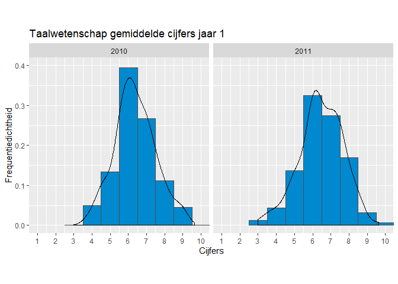
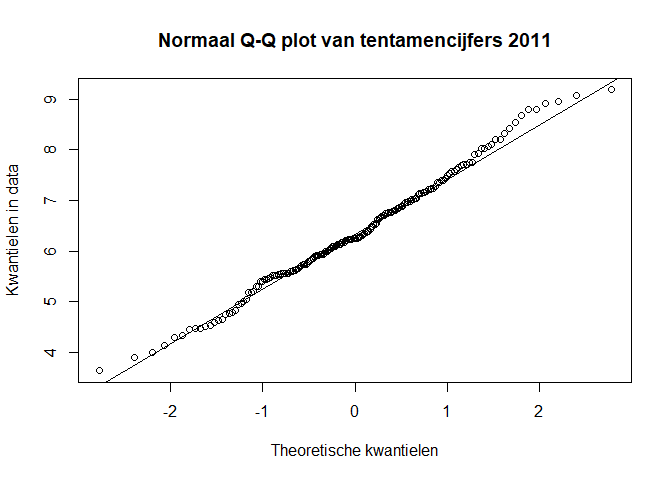
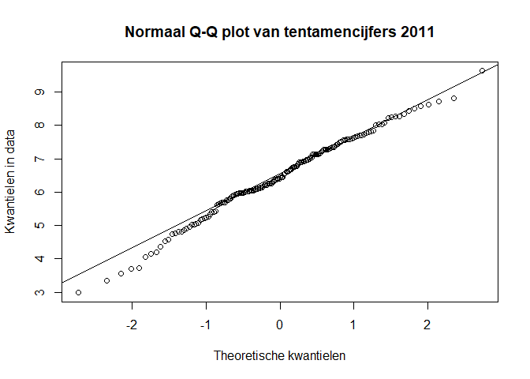
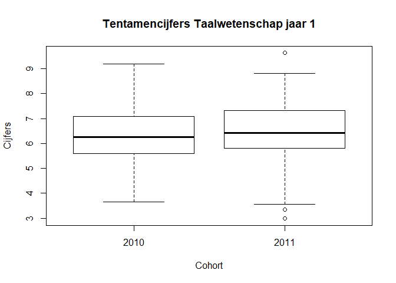

<style>
<!--html_preserve--><style>
<!--html_preserve-->/* Stylesheet Statistisch Handboek */

/* Title */
h1.title {
    opacity: 1;
    text-align: left;
    color: #158CBA;
}

/* Casus */
#casus {
    display: block;
    padding: 9.5px;
    margin: 0 0 10px;
    font-size: 14px;
    line-height: 2;
    color: #000000;
    background-color: #f5f5f5;
    border: 1px solid #158CBA;
    border-radius: 4px;
}

/* Empty data */
.empty{
    display: block;
    color: #FF0000;
}

/* Klippy */
.btn-klippy .octicon {
    display: inline-block;
    margin: 2px;
    padding: 2px;
    width: 15px !important;
}

/* Main container */
.main-container {
    margin-top: 50px;
}

/* Toetsmatrix */
table.toetsmatrix {
    text-align: center;
    margin: 5px;
    padding: 5px;
}


td.header1 {
    font-weight: bold;
    color: #FFFFFF;
    background-color: #158CBA;
    text-align: center;
}

td.header2 {
    font-weight: bold;
    color: #FFFFFF;
    background-color: #A6A6A6;
    text-align: center;
}

td.header3 {
    font-weight: bold;
    background-color: #D9D9D9;
    text-align: center;
}

table.toetsmatrix td {
    border-color: #000000 !important;
    padding: 10px;
}

td.innercell{
    border: 1px solid #000000;
}

td.innercell a {
    text-decoration: none;
}

td.innercell a:hover {
    text-decoration: underline;
}

td.published {
    color: #158cba;
}

td.unpublished, td.unpublished a {
    color: #A6A6A6;
}

td.unpublished a:hover {
    color: #A6A6A6;
    text-decoration: none;
}

/* Footer */
#footer {
 color: #808080
 background-image: url('images/VPO_logo_studiedata.png');;
 background-repeat: no-repeat;
 background-position: right;
 background-size: 230px auto;
 padding-right: 242px;
}

</style>

<div class="navbar navbar-default  navbar-fixed-top" role="navigation">
  <div class="container">
    <div class="navbar-header">
      <button type="button" class="navbar-toggle collapsed" data-toggle="collapse" data-target="#navbar">
        <span class="icon-bar"></span>
        <span class="icon-bar"></span>
        <span class="icon-bar"></span>
      </button>
      <a class="navbar-brand" href="/Users/theo/Dropbox/Bitbucket/sho_skeleton/_site/index.html">Statistisch Handboek Hoger Onderwijs</a>
    </div>
    <div id="navbar" class="navbar-collapse collapse">
      <ul class="nav navbar-nav">
        <li>
  <a href="/Users/theo/Dropbox/Bitbucket/sho_skeleton/_site/Toetsmatrix.html">Toetsmatrix</a>
</li>
<li>
  <a href="/Users/theo/Dropbox/Bitbucket/sho_skeleton/_site/Over.html">Over</a>
</li>
<li>
  <a href="/Users/theo/Dropbox/Bitbucket/sho_skeleton/_site/Licentie.html">Licentie</a>
</li>
      </ul>
      <ul class="nav navbar-nav navbar-right">

      </ul>
    </div><!--/.nav-collapse -->
  </div><!--/.container -->
</div><!--/html_preserve-->

<style>
  .col2 {
    columns: 2 200px;
    -webkit-columns: 2 200px;
    -moz-columns: 2 200px;
  }
</style><!--/html_preserve-->
</style>


<!-- ## BLOK: Functiedefinities.R -->

<!-- ## /BLOK: Functiedefinities.R -->

<!-- ## BLOK: Data-aanmaken.R -->

<!-- ## /BLOK: Data-aanmaken.R -->


# Toepassing
Gebruik de *t-toets* om te toetsen of de gemiddeldes van twee groepen aan elkaar gelijk zijn. Gebruik de *ongepaarde t-toets* om de gemiddelden van twee onafhankelijke groepen te vergelijken.[^1]

# Onderwijscasus
<div id = "casus">
Vanaf 2011 heeft de opleiding Taalwetenschap een Bindend Studieadvies (BSA) die de selectiviteit van het eerste jaar moet vergroten. Zij vraagt zich af of het gemiddelde cijfer van de opleiding Taalwetenschap op 1 februari, na invoering van het BSA, gestegen is. De data is beschikbaar voor het cohort gestart in 2010 en voor het cohort gestart in 2011.

H~0~: Het gemiddelde tentamencijfer dat de studenten halen aan de opleiding Taalwetenschap is niet veranderd na de invoer van het BSA, µ~0~ = µ~1~  

H~A~: Het gemiddelde tentamencijfer dat de studenten halen aan de opleiding Taalwetenschap is veranderd na de invoer van het BSA, µ~0~ ≠ µ~1~
</div>

# Assumpties
Voor een betrouwbaar resultaat moet de data aan een aantal voorwaarden voldoen voordat de toets uitgevoerd kan worden.

## Normaliteit  
De *t-toets* gaat ervan uit dat de data normaal verdeeld is. Bij een n > 100 kan ervanuit gegaan worden dat de *t-toets* robuust genoeg is om uit te voeren zonder dat de data een normale verdeling volgt.[^2]  

Controleer de assumptie van normaliteit met de volgende stappen:  
1. Controleer de data visueel met een histogram, een Q-Q plot of een boxplot. 
2. Toets of de data normaal verdeeld is met de *Kolmogorov-Smirnov test* of bij een kleinere steekproef (n < 50[^3]) met de *Shapiro-Wilk test*.[^4]  
3. Als blijkt dat de data niet normaal verdeeld is, transformeer de data eventueel en bepaal daarna of deze wel normaal verdeeld is. 

Als er geen sprake is van normaliteit en *n* is niet groter dan 100, gebruik de *Mann-Whitney U toets*, ook bekend als de *Wilcoxon rank-sum toets*.[^5]  

## Homogeniteit van varianties 
Toets met de *Levene’s Test (for equality of variance)* of de spreiding van iedere groep ongeveer hetzelfde is. Bij een *p* < 0,05 is de spreiding van de groepen significant verschillend.

# Effectmaat
Bereken de effectmaat om te bepalen of de gevonden p-waarde betekenisvol is. Een veel gebruikte effectmaat is Cohen's *d*. Cohen's *d* geeft de sterkte van het effect van een onafhankelijke variabele op een afhankelijke variabele weer.  

Een indicatie om *d* te interpreteren is: rond 0,3 is het een klein effect, rond 0,5 is het een gemiddeld effect en rond 0,8 is het een groot effect.[^7]

# Uitvoering in R
Er is een dataset ingeladen met gemiddelde cijfers van tweedejaarsstudenten bij de opleiding Taalwetenschap: `Cijfers_gem`. De data bevat cijfers van 180 studenten begonnen in 2010 en cijfers van 160 studenten begonnen in 2011.

## De data bekijken
De data is verdeeld in 2 kolommen: het cijfer en het cohort.
<!-- ## BLOK: Data-bekijken.R -->

```r
## Eerste 10 observaties
head(Cijfers_gem)
##   Cijfers Cohort
## 1   5.548   2010
## 2   6.520   2010
## 3   5.297   2010
## 4   8.214   2010
## 5   6.695   2010
## 6   5.315   2010

## Laatste 10 observaties
tail(Cijfers_gem)
##     Cijfers Cohort
## 335   6.247   2011
## 336   7.185   2011
## 337   7.264   2011
## 338   7.132   2011
## 339   5.763   2011
## 340   4.814   2011
```
<!-- ## /BLOK: Data-bekijken.R -->

Selecteer beide groepen en sla deze op in een vector om deze makkelijker aan te kunnen roepen. 
<!-- ## BLOK: Data-selecteren.R -->

```r
Cijfers_2010 <- Cijfers_gem[Cijfers_gem$Cohort == 2010,1]
Cijfers_2011 <- Cijfers_gem[Cijfers_gem$Cohort == 2011,1]
```
<!-- ## /BLOK: Data-selecteren.R -->

Inspecteer de data met `length()`, `mean()`en `sd()` om meer inzicht te krijgen in de data.
<div class="col2">
<!-- ## BLOK: Data-beschrijven-t1.R -->

```r
## Aantallen, gemiddelde en standaarddeviatie 2010
length(Cijfers_2010)
## [1] 180
mean(Cijfers_2010)
## [1] 6.369189
sd(Cijfers_2010)
## [1] 1.117662
```
<!-- ## /BLOK: Data-beschrijven-t1.R -->

*n* = 180
Gemiddeld tentamencijfer 2010  
(standaarddeviatie): 6,37 (1,12)

<!-- ## BLOK: Data-beschrijven-t2.R -->

```r
## Aantallen, gemiddelde en standaarddeviatie 2011
length(Cijfers_2011)
## [1] 160
mean(Cijfers_2011)
## [1] 6.462363
sd(Cijfers_2011)
## [1] 1.199976
```
<!-- ## /BLOK: Data-beschrijven-t2.R -->

*n* = 160
Gemiddeld tentamencijfer 2011  
(standaarddeviatie): 6,46 (1,2)
</div>

## Visuele inspectie van normaliteit
Geef de data visueel weer met een histogram, Q-Q plot of boxplot.

### Histogram
Controleer de data visueel met een histogram. 
<!-- ## BLOK: Histogram.R -->

```r
library(ggplot2)
ggplot(Cijfers_gem,
  aes(x = Cijfers)) +
  geom_histogram(aes(y = ..density..),
                 binwidth = 1,
                 color = "grey30",
                 fill = "#0089CF") +
  facet_wrap(~ Cohort) +
  geom_density(alpha = .2, adjust = 1) +
  ylab("Frequentiedichtheid") +
  scale_x_continuous(
    labels = as.character(seq(1, 10)),
    breaks = seq(1, 10)) +
  coord_fixed(ylim = c(0, 0.4),
              xlim = c(1, 10),
              ratio = 22) +
  labs(title = "Taalwetenschap gemiddelde cijfers jaar 1")
```

<!-- -->
<!-- ## /BLOK: Histogram.R -->
Beide histogrammen laten een belcurve zien vergelijkbaar aan een normale verdeling, veel waardes liggen rondom het gemiddelde.  

### Q-Q plot
Gebruik `qqnorm()` en `qqline()` met `pch = 1` om een Q-Q plot te maken met kleine cirkels. Als over het algemeen de meeste datapunten op de lijn liggen, kan aangenomen worden dat de data normaal verdeeld is.
<div class ="col2">
<!-- ## BLOK: QQplot-t1.R -->

```r
qqnorm(Cijfers_2010, pch = 1,
       main = "Normaal Q-Q plot van tentamencijfers 2011",
       ylab = "Kwantielen in data",
       xlab = "Theoretische kwantielen")
qqline(Cijfers_2010)
```

<!-- -->
<!-- ## /BLOK: QQplot-t1.R -->
<!-- ## BLOK: QQplot-t2.R -->

```r
qqnorm(Cijfers_2011, pch = 1,
       main = "Normaal Q-Q plot van tentamencijfers 2011",
       ylab = "Kwantielen in data",
       xlab = "Theoretische kwantielen")
qqline(Cijfers_2011)
```

<!-- -->
<!-- ## /BLOK: QQplot-t2.R -->
</div>
Bij beide groepen liggen de meeste punten op de lijn behalve bij de uiteinden. De punten bij de uiteinden liggen niet ver van de lijn vandaan, waardoor vermoedelijk de data normaal verdeeld is.

### Boxplot
Controleer de data visueel met een boxplot. De boxplotten geven de spreiding weer van het gemiddelde tentamencijfer per periode voor de Lerarenopleiding. De box geeft de middelste 50% van de tentamencijfers weer. De zwarte lijn binnen de box is de mediaan. In de staarten zitten de eerste 25% en de laatste 25%. Cirkels visualiseren uitbijters. 

<!-- ## BLOK: Boxplot.R -->

```r
boxplot(Cijfers ~ Cohort, Cijfers_gem,
        main = "Tentamencijfers Taalwetenschap jaar 1")
```

<!-- -->
<!-- ## /BLOK: Boxplot.R -->

De boxplotten geven de spreiding weer van het gemiddelde tentamencijfer voor de BSA en na de BSA. De boxplotten en de staarten lijken symmetrisch, dit kan een teken zijn van normaal verdeelde data. Het cohort van 2011 heeft een aantal uitbijters. Uitbijters kunnen invloed uitoefenen op de uitkomst van toetsen [^10]. Kijk of de uitbijters bepalend zijn voor de uitkomst van een toets en bepaal wat je met een uitbijter doet.

Om te controleren of de data, ondanks eventuele afwijkende punten of een scheef lijkende verdeling, normaal verdeel is, kan de normaliteit getoets worden. Hierbij een toelichting bij twee veel gebruikte toetsen: de *Kolmogorov-Smirnov test* en de *Shapiro-Wilk test*.

### Kolmogorov-Smirnov (met Lilliefors correctie)
De *Kolmogorov-Smirnov test* toetst het verschil in vorm tussen de twee verdelingen. In deze casus toetst deze test het verschil tussen een normale verdeling en de verdeling van de steekproef. De Lilliefors correctie wordt gebruikt als het gemiddelde niet 0 is en de standaardafwijking niet 1 is. Als de p-waarde < 0,05 is de verdeling van de data significant verschillend van de normale verdeling.

<!-- ## BLOK: Library-nortest -->

```r
library(nortest)
```
<!-- ## /BLOK: Library-nortest -->
<div class="col2">
<!-- ## BLOK: Lilliefors-test -->

```r
lillie.test(Cijfers_2010)
```

```
## 
## 	Lilliefors (Kolmogorov-Smirnov) normality test
## 
## data:  Cijfers_2010
## D = 0.05404, p-value = 0.2244
```

```r
lillie.test(Cijfers_2011)
```

```
## 
## 	Lilliefors (Kolmogorov-Smirnov) normality test
## 
## data:  Cijfers_2011
## D = 0.061106, p-value = 0.1526
```
<!-- ## /BLOK: Lilliefors-test -->
</div>

Bij deze casus is van beide groepen de p-waarde > 0,05; er is geen significant verschil gevonden tussen de verdeling van de steekproef en de normale verdeling. De *ongepaarde t-toets* kan uitgevoerd worden.

### Shapiro-Wilk Test
De *Shapiro-Wilk test* is een soortgelijke test als de *Kolmogorov-Smirnov test* en wordt vooral gebruikt bij kleine steekproeven. Als de p-waarde < 0,05 is de verdeling van de data significant verschillend van de normale verdeling.
<div class="col2">
<!-- ## BLOK: Shapiro-Wilk-test -->

```r
shapiro.test(Cijfers_2011_n30)
```

```
## 
## 	Shapiro-Wilk normality test
## 
## data:  Cijfers_2011_n30
## W = 0.99057, p-value = 0.3678
```

```r
shapiro.test(Cijfers_2010_n30)
```

```
## 
## 	Shapiro-Wilk normality test
## 
## data:  Cijfers_2010_n30
## W = 0.98796, p-value = 0.9765
```
<!-- ## /BLOK: Shapiro-Wilk-test -->
</div>

In dit voorbeeld, met een kleine *n*, hebben beide groepen een p-waarde > 0,05, dus is de verdeling van beide groepen niet significant verschillend van de normale verdeling. De *ongepaarde t-toets* kan uitgevoerd worden.


***
## Test assumpties: Levene's test
Test met de Levene's test de homogeniteit van varianties. Als uit de *Levene's test* komt dat de steekproeven verschillen in variantie kan de *ongepaarde t-toets* met ongelijke varianties uitgevoerd worden. 
<!-- ## BLOK: Levenes-test -->

```r
library(car)
leveneTest(Cijfers_gem$Cijfers, Cijfers_gem$Cohort)
## Levene's Test for Homogeneity of Variance (center = median)
##        Df F value Pr(>F)
## group   1  0.9201 0.3381
##       338
```
<!-- ## /BLOK: Levenes-test -->
*F*(1, 338) = 0,92, p-waarde = 0,34, de groepen zijn niet verschillend in spreiding.  
Vrijheidsgraden bestaat nu uit twee cijfers, het eerste cijfer (het aantal groepen - 1 = 1) en de tweede cijfer (*n~1~* + *n~2~* - 2 = 338)

## Ongepaarde t-toets
Voer een ongepaarde `t.test()` uit met `paired = FALSE` en `var.equal = TRUE`. Als uit de *Levene's test* komt dat de groepen verschillen in variantie, gebruik `var.equal = FALSE` .
<!-- ## BLOK: T-test -->

```r
t.test(Cijfers ~ Cohort, Cijfers_gem, paired = FALSE, var.equal = TRUE)
```

```
## 
## 	Two Sample t-test
## 
## data:  Cijfers by Cohort
## t = -0.74109, df = 338, p-value = 0.4592
## alternative hypothesis: true difference in means is not equal to 0
## 95 percent confidence interval:
##  -0.3404741  0.1541269
## sample estimates:
## mean in group 2010 mean in group 2011 
##           6.369189           6.462363
```
<!-- ## /BLOK: T-test -->


* Vrijheidsgraden, *df* = *n* -1 = 339-1 = 338  
* p-waarde < 0,05, dus de H~0~ wordt verworpen en de H~A~ wordt aangenomen
* *t* (339) = -0,74, *p* < 0,01
* 95%-betrouwbaarheidsinterval: bij het herhalen van het onderzoek zal in 95% van de gevallen de µ in het interval vallen. In deze casus is het interval tussen -0,34 en 0,15.


### Effectmaat: Cohen's d 
Gebruik `cohen.d()` met `paired = FALSE` om het effect te meten.
<!-- ## BLOK: Cohens-d-test -->

```r
library(effsize)
cohen.d(Cijfers_2010, Cijfers_2011, paired = FALSE)
```

```
## 
## Cohen's d
## 
## d estimate: -0.08052247 (negligible)
## 95 percent confidence interval:
##      lower      upper 
## -0.2943307  0.1332858
```
<!-- ## /BLOK: Cohens-d-test -->

*d* = -0,08. De sterkte van het effect van de tutor op het cijfer is minimaal. 


# Rapportage
Een *ongepaarde t-toets* is uitgevoerd om te toetsen of het gemiddelde tentamencijfer is veranderd na de invoer van het BSA. Het verschil tussen het gemiddelde tentamencijfer van cohort 2010 (*M~2010~* = 6,37, *SD~2010~* = 1,12) en het gemiddelde tentamencijfer van cohort 2011 (*M~2011~* =6,46, *SD~2011~* = 1,2) is significant, *t* (338) = -0,74, *p* < 0,01. Het 95% betrouwbaarheidsinterval voor het verschil tussen het gemiddelde van beide groepen is van -0,34 tot 0,15. Het effect is minimaal, *d* = -0,08.

TODO Aan de hand van de resultaten kan geconcludeerd worden dat de studenten, na een gesprek met de tutor, de opleiding beter beoordelen dan daarvoor. Het effect is echter minimaal.

[^1]: van Geloven, N. (25 maart 2016). *T-toets*. https://wikistatistiek.amc.nl/index.php/T-toets#ongepaarde_t-toets
[^2]: Lumley, T., Diehr, P., Emerson, S., & Chen, L. (2002). Tthe importance of the normality assumption in large public health data sets. *Annu Rev Public Health, 23*, 151-69. doi: 10.1146/annurev.publheath.23.100901.140546 http://rctdesign.org/techreports/arphnonnormality.pdf 
[^3]: van Geloven, N. (25 september 2013). *Wilcoxon signed rank toets*. https://wikistatistiek.amc.nl/index.php/Wilcoxon_signed_rank_toets
[^4]: Laerd statistics (2018). *Testing for Normality using SPSS Statistics*. https://statistics.laerd.com/spss-tutorials/testing-for-normality-using-spss-statistics.php  
[^5]: van Geloven, N. (13 maart 2018). *Mann-Whitney U toets*. https://wikistatistiek.amc.nl/index.php/Mann-Whitney_U_toets
[^6]: Universiteit van Amsterdam (8 juli 2014). *One-way ANOVA*. https://wiki.uva.nl/methodologiewinkel/index.php/One-way_ANOVA
[^7]: Marshall, E., & Boggis, E. (2016). *The statistics tutor’s quick guide to commonly used statistical tests*. http://www.statstutor.ac.uk/resources/uploaded/tutorsquickguidetostatistics.pdf 
