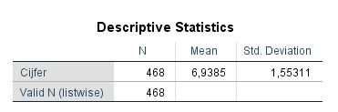
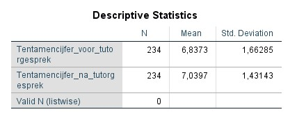
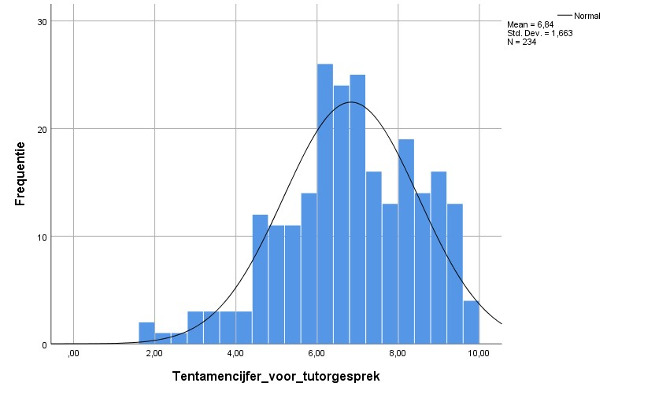
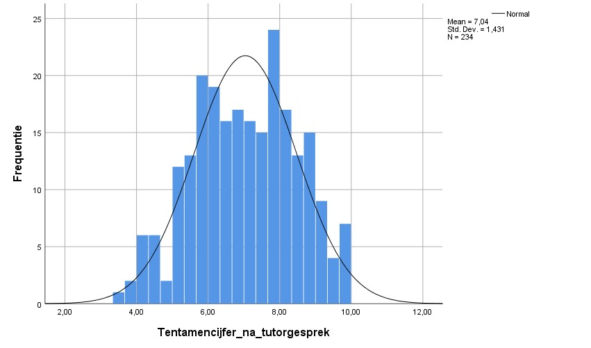
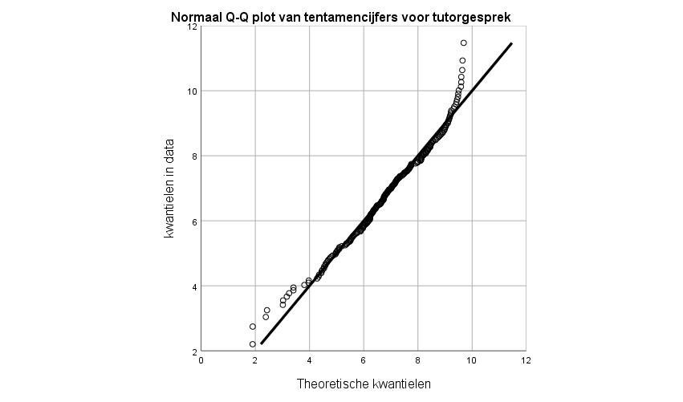
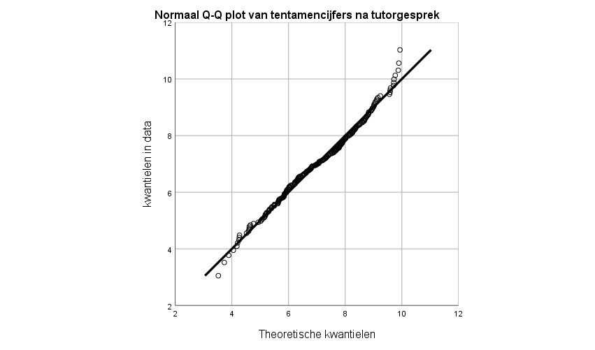

<style>
`r htmltools::includeHTML(paste0(here::here(),"/03. Includes/css/Stylesheet_SHHO.css"))`
</style>

```{r header, include = FALSE, echo = TRUE, results='asis'} 
paste0(here::here(),"/03. Includes/code/Header.R")
```

```{r functiedefinities,include=FALSE, echo=TRUE}
library(stringr)
Round_and_format <- function(x, digits = 2) {
  x <- as.character(round(x, digits))
  x <- str_replace(x, "[.]", ",")
  return(x)
}
```
<!-- ## /BLOK: Functiedefinities.R -->

```{r opmerking, include=FALSE, eval=FALSE}
# doorlinken naar de Wilcoxon Signed Rank Test
# linken naar blz transformeren data 
```

# Toepassing
Gebruik de *gepaarde t-toets* om te toetsen of bij een herhaalde meting de gemiddeldes van een groep aan elkaar gelijk zijn.[^1] 


# Onderwijscasus
<div id ="casus">
Ter voorbereiding op een visitatie vraagt de opleidingsdirecteur van de lerarenopleiding zich af of het gemiddelde tentamencijfer veranderd na een tutorgesprek. Ze bekijkt het gemiddelde tentamencijfer van de onderwijsperiode voor het tutorgesprek (T~0~) en het gemiddelde cijfer van de onderwijsperiode na het tutorgesprek (T~1~). 

H~0~: Het gemiddelde tentamencijfer per onderwijsperiode verandert niet na het tutorgesprek, µ~T0~ = µ~T1~  

H~A~: Het gemiddelde tentamencijfer per onderwijsperiode verandert na het tutorgesprek, µ~T0~ ≠ µ~T1~ 
</div>

# Assumpties
Om een valide resultaat te bereiken moeten, voordat de toets kan worden uitgevoerd, de data aan een aantal voorwaarden voldoen.

## Normaliteit
De *t-toets* gaat ervan uit dat de data normaal verdeeld zijn. Ga er bij een *n* > 100 vanuit dat de *t-toets* robuust genoeg is om uit te voeren zonder dat de data een normale verdeling volgt.[^2]   

Controleer de assumptie van normaliteit met de volgende stappen:  
1. controleer de data visueel met een histogram, een Q-Q plot of een boxplot.
2. Toets of de data normaal verdeeld is met de *Kolmogorov-Smirnov test* of bij een kleinere steekproef (n < 50) met de *Shapiro-Wilk test*.[^3] [^4]  

Als blijkt dat de data niet normaal verdeeld zijn, transformeer de data eventueel en bepaal daarna of deze wel normaal verdeeld is. 

Als er geen sprake is van normaliteit gebruik de *Wilcoxon Signed Rank Test*.[^5] [^6]

# Effectmaat
Bereken de effectmaat om te bepalen of de gevonden p-waarde betekenisvol is. Een veel gebruikte effectmaat is Cohen's *d*. Cohen's *d* geeft de sterkte van het effect van een onafhankelijke variabele op een afhankelijke variabele weer.  
Een indicatie om *d* te interpreteren is: rond 0,3 is een klein effect, rond 0,5 is een gemiddeld effect en rond 0,8 is een groot effect.[^7]  

# Uitvoering
Er is een dataset ingeladen met gemiddelde tentamencijfer voor (T~0~) en na (T~1~) een tutorgesprek: `Tentamencijfers`. 

## De data bekijken
Klik het tabblad Data View aan om de data te bekijken. Klik het tabblad Variable View aan om de eigenschappen van alle variabelen te bekijken en eventueel aan te passen.

Krijg meer inzicht in de dataset door het gemiddelde en de spreiding te bekijken.

Klik op `Analyze` > `Descriptive Statistics` > `Descriptives`. Selecteer de gewenste variabele en plaats deze in het vakje `Variable`. Vink bij options het gemiddelde (`Mean`) en de standaard deviatie (`Std. deviation`) aan en klik op `Continue`. Klik op `OK` om meteen naar de output te gaan of klik op `Paste` om de code in de Syntax te zetten.

<!-- ## BLOK: Data-beschrijven.SPSS -->
```{r de data bekijken, eval=FALSE}
* Gemiddelde en standaarddeviatie.
DESCRIPTIVES VARIABLES=Cijfer
  /STATISTICS=MEAN STDDEV.
```

<!-- ## /BLOK: Data-bekijken.SPSS -->


* Gemiddeld Cijfer (standaardafwijking): 6,94 (1,55). *n* = 468.

Selecteer beide groepen en sla deze op in een variabele om deze makkelijker aan te kunnen roepen. Klik op `Transform` > `Compute variable...`. Vul bij `Target Variable:` de nieuwe naam in (in dit geval Tentamencijfer_voor_tutorgesprek of Tentamentcijfer_na_tutorgesprek) en de waarde van deze nieuwe variabele bij .. Om een conditie aan de variabele toe te voegen klik op `if` en seleceteer `Include if case satisfies condition:`. Vul vervolgens de gewenste conditie in (in dit geval: Voor_of_na_tutorgesprek = 1 of = 2). Klik op `OK` om de variabele toe te voegen aan de dataset. 
<!-- ## BLOK: Data-selecteren.SPSS -->
```{r de data bekijken, eval=FALSE}
* Nieuwe variabele aanmaken.
IF  (Voor_of_na_tutorgesprek = 1) Tentamencijfer_voor_tutorgesprek=Cijfer.
EXECUTE.
```

Volg vervolgens bovenstaande stappen om van de nieuwe variabele(n) het gemiddelde te bekijken.

<!-- ## /BLOK: Data-bekijken.SPSS -->



</div>

* Gemiddeld tentamencijfer voor tutorgesprek (standaardafwijking): 6,84 (1,66). *n* = 234.
* Gemiddeld tentamencijfer na tutorgesprek (standaardafwijking): 7,04 (1,43). *n* = 234.

## Visuele inspectie van normaliteit
Geef normaliteit visueel weer met een histogram, boxplot of Q-Q plot. 

### Histogram
Klik op `Graphs` > `Legacy Dialogs` en vervolgens op het gewenste figuur, in dit geval `Histogram...`. Selecteer de gewenste variabele en plaats deze in het vakje `Variable`. Klik op `OK` om meteen naar de output te gaan of klik op `Paste` om de code in de Syntax te zetten. Voor een density curve ga naar de `chart editor` (dubbelklik op het figuur). Klik op `Elements` > `Hide Distribution Curve`.

<!-- ## BLOK: Histogram.SPSS -->
```{r histogram, eval=FALSE}
* Histogram.
GRAPH
  /HISTOGRAM=Tentamencijfer_voor_tutorgesprek.
```
<!-- ## /BLOK: Histogram.SPSS -->
 

Beide histogrammen laten een Bell Curve zien vergelijkbaar met een normale verdeling: veel waardes liggen rondom de gemiddeldes. Opvallend is dat het histogram van voor het tutorgesprek veel waardes in de linkerstaart van de verdeling heeft liggen.  

### Q-Q plot
Klik op `Analyze` > `Desctiptive Statistics` > `Q-Q Plots...`. Selecteer de gewenste variabele(n) en plaats deze in het vakje `Variables`. Klik op `OK` om meteen naar de output te gaan of klik op `Paste` om de code in de Syntax te zetten.

Als over het algemeen de meeste datapunten op de lijn liggen, kan aangenomen worden dat de data normaal verdeeld zijn.
<!-- ## BLOK: QQplot.R -->
```{r qqplot, eval=FALSE}
* QQ-Plot.
PPLOT
  /VARIABLES=Tentamencijfer_voor_tutorgesprek Tentamencijfer_na_tutorgesprek
  /NOLOG
  /NOSTANDARDIZE
  /TYPE=Q-Q
  /FRACTION=BLOM
  /TIES=MEAN
  /DIST=NORMAL.
```


<!-- ## /BLOK: QQplot.R -->
 

In deze casus liggen de meeste punten op de lijn behalve bij de uiteinden. 

### Boxplot
De box geeft de middelste 50% van de tentamencijfers weer. De zwarte lijn binnen de box is de mediaan. In de staarten zitten de eerste 25% en de laatste 25%. Cirkels visualiseren mogelijke uitbijters.[^8]  

<!-- ## BLOK: Boxplot.R -->
``` {r Boxplot}
## Boxplot
boxplot(Cijfer ~ Voor_of_na_tutorgesprek, Tentamencijfers,
        main = "Boxplot van tentamencijfers lerarenopleiding")
```
<!-- ## /BLOK: Boxplot.R -->

De boxplotten geven de spreiding weer van het gemiddelde tentamencijfer per periode voor de lerarenopleiding. De boxplot en de staarten van T~0~ zijn niet helemaal symmetrisch. Het gaat om een kleine afwijking, daarom is de data vermoedelijk normaal verdeeld. Er zijn een aantal mogelijke uitbijters. De boxplot van T~1~ ziet er symmetrisch uit. Er zijn geen uitbijters.[^9]    

## Toetsen van normaliteit
Om te controleren of de data normaal verdeeld zijn, kan de normaliteit getoetst worden. Hierbij een toelichting bij twee veel gebruikte toetsen: de *Kolmogorov-Smirnov test* en de *Shapiro-Wilk test*.


### Kolmogorov-Smirnov 
De *Kolmogorov-Smirnov test* toetst het verschil tussen twee verdelingen. Standaard toetst deze test het verschil tussen een normale verdeling en de verdeling van de steekproef. De Lilliefors correctie wordt gebruikt als het gemiddelde niet 0 is en de standaardafwijking niet 1 is. Als de p < 0,05 is, is de verdeling van de data statistisch significant verschillend van de normale verdeling.

<!-- ## BLOK: Library-nortest.R -->
```{r library nortest, warning=FALSE}
library(nortest)
```
<!-- ## /BLOK: Library-nortest.R -->
<div class ="col2">
<!-- ## BLOK: Lilliefors-test.R -->
``` {r Lilliefors Test, warning=FALSE}
lillie.test(
  Tentamencijfer_voor_tutorgesprek)
lillie.test(
  Tentamencijfer_na_tutorgesprek)
```
<!-- ## /BLOK: Lilliefors-test.R -->
</div>

Van beide groepen is de p > 0,05; er is geen statistisch significant verschil gevonden tussen de verdeling van de steekproef en de normale verdeling. De *gepaarde t-toets* kan uitgevoerd worden. 

### Shapiro-Wilk Test
De *Shapiro-Wilk test* is een soortgelijke test als de *Kolmogorov-Smirnov test* en wordt vooral gebruikt bij kleine steekproeven (n < 50). Als de p < 0,05 is, is de verdeling van de data significant verschillend van de normale verdeling.

Er zijn 2 steekproeven van `Tentamencijfers` ingeladen: `Tentamencijfer_voor_tutorgesprek_n30` (T~0~) en `Tentamencijfer_na_tutorgesprek_n30` (T~1~), *n~T0~* = `r length(Tentamencijfer_voor_tutorgesprek_n30)` , *n~T1~* = `r length(Tentamencijfer_na_tutorgesprek_n30)` 

<div class ="col2">
<!-- ## BLOK: Shapiro-Wilk-test.R -->
``` {r Shapiro-Wilk Test, warning=FALSE}
shapiro.test(
  Tentamencijfer_voor_tutorgesprek_n30)
shapiro.test(
  Tentamencijfer_na_tutorgesprek_n30)
```
<!-- ## /BLOK: Shapiro-Wilk-test.R -->
</div>

Voorbeide groepen is de *p* > 0,05, dus er is geen statistisch significant verschil gevonden tussen de verdeling van de steekproef en de normale verdeling. De *gepaarde t-toets* kan uitgevoerd worden.  

## Gepaarde t-toets
Gebruik `t.test()` met `paired = TRUE` om een *gepaarde t-toets* uit te voeren. 

Er is een dataset ingeladen met `Tentamencijfer_voor_tutorgesprek` (T~0~) en met `Tentamencijfer_na_tutorgesprek` (T~1~), *n~T0~* = `r vN_t0`, *n~T1~* = `r vN_t1`. 

De *gepaarde t-toets* wordt uitgevoerd om de vraag te beantwoorden of het gemiddelde tentamencijfer verandert na een tutorgesprek. De verwachting is dat de studenten hoger scoren, maar omdat het relevant om te weten of de studenten ook lager scoren na een gesprek is er voor gekozen om tweezijdig te toetsen. 

<!-- ## BLOK: T-toets -->
```{r T-test}
t.test(Cijfer ~ Voor_of_na_tutorgesprek, Tentamencijfers, paired = TRUE)
```
<!-- ## BLOK: T-toets -->
```{r T-test als object, echo = FALSE}
t <- t.test(Cijfer ~ Voor_of_na_tutorgesprek, Tentamencijfers, paired = TRUE)
vT_waarde <- Round_and_format(t$statistic)
vN <- t$parameter+1
vDF <- t$parameter
vconf.int1 <- Round_and_format(t$conf.int[1])
vconf.int2 <- Round_and_format(t$conf.int[2])
vDiffMean <- Round_and_format(t$estimate*-1)
```
* *t* ~`r vDF`~ = `r vT_waarde`, *p* << 0,05
* Vrijheidsgraden, *df* = *n* -1 = `r vN`-1 = `r vDF`  
* p-waarde < 0,05, dus de H~0~ wordt verworpen en de H~A~ wordt aangenomen [^10]
* 95%-betrouwbaarheidsinterval: bij het herhalen van het onderzoek zal in 95% van de gevallen de µ in het interval vallen. In deze casus is het interval tussen `r vconf.int1` en `r vconf.int2`.
* het absolute verschil tussen de twee groepen: `r vDiffMean` 

### Effectmaat: Cohen's d
Gebruik `cohen.d()` met `paired = TRUE` om de effectgrootte te meten.
<!-- ## BLOK: Cohens-d-test.R -->
```{r Cohens d}
library(effsize)
cohen.d(Cijfer ~ Voor_of_na_tutorgesprek, Tentamencijfers, paired = TRUE)
```
<!-- ## /BLOK: Cohens-d-test.R -->
```{r var Cohens d, echo = FALSE}
d <- cohen.d(Cijfer ~ Voor_of_na_tutorgesprek, Tentamencijfers, paired = TRUE)
vD_waarde <- Round_and_format(d$estimate)
```
*d* = `r vD_waarde`. De sterkte van het effect van de tutor op het cijfer is minimaal. 

# Rapportage
Een *gepaarde t-toets* is uitgevoerd om te toetsen of het gemiddelde tentamencijfer van de studenten gelijk is gebleven na een gesprek met hun tutor. Het verschil tussen het gemiddelde van T~0~ (*M~T0~* = `r vMean_t0`, *SD~T0~* = `r vSD_t0`) en het gemiddelde van T~1~ (*M~T1~* =`r vMean_t1`, *SD~T1~* = `r vSD_t1`) is significant, *t* ~`r vDF`~ = `r vT_waarde`, *p* < 0,01. Het 95% betrouwbaarheidsinterval voor het verschil tussen het gemiddelde van beide groepen is van `r vconf.int1` tot `r vconf.int2`. Het valt op dat het gemiddelde van T~1~ hoger is dan van T~0~. Het effect is echter verwaarloosbaar klein, *d* = `r vD_waarde`. 


| Meting     | N         | M            | SD         |
| --------   | --------- | ------------ | ---------- |
| T~0~       | `r vN_t0` | `r vMean_t0` | `r vSD_t0` |
| T~1~       | `r vN_t1` | `r vMean_t1` | `r vSD_t1` |

Aan de hand van de resultaten kan geconcludeerd worden dat de studenten, na een gesprek met de tutor, de opleiding beter beoordelen dan daarvoor. Het effect is verwaarloosbaar klein.  

[^1]: Wikipedia (21 augustus 2019). *student's t-test*. [Wikipedia](https://en.wikipedia.org/wiki/student%27s_t-test).
[^2]: Lumley, T., Diehr, P., Emerson, S., & Chen, L. (2002). Tthe importance of the normality assumption in large public health data sets. *Annu Rev Public Health, 23*, 151-69. doi: 10.1146/annurev.publheath.23.100901.140546 http://rctdesign.org/techreports/arphnonnormality.pdf 
[^3]: van Geloven, N. (25 september2013). *Wilcoxon signed rank toets*. [Wiki Statistiek Academisch Medisch Centrum](https://wikistatistiek.amc.nl/index.php/Wilcoxon_signed_rank_toets).
[^4]: Laerd statistics (2018). *Testing for Normality using SPSS Statistics*. [Testing for Normality using SPSS Statistics](https://statistics.laerd.com/spss-tutorials/testing-for-normality-using-spss-statistics.php).  
[^5]: Universiteit van Amsterdam (14 juli 2014). *Normaliteit*. [UvA Wiki Methodologiewinkel](https://wiki.uva.nl/methodologiewinkel/index.php/Normaliteit).  
[^6]: De *Wilcoxon signed rank toets* maakt een rangschikking van de data. Hierdoor is de test verdelingsvrij en is normaliteit geen assumptie. Ook zijn uitbijters minder van invloed op het eindresultaat. Toch wordt er voor deze test minder vaak gekozen, dit komt doordat bij het maken van een rankschikking de data informatie verliest. Als de data wel normaal verdeeld zijn heeft de *Wilcoxon signed rank toets* minder onderscheidend vermogen, dan wanneer de *one sample t-toets* uitgevoerd zou worden.  
[^7]: Marshall, E., & Boggis, E. (2016). *The statistics tutor’s quick guide to commonly used statistical tests*. http://www.statstutor.ac.uk/resources/uploaded/tutorsquickguidetostatistics.pdf 
[^8]: Outliers (13 augustus 2016). [UvA Wiki Methodologiewinkel](https://wiki.uva.nl/methodologiewinkel/index.php/Outliers).
[^9]: Uitbijters kunnen bepalend zijn voor de uitkomst van toetsen. Bekijk of de uitbijters valide uitbijters zijn en niet een meetfout of op een andere manier incorrect verkregen data. Het weghalen van uitbijters kan de uitkomst ook vertekenen, daarom is het belangrijk om verwijderde uitbijters te melden in een rapport. 
[^10]: In dit voorbeeld wordt eruit gegaan van een waarschijnlijkheid van 95% en zodoende een p-waardegrens van 0,05. Dit is naar eigen inzicht aan te passen. Houdt hierbij rekening met type I en type II fouten.