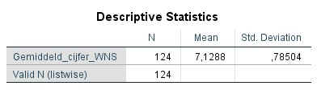
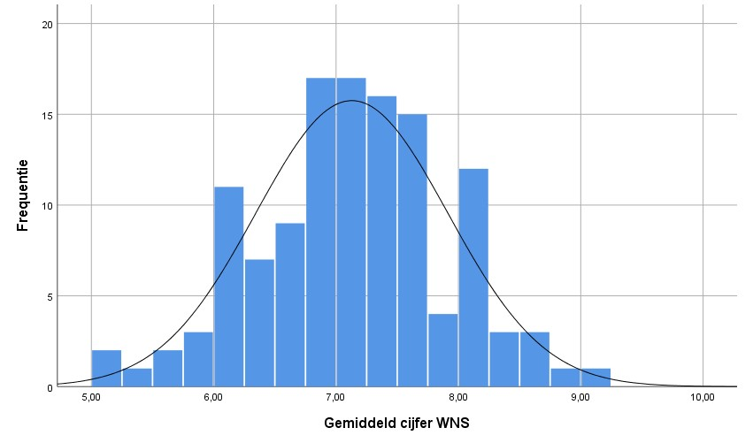
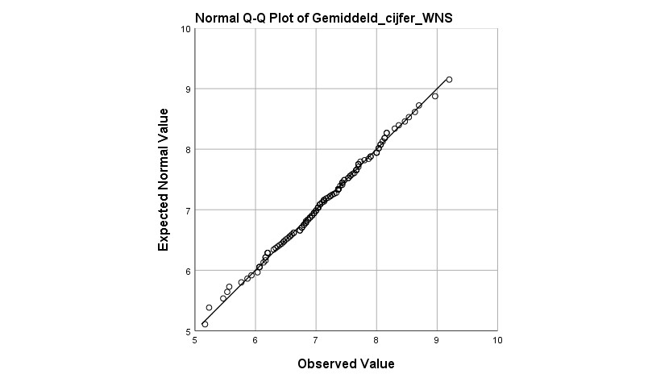
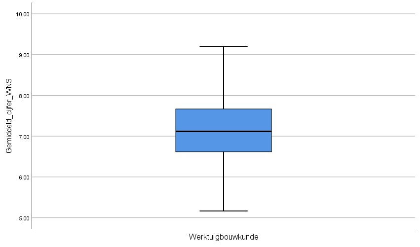
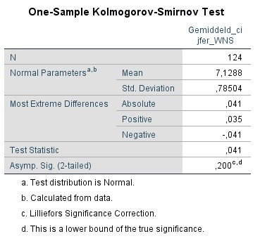
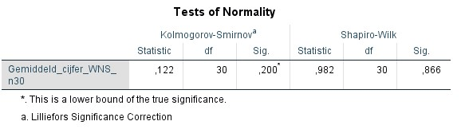
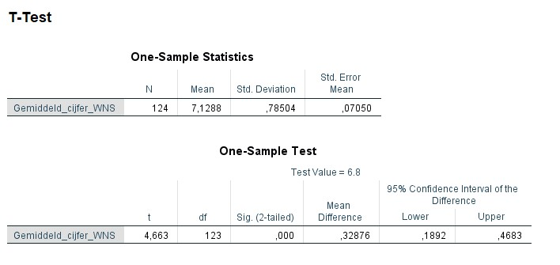

<style>
`r htmltools::includeHTML(paste0(here::here(),"/01. Includes/css/Stylesheet_SHHO.css"))`
</style>

<!-- ## CLOSEDBLOK: Header.R -->
```{r header, include = FALSE, echo = TRUE, results='asis'} 
paste0(here::here(),"/01. Includes/code/Header.R")
```
<!-- ## /CLOSEDBLOK: Header.R -->

```{r opmerking, include=FALSE, eval=FALSE}

```
# Uitvoering in SPSS
Er is een dataset ingeladen met de gemiddelde eindexamencijfers van WNS van eerstejaars Werktuigbouwkunde: `Gemiddeld_cijfer_WNS` .

## De data bekijken
Klik het tabblad Data View aan om de data te bekijken. Klik het tabblad Variable View aan om de eigenschappen van alle variabelen te bekijken en eventueel aan te passen.

Krijg meer inzicht in de dataset door het gemiddelde en de spreiding te bekijken.

Klik op `Analyze` > `Descriptive Statistics` > `Descriptives`.  Vink bij options het gemiddelde (`Mean`) en de standaard deviatie (`Std. deviation`) aan en klik op `Continue`. Klik op `OK` om meteen naar de output te gaan of klik op `Paste` om de code in de Syntax te zetten.

<!-- ## OPENBLOK: Data-beschrijven.SPSS -->
```{r de data bekijken, eval=FALSE}
* Gemiddelde en standaarddeviatie.
DESCRIPTIVES VARIABLES=Gemiddeld_cijfer_WNS
  /STATISTICS=MEAN STDDEV.
```

<!-- ## /OPENBLOK: Data-bekijken.SPSS -->


* Gemiddeld cijfer WNS (standaardafwijking): 7,13 (0,79). *n* = 124.

## Visuele inspectie van normaliteit
Geef normaliteit visueel weer met een histogram, boxplot of Q-Q plot. 

### Histogram
Klik op `Graphs` > `Legacy Dialogs` en vervolgens op het gewenste figuur, in dit geval `Histogram...`. Selecteer de gewenste variabele en plaats deze in het vakje `Variable`. Klik op `OK` om meteen naar de output te gaan of klik op `Paste` om de code in de Syntax te zetten. Voor een density curve ga naar de `chart editor` (dubbelklik op het figuur). Klik op `Elements` > `Hide Distribution Curve`.

<!-- ## OPENBLOK: Histogram.SPSS -->
```{r histogram, eval=FALSE}
* Histogram.
GRAPH
  /HISTOGRAM=Gemiddeld_cijfer_WNS.
```
<!-- ## /OPENBLOK: Histogram.SPSS -->


Het histogram laat een Bell Curve zien vergelijkbaar met een normale verdeling: veel waardes liggen rondom het gemiddelde en weinig bij de staarten van de verdeling. Daarnaast ziet de verdeling er in grote mate symmetrisch uit.

### Q-Q plot
Klik op `Analyze` > `Desctiptive Statistics` > `Q-Q Plots...`. Selecteer de gewenste variabele(n) en plaats deze in het vakje `Variables`. Klik op `OK` om meteen naar de output te gaan of klik op `Paste` om de code in de Syntax te zetten.

Als over het algemeen de meeste datapunten op de lijn liggen, kan aangenomen worden dat de data normaal verdeeld zijn.
<!-- ## OPENBLOK: QQplot.R -->
```{r qqplot, eval=FALSE}
* QQ-Plot.
PPLOT
  /VARIABLES=Gemiddeld_cijfer_WNS
  /NOLOG
  /NOSTANDARDIZE
  /TYPE=Q-Q
  /FRACTION=BLOM
  /TIES=MEAN
  /DIST=NORMAL.
```


<!-- ## /OPENBLOK: QQplot.R -->


In deze casus liggen de meeste punten op de lijn. Bij de uiteinden liggen de punten dichtbij de lijn. 

### Boxplot
De box geeft de middelste 50% van de tentamencijfers weer. De zwarte lijn binnen de box is de mediaan. In de staarten zitten de eerste 25% en de laatste 25%. Cirkels visualiseren mogelijke uitbijters.[^8] 

Klik op `Graphs` > `Legacy Dialogs` > `Boxplot...`. Kies vervolgens voor `Simple`. Kies voor `Summaries of separate variables` en klik op `Define`.  Selecteer de gewenste variabele(n) en plaats deze in het vakje `Boxes Represent`. Klik op `OK` om meteen naar de output te gaan of klik op `Paste` om de code in de Syntax te zetten.

<!-- ## OPENBLOK: Boxplot.R -->
``` {r boxplot, eval=FALSE}
* Boxplot.
EXAMINE VARIABLES=Gemiddeld_cijfer_WNS 
  /COMPARE VARIABLE
  /PLOT=BOXPLOT
  /STATISTICS=NONE
  /NOTOTAL
  /MISSING=LISTWISE.
```

<!-- ## /OPENBLOK: Boxplot.R -->


De boxplot geeft de spreiding van het gemiddelde eindexamencijfer voor de exacte vakken weer van de studenten Werktuigbouwkunde. De box en staarten zien er symmetrisch uit, wat een indicatie is van een normale verdeling.[^9]  

## Toetsen van normaliteit
Om te controleren of de data normaal verdeeld zijn, kan de normaliteit getoetst worden. Hierbij een toelichting bij twee veelgebruikte toetsen: de *Kolmogorov-Smirnov test* en de *Shapiro-Wilk test*.

### Kolmogorov-Smirnov
De *Kolmogorov-Smirnov test* toetst het verschil tussen twee verdelingen. Standaard toetst deze test het verschil tussen een normale verdeling en de verdeling van de steekproef. De Lilliefors correctie wordt gebruikt als het gemiddelde niet 0 is en de standaardafwijking niet 1 is. Als de p < 0,05 is, is de verdeling van de data statistisch significant verschillend van de normale verdeling.

Klik op `Analyze` > `Nonparametric Tests` > `Legacy Dialogs` > `1-Sample K-S...`. Selecteer de gewenste variabele(n) en plaats deze in het vakje `Test Variable List`. Vink bij `Test Distribution` het vakje voor `Normal` aan. Klik op `OK` om meteen naar de output te gaan of klik op `Paste` om de code in de Syntax te zetten.

<!-- ## OPENBLOK: Lilliefors-test.R -->
```{r Kolmogorov-Smirnov Test, eval=FALSE}
* Kolmogorov-Smirnov test.
NPAR TESTS
  /K-S(NORMAL)=Gemiddeld_cijfer_WNS
  /MISSING ANALYSIS.
```

<!-- ## /OPENBLOK: Kolmogorov-Smirnov-test.R -->


Kijk voor het  verschil naar `Asymp. Sig. (2-tailed)`. 

De p-waarde is *p* > 0,05, dus er is geen statistisch significant verschil gevonden tussen de verdeling van de steekproef en de normale verdeling. De *one sample-t-toets* kan uitgevoerd worden.  

### Shapiro-Wilk Test
De *Shapiro-Wilk test* is een soortgelijke test als de *Kolmogorov-Smirnov test* en wordt vooral gebruikt bij kleine steekproeven (n < 50). Als de p < 0,05 is, is de verdeling van de data significant verschillend van de normale verdeling.

Er is een steekproef van `Gemiddeld_cijfer_WNS` ingeladen: `Gemiddeld_cijfer_WNS_n30. De steekproef bevat *n* = 30 studenten.

Klik op `Analyze` > `Descriptive Statistics` > `Explore...`. Selecteer de gewenste variabele(n) en plaats deze in het vakje `Test Variable List`. Vink bij `Plots` het vakje voor `Normality plots with tests` aan en klik op `Continue`. Vink bij `Display` het vakje voor `Plots` aan. Klik op `OK` om meteen naar de output te gaan of klik op `Paste` om de code in de Syntax te zetten. 

<!-- ## OPENBLOK: Shapiro-Wilk-test.R -->
``` {r Shapiro-Wilk Test, eval=FALSE}
* Shapiro-Wilk test.
EXAMINE VARIABLES=Gemiddeld_cijfer_WNS_n30
  /PLOT NPPLOT
  /STATISTICS NONE
  /CINTERVAL 95
  /MISSING LISTWISE
  /NOTOTAL.
```

<!-- ## /OPENBLOK: Shapiro-Wilk-test.R -->


De p-waarde is *p* > 0,05 (`Sig.`), dus er is geen statistisch significant verschil gevonden tussen de verdeling van de steekproef en de normale verdeling. De *one sample-t-toets* kan uitgevoerd worden.

***

##  One sample t-toets
De dataset met `Gemiddeld_cijfer_WNS` is ingeladen met de gemiddelde eindexamencijfers van WNS van eerstejaars Werktuigbouwkunde, *n* = 124. 
De *one sample t-toets* is uitgevoerd om de vraag te beantwoorden of het gemiddelde eindexamencijfer voor de exacte vakken van vwo studenten die beginnen aan de Bachelor Werktuigbouwkunde anders is dan het landelijk gemiddelde (µ = 6,8). De verwachting is dat de studenten hoger scoren, maar omdat het relevant om te weten of de studenten ook lager scoren dan het landelijk gemiddelde is er voor gekozen om tweezijdig te toetsen. 

Klik op `Analyze` > `Compare Means` > `One-Sample T Test...`. Selecteer de gewenste variabele(n), plaats deze in het vakje `Test Variable(s)`. Vul bij `Test Value` het te vergelijkbare gemiddelde in, in dit geval 6,8. *(Let op: gebruik een komma en geen punt)*. Klik op `OK` om meteen naar de output te gaan of klik op `Paste` om de code in de Syntax te zetten.

<!-- ## OPENBLOK: T-test.R -->
```{r ttest, eval=FALSE}
* T-test.
T-TEST
  /TESTVAL=6.8
  /MISSING=ANALYSIS
  /VARIABLES=Gemiddeld_cijfer_WNS
  /CRITERIA=CI(.95).
```



* Vrijheidsgraden, *df* = *n* -1 = 124-1 = 123 
* *t* ~123~ = 4.66, *p* << 0,05
* p-waarde < 0,05, dus de H~0~ wordt verworpen en de H~A~ wordt aangenomen [^10]
* 95%-betrouwbaarheidsinterval: bij het herhalen van het onderzoek zal in 95% van de gevallen de µ in het interval vallen. In deze casus is het interval tussen 6,99 en 7,27
* Het gemiddelde van de steekproef is 7,13  

# Rapportage
De *one sample t-toets* is uitgevoerd om te toetsen of het gemiddelde eindexamencijfer voor de exacte vakken van vwo studenten die Werktuigbouwkunde zijn gaan studeren anders is dan het landelijk gemiddelde. Het gemiddelde van de steekproef (*M* = 7,13, *SD* = 0,79) is statistisch significant hoger dan het landelijk gemiddelde van 6,8, *t* ~`123`~ = 4,66, *p* << 0,05. 

De resultaten ondersteunen de conclusie dat het gemiddelde eindexamencijfer voor de exacte vakken van studenten Werktuigbouwkunde met een vwo vooropleiding hoger ligt dan het landelijk gemiddelde.

```{r footer, include = FALSE, echo = TRUE, results='asis'} 
paste0(here::here(),"/01. Includes/code/Footer.R")
```

[^1]: van Geloven, N. (25 mei 2016). *T-toets* [Wiki Statistiek Academisch Medisch Centrum](https://wikistatistiek.amc.nl/index.php/T-toets#one_sample_t-toets). 
[^2]: Centraal Instituut voor Toetsontwikkeling (2018). *Examenverslag 2018*. https://www.cito.nl/onderwijs/voortgezet-onderwijs/centrale-examens-voortgezet-onderwijs/tools-en-informatie-voor-docenten/examenverslagen/examenverslag-2018
[^3]: Lumley, T., Diehr, P., Emerson, S., & Chen, L. (2002). The importance of the normality assumption in large public health data sets. Annu Rev Public Health, 23, 151-69. doi: 10.1146/annurev.publheath.23.100901.140546 http://rctdesign.org/techreports/arphnonnormality.pdf
[^4]: Laerd statistics (2018). [Testing for Normality using SPSS Statistics](https://statistics.laerd.com/spss-tutorials/testing-for-normality-using-spss-statistics.php).  
[^5]: Normaliteit. (14 juli 2014). [UvA Wiki Methodologiewinkel](https://wiki.uva.nl/methodologiewinkel/index.php/Normaliteit).
[^6]: De *Wilcoxon Signed Rank Test* maakt een rangschikking van de data. Hierdoor is de test verdelingsvrij en is normaliteit geen assumptie. Ook zijn uitbijters minder van invloed op het eindresultaat. Toch wordt er voor deze test minder vaak gekozen, dit komt doordat bij het maken van een rankschikking de data informatie verliest. Als de data wel normaal verdeeld is heeft de *Wilcoxon Signed Rank Test* minder onderscheidend vermogen, dan wanneer de *one sample t-toets* uitgevoerd zou worden. 
[^7]: Prabhakaran, S. (2016-2017). *Statistical Tests*. http://r-statistics.co/Statistical-Tests-in-R.html  
[^8]: Outliers (13 augustus 2016). [UvA Wiki Methodologiewinkel](https://wiki.uva.nl/methodologiewinkel/index.php/Outliers).
[^9]: Uitbijters kunnen bepalend zijn voor de uitkomst van toetsen. Bekijk of de uitbijters valide uitbijters zijn en niet een meetfout of op een andere manier incorrect verkregen data. Het weghalen van uitbijters kan de uitkomst ook vertekenen, daarom is het belangrijk om verwijderde uitbijters te melden in een rapport. 
[^10]: In dit voorbeeld wordt eruit gegaan van een waarschijnlijkheid van 95% en zodoende een p-waardegrens van 0,05. Dit is naar eigen inzicht aan te passen. Hou hierbij rekening met type I en type II fouten.
