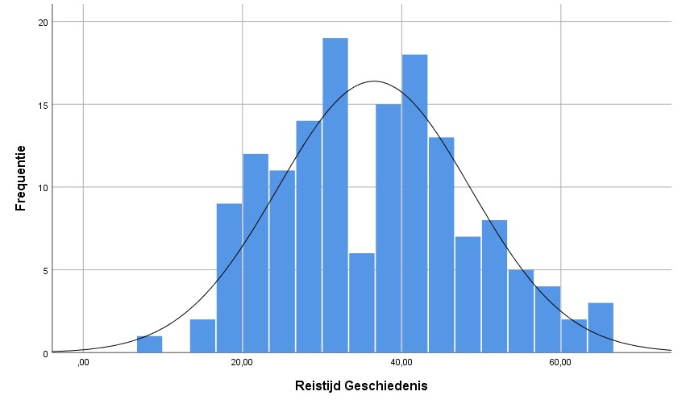

<style>
`r htmltools::includeHTML(paste0(here::here(),"/01. Includes/css/Stylesheet_SHHO.css"))`
</style>

```{r header, include = FALSE, echo = TRUE, results='asis'} 
paste0(here::here(),"/01. Includes/code/Header.R")
```

# Toepassing
Gebruik de *one-way ANOVA* bij het toetsen of het gemiddelde van drie of meer onafhankelijke groepen aan elkaar gelijk zijn.[^1] 

# Onderwijscasus
<div id = "casus">
In verband met wervingsactiviteiten wil het hoofd van de afdeling Communicatie weten wat de reistijd is van studenten aan verschillende opleidingen. Hij heeft daarom data verzameld over de reistijd van uitwonende studenten voor de opleidingen: Arabische Taal en Cultuur, Filosofie en Geschiedenis. 

H~0~: De gemiddelde reistijd van de studenten is per opleiding gelijk aan elkaar: µ~1~ = µ~2~ = µ~3~   

H~A~: Tenminste voor één opleiding is de gemiddelde reistijd niet gelijk aan de gemiddelde reistijd van studenten voor andere opleidingen. µ~1~ ≠ µ~2~ = µ~3~ 
</div>

# Assumpties
Om een valide toetsresultaat te bereiken moeten de data aan een aantal voorwaarden voldoen. Controleer of de steekproef aan de volgende assumpties voldoet: normaliteit, homogeniteit van varianties en onafhankelijkheid.  

De *one-way ANOVA* is een robuuste test. Dit betekent dat als één groep uit de steekproef niet voldoet aan de assumptie van normaliteit of homogeniteit van varianties dan kan de *one-way ANOVA* nog steeds uitgevoerd en geïnterpreteerd worden.[^2] De *Kruskal-Wallis test* wordt gezien als een alternatief voor de *one-way ANOVA* als er geen sprake is van normaliteit en/of homogeniteit.[^3] 

## Normaliteit
Controleer de assumptie van normaliteit met de volgende stappen:  
1. Controleer de data visueel met een histogram, een boxplot of een Q-Q plot.   
2. Toets of de data normaal verdeeld zijn met de *Kolmogorov-Smirnov test* of bij een kleinere steekproef (n < 50) met de *Shapiro-Wilk test*.[^4] [^5]  

Als blijkt dat de data niet normaal verdeeld zijn, transformeer de data eventueel en bepaal daarna of deze wel normaal verdeeld zijn.

## Homogeniteit van Varianties
Toets met de *Levene's Test (for equality of variance)* of de spreiding van iedere groep ongeveer hetzelfde is. Bij een *p* < 0,05 is de spreiding van de groepen significant verschillend.[^6]

# Effectmaat
Bereken de effectmaat om te bepalen of de gevonden p-waarde van een ANOVA betekenisvol is. Hier worden twee effectmaten besproken die veel voorkomen: Cohen's *f* en eta squared.   

## Cohen's f
Cohen's *f* geeft de sterkte van het effect van een onafhankelijke variabele op een afhankelijke variabele weer. Een indicatie om *f* te interpreteren is: rond 0,10 is een klein effect, rond 0,25 is een gemiddeld effect en rond 0,40 is een groot effect.[^7]

## Eta squared
Eta squared (*η^2^*) berekent de proportie van de variantie in de afhankelijke variabele wat verklaard wordt door de onafhankelijke variabele. In dit geval berekent het de proportie van de variantie in de lengte van de reistijd wat verklaard kan worden door de opleiding. Een indicatie om *η^2^* te interpreteren is: rond 0,01 is een klein effect, rond 0,06 is een gemiddeld effect en rond 0,14 is een groot effect.[^8]

# Post-hoc toetsen
De one-way ANOVA toetst of één of meerdere van de gemiddelden anders is dan de andere gemiddelden. Welke groep anders is wordt niet gespecificeerd. Als er bij de *one-way ANOVA* uitkomt dat er een significant verschil is tussen de groepen kan een post-hoc vergelijking gedaan worden om te bepalen welke groepen significant verschillen.
Er zijn meerdere post-hoc vergelijkingen:  
* Tukey wordt gebruikt als de assumptie van gelijke varianties is voldaan [^9]
* Dunnet’s C wordt gebruikt bij ongelijke varianties

# Uitvoering
Er is een dataset ingeladen met de reistijden van uitwonende studenten per opleiding is ingeladen genaamd `Reistijd_per_opleiding`. 

## De data bekijken
Klik het tabblad Data View aan om de data te bekijken. Klik het tabblad Variable View aan om de eigenschappen van alle variabelen te bekijken en eventueel aan te passen.

Krijg meer inzicht in de dataset door het gemiddelde en de spreiding te bekijken.

Klik op `Analyze` > `Descriptive Statistics` > `Descriptives`. Selecteer de gewenste variabele en plaats deze in het vakje `Variable`. Vink bij options het gemiddelde (`Mean`) en de standaard deviatie (`Std. deviation`) aan en klik op `Continue`. Klik op `OK` om meteen naar de output te gaan of klik op `Paste` om de code in de Syntax te zetten.

<!-- ## OPENBLOK: Data-beschrijven.SPSS -->
```{r data bekijken, eval=FALSE}
* Gemiddelde en standaarddeviatie.
DESCRIPTIVES VARIABLES=Reistijd
  /STATISTICS=MEAN STDDEV.
```

<!-- ## /BLOK: Data-bekijken.SPSS -->


* Gemiddeld tentamencijfer (standaarddeviatie): 6.41 (1.16). *n* = 340.

Selecteer de drie groepen en sla deze op in een variabele om deze makkelijker aan te kunnen roepen. Klik op `Transform` > `Compute variable...`. Vul bij `Target Variable:` de nieuwe naam in (in dit geval *Reistijd_ATC*, *Reistijd_FIL* of *Reistijd_GSC*) en de waarde van deze nieuwe variabele bij `Numeric Experssion` (in dit geval *Reistijd*). Om een conditie aan de variabele toe te voegen klik op `if` en seleceteer `Include if case satisfies condition:`. Vul vervolgens de gewenste conditie in (in dit geval: *Opleiding* = 1 of = 2 of = 3). Klik op `OK` om de variabele toe te voegen aan de dataset. 
<!-- ## OPENBLOK: Data-selecteren.SPSS -->
```{r nieuwe variabelen, eval=FALSE}
* Nieuwe variabele aanmaken.
IF  (Opleiding = 1) Reistijd_ATC=Reistijd.
EXECUTE.
```

Volg vervolgens bovenstaande stappen om van de nieuwe variabele(n) het gemiddelde te bekijken.

<!-- ## /BLOK: Meer data-bekijken.SPSS -->


* Gemiddelde reistijd Arabische Taal en Cultuur (standaarddeviatie): 47,45 (10,05). *n* = 48.  
* Gemiddelde reistijd Filosofie (standaarddeviatie): 33,77 (10,96). *n* = 60.
* Gemiddelde reistijd Geschiedenis (standaarddeviatie): 36,53 (12,09). *n* = 149.

## Visuele inspectie van normaliteit
Geef normaliteit visueel weer met een histogram, Q-Q plot of boxplot.

### Histogram
<!-- ## OPENBLOK: Histogram.R -->
Klik op `Graphs` > `Legacy Dialogs` en vervolgens op het gewenste figuur, in dit geval `Histogram...`. Selecteer de gewenste variabele en plaats deze in het vakje `Variable`. Klik op `OK` om meteen naar de output te gaan of klik op `Paste` om de code in de Syntax te zetten. Voor een density curve ga naar de `chart editor` (dubbelklik op het figuur). Klik op `Elements` > `Hide Distribution Curve`.

<!-- ## OPENBLOK: Histogram.SPSS -->
```{r histogram, eval=FALSE}
* Histogram.
GRAPH
  /HISTOGRAM=Reistijd_ATC.
```
<!-- ## /BLOK: Histogram.SPSS -->
{width=60%} {width=60%} {width=60%}

De opleidingen Geschiedenis en Arabische taal en Cultuur laten een Bell Curve zien vergelijkbaar aan een normale verdeling, veel waardes liggen rondom het gemiddelde.  Filosofie heeft een lagere frequentie bij een reistijd van 40 minuten, dit kan duiden op niet normaal verdeelde data. 

### Q-Q plot
Klik op `Analyze` > `Desctiptive Statistics` > `Q-Q Plots...`. Selecteer de gewenste variabele(n) en plaats deze in het vakje `Variables`. Klik op `OK` om meteen naar de output te gaan of klik op `Paste` om de code in de Syntax te zetten.

Als over het algemeen de meeste datapunten op de lijn liggen, kan aangenomen worden dat de data normaal verdeeld zijn.
<!-- ## OPENBLOK: QQplot.R -->
```{r qqplot, eval=FALSE}
* QQ-Plot.
PPLOT
  /VARIABLES=Reistijd_ATC Reistijd_FIL Reistijd_GSC
  /NOLOG
  /NOSTANDARDIZE
  /TYPE=Q-Q
  /FRACTION=BLOM
  /TIES=MEAN
  /DIST=NORMAL.
```


<!-- ## /BLOK: QQplot.R -->
{width=40%} {width=40%} {width=40%}

Bij de Q-Q plot van de reistijd van studenten Geschiedenis liggen de meeste punten op de lijn behalve bij de uiteinden. De cirkels van de Q-Q plot van studenten Arabische Taal en Cultuur en studenten Filosofie liggen net naast de lijn. De discrepantie is minimaal, vermoedelijk zijn de data normaal verdeeld.

### Boxplot
De box geeft de middelste 50% van de reistijd weer. De zwarte lijn binnen de box is de mediaan. In de staarten zitten de eerste 25% en de laatste 25%. Cirkels visualiseren mogelijke uitbijters.[^10]

Klik op `Graphs` > `Legacy Dialogs` > `Boxplot...`. Kies vervolgens voor `Simple`. Kies voor `Summaries of for groups of cases` en klik op `Define`.  Selecteer de gewenste variabele(n), plaats de afhankelijke variabelen in het vakje `Variable` en de variabelen waarop gegroepeerd moet worden in het vakje `Category Axis`. Klik op `OK` om meteen naar de output te gaan of klik op `Paste` om de code in de Syntax te zetten.

<!-- ## OPENBLOK: Boxplot.R -->
``` {r boxplot, eval=FALSE}
* Boxplot.
EXAMINE VARIABLES=Reistijd BY Opleiding
  /PLOT=BOXPLOT
  /STATISTICS=NONE
  /NOTOTAL.
```

<!-- ## /BLOK: Boxplot.R -->


De boxplotten geven de spreiding weer van de gemiddelde reistijd van uitwonende studenten voor de opleidingen: Arabische Taal en Cultuur, Filosofie en Geschiedenis. De boxplotten Arabische Taal en Cultuur en Geschiedenis zien er symmetrisch uit; de boxen zijn even hoog boven als onder de mediaan. De staarten zijn onder en boven even groot. De boxplot van Filosofie is boven de mediaan groter dan onder de mediaan, de data kan wat scheef verdeeld zijn. De mediaan Arabische Taal en Cultuur ligt hoger dan de twee andere opleidingen. 

## Toetsen van normaliteit
Om te controleren of de data normaal verdeeld zijn, kan de normaliteit getoetst worden. Twee veelgebruikte toetsen zijn: de *Kolmogorov-Smirnov test* en de *Shapiro-Wilk test*.

### Kolmogorov-Smirnov
De *Kolmogorov-Smirnov test* toetst het verschil tussen twee verdelingen. Standaard toetst deze test het verschil tussen een normale verdeling en de verdeling van de steekproef. De Lilliefors correctie wordt gebruikt als het gemiddelde niet 0 is en de standaardafwijking niet 1 is. Als de p < 0,05 is, is de verdeling van de data statistisch significant verschillend van de normale verdeling.

Klik op `Analyze` > `Nonparametric Tests` > `Legacy Dialogs` > `1-Sample K-S...`. Selecteer de gewenste variabele(n) en plaats deze in het vakje `Test Variable List`. Vink bij `Test Distribution` het vakje voor `Normal` aan. Klik op `OK` om meteen naar de output te gaan of klik op `Paste` om de code in de Syntax te zetten.

<!-- ## OPENBLOK: Lilliefors-test.R -->
```{r Kolmogorov-Smirnov Test, eval=FALSE}
* Kolmogorov-Smirnov test.
NPAR TESTS
  /K-S(NORMAL)=Reistijd_ATC Reistijd_FIL Reistijd_GSC
  /MISSING ANALYSIS.
```

<!-- ## /BLOK: Kolmogorov-Smirnov-test.R -->


Kijk voor het  verschil naar `Asymp. Sig. (2-tailed)`.

De p-waarde is *p* > 0,05, er is geen statistisch significant verschil gevonden tussen de verdeling van de steekproef en de normale verdeling. De *one-way ANOVA* kan uitgevoerd worden.

### Shapiro-Wilk Test
De *Shapiro-Wilk test* is een soortgelijke test als de *Kolmogorov-Smirnov test* en wordt vooral gebruikt bij kleine steekproeven (n < 50). Als de p < 0,05 is, is de verdeling van de data significant verschillend van de normale verdeling.

<div class="col-container"> 
  <div class="col">
<!-- ## OPENBLOK: Shapiro-Wilk-test-3.R -->
``` {r Shapiro-Wilk Test-3, warning=FALSE}
shapiro.test(Reistijd_GSC)
```
<!-- ## /BLOK: Shapiro-Wilk-test-3.R -->
  </div>
  <div class= "col">
<!-- ## OPENBLOK: Shapiro-Wilk-test-2.R -->
``` {r Shapiro-Wilk Test-2, warning=FALSE}
shapiro.test(Reistijd_FIL)
```
<!-- ## OPENBLOK: Shapiro-Wilk-test-2.R -->
  </div>
  <div class= "col"> 
<!-- ## OPENBLOK: Shapiro-Wilk-test-1.R -->
``` {r Shapiro-Wilk Test-1, warning=FALSE}
shapiro.test(Reistijd_ATC)
```
<!-- ## OPENBLOK: Shapiro-Wilk-test-1.R -->
  </div>
</div>

De p-waarde is *p* > 0,05, dus er is geen statistisch significant verschil gevonden tussen de verdeling van de steekproef en de normale verdeling. De *one-way ANOVA* kan uitgevoerd worden.

## Toetsen van Homogeniteit van varianties
Test met de Levene's test de homogeniteit van varianties. Als uit de *Levene's test* komt dat de steekproeven verschillen in variantie kan de *ongepaarde t-toets* met ongelijke varianties uitgevoerd worden. 

<!-- ## OPENBLOK: Levenes-test.R -->
```{r LeveneTest, warning = FALSE, message = FALSE}
library(car)
leveneTest(Reistijd_per_opleiding$Reistijd, Reistijd_per_opleiding$Opleiding)
```
<!-- ## /BLOK: Levenes-test.R -->
```{r Levenes test als object, echo = FALSE}
L <- leveneTest(Reistijd_per_opleiding$Reistijd, Reistijd_per_opleiding$Opleiding)
vF_waarde <- Round_and_format(L$`F value`[1])
vF_p <- Round_and_format(L$`Pr(>F)`[1])
vDF1 <- Round_and_format(L$`Df`[1])
vDF2 <- Round_and_format(L$`Df`[2])
```
* *F*~`r vDF1`~~,~~`r vDF2`~ = `r vF_waarde`, p-waarde = `r vF_p`, 
* De p-waarde is *p* > 0,05, dus er is geen statistisch significant verschil gevonden tussen de groepen in spreiding.   
* Vrijheidsgraden bestaan uit twee cijfers, het eerste cijfer (het aantal groepen - 1 = `r vDF1`) en het tweede cijfer (*n~1~* + *n~2~* - 2 = `r vDF2`).  
* De p-waarde is *p* > 0,05, dus er is geen statistisch significant verschil gevonden in variantie.  


## One-way ANOVA 
De *one-way ANOVA* is uitgevoerd om de vraag te beantwoorden of de gemiddelde reistijd van de studenten per opleiding  

Gebruik `aov()` om een ANOVA-object (`aov`) te creëren. Geef het resultaat overzichtelijk weer met `summary()`.
<!-- ## OPENBLOK: ANOVA-toets.R -->
```{r ANOVA}
res.aov <- aov(Reistijd ~ Opleiding, Reistijd_per_opleiding)
summary(res.aov)
```
<!-- ## /BLOK: ANOVA-toets.R -->
```{r ANOVA als object, echo=FALSE}
ANOVA <- summary(res.aov)
vF_waarde <- Round_and_format(ANOVA[[1]]$`F value`[1])
```
* *F* ~`r vDF1`~~,~~`r vDF2`~ = `r vF_waarde`, *p* < 0,05
* p-waarde < 0,05, dus de H~0~ wordt verworpen en de H~A~ wordt aangenomen
* Vrijheidsgraden: het aantal groepen - 1 = `r vDF1`; *n~1~* + *n~2~* - 2 = `r vDF2`

### Effectmaat: Cohen's *f*
Gebruik `cohens_f()` om het effect te meten.

<!-- ## OPENBLOK: Cohens-f.R --> 
```{r Cohen s F, warning=FALSE, message=FALSE}
library(sjstats)
cohens_f(res.aov)
```
<!-- ## /BLOK: Cohens-f.R --> 
```{r Cohen s F als object, include=FALSE}
f<-cohens_f(res.aov)
vCohens_f <- Round_and_format(f$cohens.f)
```
*f* = `r vCohens_f`. 
De sterkte van het effect van type opleiding op de reistijd is groot. 

### Effectmaat: eta squared
Gebruik `EtaSq()` op een `aov` om het effect te meten.
<!-- ## OPENBLOK: Eta-squared.R --> 
```{r eta-squared, message = FALSE}
library(DescTools)
EtaSq(res.aov)
```
<!-- ## /BLOK: Eta-squared.R -->
```{r eta-squared als object, include = FALSE}
Esq <- Round_and_format(EtaSq(res.aov)[1])
```
*η^2^* = `r Esq`
De sterkte van het effect van de type opleiding op de reistijd is groot. 

## Post-hoc toets: Tukey's toets
Om te bepalen welke van de type opleidingen in reistijd verschillen wordt een post-hoc toets gedaan. Gebruik bij groepen met gelijke variantie de Tukey honestly significant difference test.
Gebruik `TukeyHSD()` op het ANOVA-object (`aov`).

<!-- ## OPENBLOK: Tukey-HSD.R -->
```{r TukeyHSD}
TukeyHSD(res.aov)
```
<!-- ## /BLOK: Tukey-HSD.R -->
```{r TukeyHSD als object}
THSD <- TukeyHSD(res.aov)
vATCvsFIL <- Round_and_format(THSD$Opleiding[1,1])
vATCvsGSC <- Round_and_format(THSD$Opleiding[2,1])
vFILvsGSC <- Round_and_format(THSD$Opleiding[3,1])
```
Het verschil tussen Filosofie en Arabische Taal en Cultuur: *MD* = `r vATCvsFIL`, p < 0,01. 
Het verschil tussen Geschiedenis en Arabische Taal en Cultuur: *MD* = `r vATCvsGSC`, p < 0,01. 
Het verschil tussen Geschiedenis en Filosofie: *MD* = `r vFILvsGSC`, p = 0,26. 

# Rapportage
Een *one-way ANOVA* is uitgevoerd om te toetsen of de gemiddelde reistijd van de studenten is per opleiding gelijk aan elkaar is. De opleidingen zijn: Arabische Taal en Cultuur (*M~atc~* = `r vM_ATC`, *SD~atc~* = `r vSD_ATC`), Filosofie (*M~fil~* = `r vM_FIL`, *SD~fil~* = `r vSD_FIL`) en Geschiedenis (*M~gsc~* = `r vM_GSC`, *SD~fil~* = `r vSD_FIL`, zie ook tabel. De gemiddelde reistijd van de groepen verschillen significant van elkaar, *F*(`r vDF1`, `r vDF2`) = `r vF_waarde`, *p* < 0,05. De sterkte van het effect van de type opleiding op de reistijd is groot. 

| Opleiding     | N          | M          | SD          |
| ------------- | ---------- | ---------- | ----------- |
| Arabisch      | `r vN_ATC` | `r vM_ATC` | `r vSD_ATC` |
| Filosofie     | `r vN_FIL` | `r vM_FIL` | `r vSD_FIL` |
| Geschiedenis  | `r vN_GSC` | `r vM_GSC` | `r vSD_GSC` |

*Tukey's HSD test* is uitgevoerd om te toetsen welke van de drie gemiddelden significant verschillen. Filosofie en Arabische Taal en Cultuur verschillen significant (*MD* = `r vATCvsFIL`, p < 0,01). Tussen Geschiedenis en Arabische Taal en Cultuur is een significant verschil (*MD* = `r vATCvsGSC`, p < 0,01). Tussen Geschiedenis en Filosofie is geen significant verschil gevonden (*MD* = `r vFILvsGSC`, p = 0,26). 

Aan de hand van de resultaten kan geconcludeerd worden dat de studenten van Arabische Taal en Cultuur significant langer moeten reizen dan de andere twee opleidingen. Het effect is groot. Tussen de Filosofie en Geschiedenis is geen significant verschil gevonden. 

[^1]: van Geloven, N. (25 mei 2016). *One-way ANOVA*. [Wiki Statistiek Academisch Medisch Centrum](https://wikistatistiek.amc.nl/index.php/One-way_ANOVA).
[^2]: Universiteit van Amsterdam (8 juli 2014). *One-way ANOVA*. [UvA Wiki Methodologiewinkel](https://wiki.uva.nl/methodologiewinkel/index.php/One-way_ANOVA).
[^3]: van Geloven, N. (21 maart 2018). *Kruskal Wallis*. [Wiki Statistiek Academisch Medisch Centrum](https://wikistatistiek.amc.nl/index.php/Kruskal_Wallis).
[^4]: Laerd statistics (2018). *Testing for Normality using SPSS Statistics*. https://statistics.laerd.com/spss-tutorials/testing-for-normality-using-spss-statistics.php 
[^5]: Universiteit van Amsterdam (14 juli 2014). *Normaliteit*. [UvA Wiki Methodologiewinkel](https://wiki.uva.nl/methodologiewinkel/index.php/Normaliteit).  
[^6]: Wikipedia (7 september 2019). *Analysis of variance*. https://en.wikipedia.org/wiki/Analysis_of_variance 
[^7]: Watson, P. (30 oktober 2019). *Rules of thumb on magnitudes of effect sizes*. [MRC Cognition and Brain Sciences Unit Wiki](http://imaging.mrc-cbu.cam.ac.uk/statswiki/FAQ/effectSize).
[^8]: Eta-squared. (2019 May 14). Retrieved from: https://en.wikiversity.org/wiki/Eta-squared
[^9]: Universiteit van Amsterdam (26 augustus 2014). *MANOVA*. [UvA Wiki Methodologiewinkel](https://wiki.uva.nl/methodologiewinkel/index.php/MANOVA).

[^10]: Outliers (13 augustus 2016). [UvA Wiki Methodologiewinkel](https://wiki.uva.nl/methodologiewinkel/index.php/Outliers).