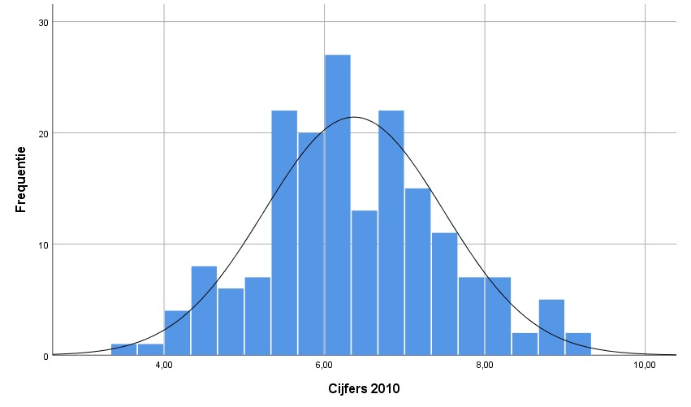
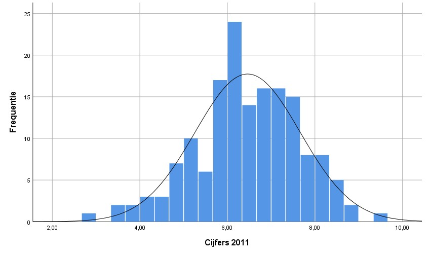

<style>
`r htmltools::includeHTML(paste0(here::here(),"/01. Includes/css/Stylesheet_SHHO.css"))`
</style>

<!-- ## CLOSEDBLOK: Header.R -->
```{r header, include = FALSE, echo = TRUE, results='asis'} 
paste0(here::here(),"/01. Includes/code/Header.R")
```
<!-- ## /CLOSEDBLOK: Header.R -->

# Toepassing
Gebruik de *ongepaarde t-toets* om de gemiddelden van twee onafhankelijke groepen te vergelijken.[^1]

# Onderwijscasus
<div id = "casus">
Vanaf 2011 heeft de opleiding Taalwetenschap een Bindend Studieadvies (BSA) die de selectiviteit van het eerste jaar moet vergroten. Zij vraagt zich af of het gemiddelde cijfer van de opleiding Taalwetenschap op 1 februari, na invoering van het BSA, veranderd is. De data is beschikbaar voor het cohort gestart in 2010 en voor het cohort gestart in 2011.

H~0~: Het gemiddelde tentamencijfer dat de studenten halen aan de opleiding Taalwetenschap is niet veranderd na de invoer van het BSA, µ~0~ = µ~1~  

H~A~: Het gemiddelde tentamencijfer dat de studenten halen aan de opleiding Taalwetenschap is veranderd na de invoer van het BSA, µ~0~ ≠ µ~1~
</div>

# Assumpties
Voor een valide resultaat moeten de data aan een aantal voorwaarden voldoen voordat de toets uitgevoerd kan worden.

## Normaliteit 
De *t-toets* gaat ervan uit dat de data van de steekproef normaal verdeeld zijn. Ga er bij een n > 100 vanuit dat de t-toets robuust genoeg is om uit te voeren zonder dat de data een normale verdeling volgen.[^2] 

Controleer de assumptie van normaliteit met de volgende stappen:  
1. Controleer de data visueel met een histogram, een boxplot of een Q-Q plot.   
2. Toets of de data normaal verdeeld zijn met de *Kolmogorov-Smirnov test* of bij een kleinere steekproef (n < 50) met de *Shapiro-Wilk test*.[^3] [^4]  

Als blijkt dat de data niet normaal verdeeld zijn, transformeer de data eventueel en bepaal daarna of deze wel normaal verdeeld zijn.

Als er geen sprake is van normaliteit gebruik de *Mann-Whitney U toets*, ook bekend als de *Wilcoxon rank-sum toets*.[^5] [^6]  

## Homogeniteit van varianties 
Toets met de *Levene’s Test (for equality of variance)* of de spreiding van iedere groep globaal hetzelfde is. Bij een *p* < 0,05 is de spreiding van de groepen statistisch significant verschillend.[^7]

# Effectmaat
Bereken de effectmaat om te bepalen of de gevonden p-waarde van een t-toets betekenisvol is. Een veel gebruikte effectmaat is Cohen's *d*. Cohen's *d* geeft de sterkte van het effect van een onafhankelijke variabele op een afhankelijke variabele weer. Een indicatie om *d* te interpreteren is: rond 0,3 is het een klein effect, rond 0,5 is het een gemiddeld effect en rond 0,8 is het een groot effect.[^8]

# Uitvoering
Er is een dataset ingeladen met gemiddelde cijfers van tweedejaarsstudenten bij de opleiding Taalwetenschap: `Cijfers_gem`. De data bevatten cijfers van 180 studenten begonnen in 2010 en cijfers van 160 studenten begonnen in 2011.

## De data bekijken
Klik het tabblad Data View aan om de data te bekijken. Klik het tabblad Variable View aan om de eigenschappen van alle variabelen te bekijken en eventueel aan te passen.

Krijg meer inzicht in de dataset door het gemiddelde en de spreiding te bekijken.

Klik op `Analyze` > `Descriptive Statistics` > `Descriptives`. Selecteer de gewenste variabele en plaats deze in het vakje `Variable`. Vink bij options het gemiddelde (`Mean`) en de standaard deviatie (`Std. deviation`) aan en klik op `Continue`. Klik op `OK` om meteen naar de output te gaan of klik op `Paste` om de code in de Syntax te zetten.

<!-- ## OPENBLOK: Data-beschrijven.SPSS -->
```{r data bekijken, eval=FALSE}
* Gemiddelde en standaarddeviatie.
DESCRIPTIVES VARIABLES=Cijfers
  /STATISTICS=MEAN STDDEV.
```

<!-- ## /OPENBLOK: Data-bekijken.SPSS -->


* Gemiddeld tentamencijfer (standaarddeviatie): 6.41 (1.16). *n* = 340.

Selecteer beide groepen en sla deze op in een variabele om deze makkelijker aan te kunnen roepen. Klik op `Transform` > `Compute variable...`. Vul bij `Target Variable:` de nieuwe naam in (in dit geval *Cijfers_2010* of *Cijfers_2011*) en de waarde van deze nieuwe variabele bij `Numeric Experssion` (in dit geval *Cijfers*). Om een conditie aan de variabele toe te voegen klik op `if` en seleceteer `Include if case satisfies condition:`. Vul vervolgens de gewenste conditie in (in dit geval: *Cohort* = 2010 of = 2011). Klik op `OK` om de variabele toe te voegen aan de dataset. 
<!-- ## OPENBLOK: Data-selecteren.SPSS -->
```{r nieuwe variabelen, eval=FALSE}
* Nieuwe variabele aanmaken.
IF  (Cohort = 2010) Cijfers_2010=Cijfers.
EXECUTE.
```

Volg vervolgens bovenstaande stappen om van de nieuwe variabele(n) het gemiddelde te bekijken.

<!-- ## /OPENBLOK: Meer data-bekijken.SPSS -->


* Gemiddeld tentamencijfer 2010 (standaarddeviatie): 6.37 (1.12). *n* = 180.
* Gemiddeld tentamencijfer 2011 (standaarddeviatie): 6.46 (1.20). *n* = 180.

## Visuele inspectie van normaliteit
Geef normaliteit visueel weer met een histogram, Q-Q plot of boxplot.

### Histogram
<!-- ## OPENBLOK: Histogram.R -->
Klik op `Graphs` > `Legacy Dialogs` en vervolgens op het gewenste figuur, in dit geval `Histogram...`. Selecteer de gewenste variabele en plaats deze in het vakje `Variable`. Klik op `OK` om meteen naar de output te gaan of klik op `Paste` om de code in de Syntax te zetten. Voor een density curve ga naar de `chart editor` (dubbelklik op het figuur). Klik op `Elements` > `Hide Distribution Curve`.

<!-- ## OPENBLOK: Histogram.SPSS -->
```{r histogram, eval=FALSE}
* Histogram.
GRAPH
  /HISTOGRAM=Cijfers_2010.
```
<!-- ## /OPENBLOK: Histogram.SPSS -->
{width=60%} {width=60%}


Beide histogrammen laten een Bell Curve zien vergelijkbaar met een normale verdeling: veel waardes liggen rondom het gemiddelde.  

### Q-Q plot
Klik op `Analyze` > `Desctiptive Statistics` > `Q-Q Plots...`. Selecteer de gewenste variabele(n) en plaats deze in het vakje `Variables`. Klik op `OK` om meteen naar de output te gaan of klik op `Paste` om de code in de Syntax te zetten.

Als over het algemeen de meeste datapunten op de lijn liggen, kan aangenomen worden dat de data normaal verdeeld zijn.
<!-- ## OPENBLOK: QQplot.R -->
```{r qqplot, eval=FALSE}
* QQ-Plot.
PPLOT
  /VARIABLES=Cijfers_2010 Cijfers_2011
  /NOLOG
  /NOSTANDARDIZE
  /TYPE=Q-Q
  /FRACTION=BLOM
  /TIES=MEAN
  /DIST=NORMAL.
```


<!-- ## /OPENBLOK: QQplot.R -->
{width=48%} {width=48%}

Bij beide groepen liggen de meeste punten op de lijn behalve bij de uiteinden.

### Boxplot
De box geeft de middelste 50% van de tentamencijfers weer. De zwarte lijn binnen de box is de mediaan. In de staarten zitten de eerste 25% en de laatste 25%. Cirkels visualiseren mogelijke uitbijters.[^9] 

Klik op `Graphs` > `Legacy Dialogs` > `Boxplot...`. Kies vervolgens voor `Simple`. Kies voor `Summaries of for groups of cases` en klik op `Define`.  Selecteer de gewenste variabele(n), plaats de afhankelijke variabelen in het vakje `Variable` en de variabelen waarop gegroepeerd moet worden in het vakje `Category Axis`. Klik op `OK` om meteen naar de output te gaan of klik op `Paste` om de code in de Syntax te zetten.

<!-- ## OPENBLOK: Boxplot.R -->
``` {r boxplot, eval=FALSE}
* Boxplot.
EXAMINE VARIABLES=Cijfers BY Cohort
  /PLOT=BOXPLOT
  /STATISTICS=NONE
  /NOTOTAL.
```

<!-- ## /OPENBLOK: Boxplot.R -->


De boxplotten geven de spreiding weer van het gemiddelde tentamencijfer voor de BSA en na de BSA. De boxplotten en de staarten lijken symmetrisch, wat een teken kan zijn van normaal verdeelde data. Het cohort van 2011 heeft een aantal mogelijke uitbijters.[^10] 

## Toetsen van normaliteit
Om te controleren of de data normaal verdeeld zijn, kan de normaliteit getoets worden. Hierbij een toelichting bij twee veel gebruikte toetsen: de *Kolmogorov-Smirnov test* en de *Shapiro-Wilk test*.

### Kolmogorov-Smirnov
De *Kolmogorov-Smirnov test* toetst het verschil tussen twee verdelingen. Standaard toetst deze test het verschil tussen een normale verdeling en de verdeling van de steekproef. De Lilliefors correctie wordt gebruikt als het gemiddelde niet 0 is en de standaardafwijking niet 1 is. Als de p < 0,05 is, is de verdeling van de data statistisch significant verschillend van de normale verdeling.

Klik op `Analyze` > `Nonparametric Tests` > `Legacy Dialogs` > `1-Sample K-S...`. Selecteer de gewenste variabele(n) en plaats deze in het vakje `Test Variable List`. Vink bij `Test Distribution` het vakje voor `Normal` aan. Klik op `OK` om meteen naar de output te gaan of klik op `Paste` om de code in de Syntax te zetten.

<!-- ## OPENBLOK: Lilliefors-test.R -->
```{r Kolmogorov-Smirnov Test, eval=FALSE}
* Kolmogorov-Smirnov test.
NPAR TESTS
  /K-S(NORMAL)=Cijfers_2010 Cijfers_2011
  /MISSING ANALYSIS.
```

<!-- ## /OPENBLOK: Kolmogorov-Smirnov-test.R -->


Kijk voor het  verschil naar `Asymp. Sig. (2-tailed)`.

Bij deze casus is van beide groepen de p-waarde > 0,05; er is geen statistisch significant verschil gevonden tussen de verdeling van de steekproef en de normale verdeling. De *ongepaarde t-toets* kan uitgevoerd worden.

### Shapiro-Wilk Test
De *Shapiro-Wilk test* is een soortgelijke test als de *Kolmogorov-Smirnov test* en wordt vooral gebruikt bij kleine steekproeven.  Als de p-waarde < 0,05 is de verdeling van de data statistisch significant verschillend van de normale verdeling. 

Er zijn 2 steekproeven van `Cijfers_gem` ingeladen: `Cijfers_2010_n30` en `Cijfers_2011_n30`. Beide steekproeven bevatten 30 studenten.

Klik op `Analyze` > `Descriptive Statistics` > `Explore...`. Selecteer de gewenste variabele(n) en plaats deze in het vakje `Dependent List`. Vink bij `Plots` het vakje voor `Normality plots with tests` aan en klik op `Continue`. Vink bij `Display` het vakje voor `Plots` aan. Klik op `OK` om meteen naar de output te gaan of klik op `Paste` om de code in de Syntax te zetten. 

<!-- ## OPENBLOK: Shapiro-Wilk-test.R -->
``` {r Shapiro-Wilk Test, eval=FALSE}
* Shapiro-Wilk test.
EXAMINE VARIABLES=Cijfers_2010_n30
  /PLOT NPPLOT
  /STATISTICS NONE
  /CINTERVAL 95
  /MISSING LISTWISE
  /NOTOTAL.
```

<!-- ## /OPENBLOK: Shapiro-Wilk-test.R -->
  

De p-waarde is *p* > 0,05, dus er is geen statistisch significant verschil gevonden tussen de verdeling van de steekproef en de normale verdeling. De *ongepaarde t-toets* kan uitgevoerd worden.

## Ongepaarde t-toets
De *ongepaarde t-toets* wordt uitgevoerd om de vraag te beantwoorden of het het gemiddelde tentamencijfer van de opleiding Taalwetenschap na invoering van het BSA veranderd is. De verwachting is dat de studenten hoger scoren, maar omdat het relevant om te weten of de studenten ook lager scoren na de invoering is er voor gekozen om tweezijdig te toetsen. 
Test daarnaast de assumptie van Levene's test.Test met de Levene's test de homogeniteit van varianties. Als uit de *Levene's test* komt dat de steekproeven verschillen in variantie kan de *ongepaarde t-toets* met ongelijke varianties uitgevoerd worden. 
Gebruik hier weer het hele dataframe `Cijfers_gem`.


Klik op `Analyze` > `Compare Means` > `Independent-Samples T Test...`. Plaats de afhankelijke variabele in het vakje `Test Variable(s)` en de onafhankelijke variabele in het vakje `Grouping Variabel:`. Klik op `Define Groups...` on de onafhankelijke variabele om de groepen de definieren. Vul per groep in wat de codering is (in dit geval: `Group 1:` = 2010 en `Group 2:` = 2011) en klik op `Continue`. Klik op `OK` om meteen naar de output te gaan of klik op `Paste` om de code in de Syntax te zetten.

<!-- ## OPENBLOK: T-test.R -->
```{r ttest, eval=FALSE}
* T-test.
T-TEST GROUPS=Cohort(2010 2011)
  /MISSING=ANALYSIS
  /VARIABLES=Cijfers
  /CRITERIA=CI(.95).
```

* *t* ~338~ = -0.74, *p* = 0.459
* Vrijheidsgraden, *df* = *n* -1 = 338-1 = 337
* p-waarde > 0,05, dus de H~0~ wordt niet verworpen [^11]
* 95%-betrouwbaarheidsinterval: bij het herhalen van het onderzoek zal in 95% van de gevallen de µ in het interval vallen. In deze casus is het interval tussen -0.34 en 0.15.
* Het gemiddelde van de steekproef in 2010: 6.37
* Het gemiddelde van de steekproef in 2011: 6.46

Kijk voor de Levene's test onder `Levene's Test for Equality of Variances`
* *F*~1~~,~~338~ = 0.80, p-waarde = 0.372 
* p-waarde > 0,05, dus de groepen zijn niet significant verschillend in spreiding.  
* Vrijheidsgraden bestaan uit twee cijfers: het eerste cijfer (het aantal groepen - 1 = 2) en het tweede cijfer (*180* + *160* - 2 = 338)


### Effectmaat: Cohen's d 
Wanneer p < 0,05 wordt de effectmaat berekend om te bepalen of de gevonden p-waarde betekenisvol is. In dit voorbeeld is de p > 0,05, dus is een effectmaat irrelevant. Hieronder laten we zien wat de stappen zouden zijn bij een p < 0,05.

Manier 1

Maak een gestandaardiseerde variant van de afhankelijke variabele. Klik op `Analyze` > `Descriptives Statistics` > `Descriptives...`. Plaats de afhankelijke variabele in het vakje `Variable(s):` en vink het vakje `Save standardized values as variables` aan. Klik op `OK` om meteen naar de output te gaan of klik op `Paste` om de code in de Syntax te zetten.

Voer vervolgens opnieuw de gepaarde t-test uit zoals hierboven beschreven, selecteer de gestandaardiseerde afhankelijke variabele (gekenmerkt door `Zscore`). De Cohen's D staat onder `Mean Difference` onder `t-test for Equality of Means`, ga hierbij uit van `Equal variances assumed`.

<!-- ## OPENBLOK: Cohen's D.spss -->
``` {r Cohens D, eval=FALSE}
* Standaardiseer de variabele.
DESCRIPTIVES VARIABLES=Cijfers
  /SAVE
  /STATISTICS=MEAN STDDEV MIN MAX.

* Cohens D bekijken.
T-TEST GROUPS=Cohort(2010 2011)
  /MISSING=ANALYSIS
  /VARIABLES=ZCijfers
  /CRITERIA=CI(.95).
```

<!-- ## /OPENBLOK: Cohen's D.spss -->


Manier 2

Gebruik de gegevens van de `Group Statistics` tabel van de T-Test om de Cohen's D via de volgende formules te berekenen:

<!-- ## /OPENBLOK: Cohen's D.spss -->
 

M1 = gemiddelde groep 1 (`Mean`)

M2 = gemiddelde groep 2 (`Mean`)

N1 = grootte groep 1 (`N`)

N2 = grootte groep 2 (`N`)

S~1~^2^ = standaard deviatie groep 1 (`Std. Error Mean`)

S~2~^2^ = standaard deviatie groep 2 (`Std. Error Mean`)

Manier 3

Gebruik de gegevens van de `Group Statistics` tabel van de T-Test om de Cohen's D [hier](http://web.cs.dal.ca/~anwar/ds/Excel4.xlsx) te berekenen via excel.

*d* = 0.08. De sterkte van het effect van de tutor op het cijfer is verwaarloosbaar. 


# Rapportage
Een *ongepaarde t-toets* is uitgevoerd om te toetsen of het gemiddelde tentamencijfer is veranderd na de invoer van het BSA. Het verschil tussen het gemiddelde tentamencijfer van cohort 2010 (*M~2010~* = 6.37, *SD~2010~* = 1.12) en het gemiddelde tentamencijfer van cohort 2011 (*M~2011~* = 6.46, *SD~2011~* = 1.20) is statistisch niet significant, *t* ~338~ = -.74, *p* > 0,05, zie tabel hieronder. Het 95% betrouwbaarheidsinterval voor het verschil tussen het gemiddelde van beide groepen is van -.34 tot .15. Het effect is minimaal, *d* = .08.

Aan de hand van de resultaten kan geconcludeerd worden dat het gemiddelde tentamencijfer niet is veranderd na de invoer van het BSA. 

| Cohort   | N         | M            | SD         |
| -------- | --------- | ------------ | ---------- |
| 2010     | 180       | 6.37         | 1.12       |
| 2011     | 160       | 6.46         | 1.20       |

[^1]: Van Geloven, N. (25 mei 2016). *T-toets* [Wiki Statistiek Academisch Medisch Centrum](https://wikistatistiek.amc.nl/index.php/T-toets#ongepaarde_t-toets).
[^2]: Lumley, T., Diehr, P., Emerson, S., & Chen, L. (2002). Tthe importance of the normality assumption in large public health data sets. *Annu Rev Public Health, 23*, 151-69. doi: 10.1146/annurev.publheath.23.100901.140546 http://rctdesign.org/techreports/arphnonnormality.pdf 
[^3]: Laerd statistics. (2018). [Testing for Normality using SPSS Statistics](https://statistics.laerd.com/spss-tutorials/testing-for-normality-using-spss-statistics.php).
[^4]: Normaliteit. (14 juli 2014). [UvA Wiki Methodologiewinkel](https://wiki.uva.nl/methodologiewinkel/index.php/Normaliteit).
[^5]: Van Geloven, N. (13 maart 2018). *Mann-Whitney U toets* [Wiki Statistiek Academisch Medisch Centrum](https://wikistatistiek.amc.nl/index.php/Mann-Whitney_U_toets).
[^6]: De *Mann-Whitney U toets* maakt een rangschikking van de data. Hierdoor is de test verdelingsvrij en is normaliteit geen assumptie. Ook zijn uitbijters minder van invloed op het eindresultaat. Toch wordt er voor deze test minder vaak gekozen, doordat bij het maken van een rankschikking de data informatie verliest. Als de data wel normaal verdeeld zijn heeft de *Mann-Whitney U toets* minder onderscheidend vermogen dan wanneer de *ongepaarde t-toets* uitgevoerd zou worden. 
[^7]: Van Geloven, N. (25 mei 2016). *One-way ANOVA* [Wiki Statistiek Academisch Medisch Centrum](https://wikistatistiek.amc.nl/index.php/One-way_ANOVA).
[^8]: Marshall, E., & Boggis, E. (2016). *The statistics tutor’s quick guide to commonly used statistical tests*. http://www.statstutor.ac.uk/resources/uploaded/tutorsquickguidetostatistics.pdf 
[^9]: Outliers (13 augustus 2016). [UvA Wiki Methodologiewinkel](https://wiki.uva.nl/methodologiewinkel/index.php/Outliers).
[^10]: Uitbijters kunnen bepalend zijn voor de uitkomst van toetsen. Bekijk of de uitbijters valide uitbijters zijn en niet een meetfout] of op een andere manier incorrect verkregen data. Het weghalen van uitbijters kan de uitkomst ook vertekenen, daarom is het belangrijk om verwijderde uitbijters te melden in een rapport. 
[^11]: In dit voorbeeld wordt eruit gegaan van een waarschijnlijkheid van 95% en zodoende een p-waardegrens van 0,05. Dit is naar eigen inzicht aan te passen. Hou hierbij rekening met type I en type II fouten.

